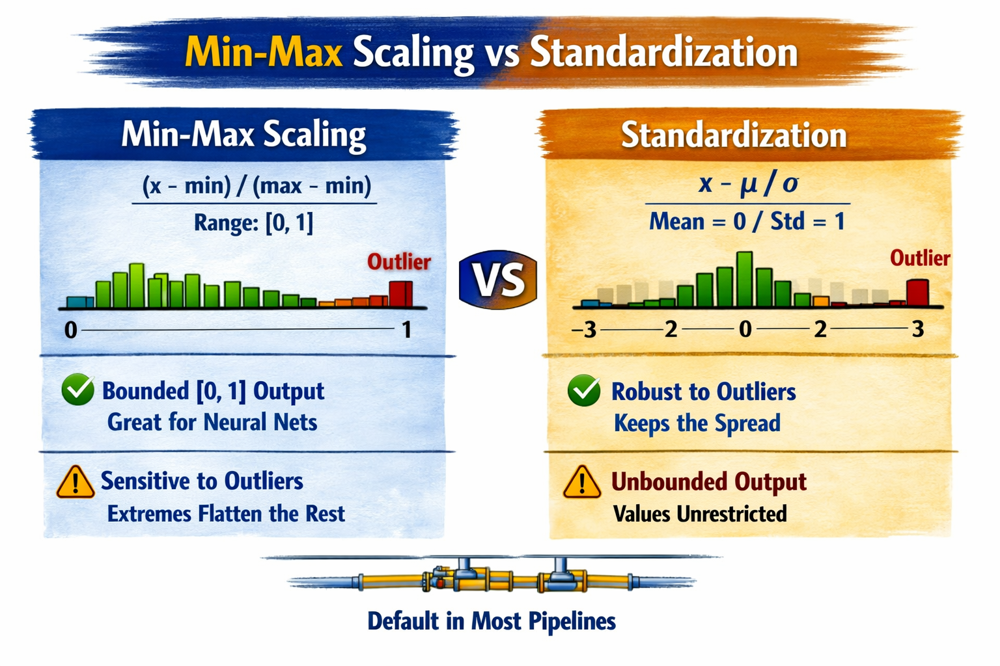
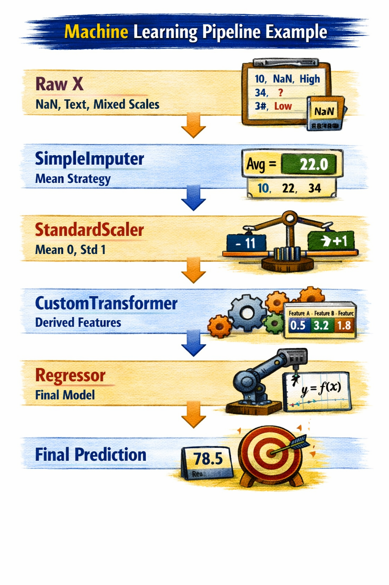

# Complete overview: from dataset to production model

## The Complete Project Journey
> 12 stages, one single goal: a robust and reproducible model

1. Loading & Exploration
2. Train/Test Split
3. Preparation
4. Feature Scaling
5. Transformers
6. Pipeline + Column Transformer
7. Models
8. Cross-Validation
9. Hyperparameters
10. Feature Importance
11. Final Evaluation
12. Save Model

---

## Dataset: California Housing (1990 US Census)
20,640 wards (rows)
- 10 attributes per ward
- 1 categorical column (ocean_proximity)
- NaN missing values ​​present

> Target: median_house_value

### 01. Loading and Exploration
**Initial Exploration Methods**
- `head()` First rows, quick view of the structure
- `info()` Data type and null values ​​by column
- `describe()` Statistics: mean, standard deviation, and percentiles
- `value_counts()` Frequencies in categorical variables
- `hist()` Visual distribution of each attribute
- `corr()` Correlations between numeric variables

---

### Visual Exploration
What the Data Reveals at First Glance

**Key Observations:**
- **NaN:** `total_bedrooms` contains missing values
- **Scaling:** Attributes with highly heterogeneous ranges require scaling
- **Cap:** `median_house_value` capped at $500,000 (affects the model)

---

### 02. Training / Test Split
**Before looking at the data, split the test**

> **DATA SNOOPING BIAS:** Bias that appears when observing the test set during development: the brain learns patterns and chooses models that fit that test, inflating apparent performance.

- **Random Shuffle:** Mixed score pool → 80/20 split.
  - ✅ Simple and fast
  - ⚠️ Changes with each run if the dataset is updated

- **Split by ID hash:** Each row → hash → stable bucket
  - ​​✅ Stable with dataset updates
  - ⚠️ Requires a unique and stable identifier

- **`train_test_split`:** sklearn → `random_state` fixed for replay
  - ✅ Reproducible via `random_state`, integrated into sklearn
  - ⚠️ Simple random, does not stratify by default.

---

## 03. Stratified Sampling
If `median_income` is predictive, the train and test groups must have the same income level distribution.

1. Create `income_category` in bins: [0 - 1.5, 1.5 - 3.0, 3.0 - 4.5, 4.5 - 6.0, 6.0+]
2. Use `StratifiedShuffleSplit` on `income_category`
3. Remove `income_category` after the split (auxiliary column)

> Key insight: Stratified sampling ensures that each subgroup of `income_category` is proportionally represented in both the train and test groups.

---

## 04. Data Preparation
`SimpleInput`: Fill in missing values

- **median:** Robust against outliers, recommended for numeric data
- **mean:** Sensitive to outliers, only for symmetrical distributions
- **most_frequent:** For categorical variables
- **constant:** Replaces with a fixed value (e.g., 0, 'missing')

## Median Imputation Example

### Original Data (Before Imputation)

| Feature 1 | Feature 2 | Feature 3 |
| --------- | --------- | --------- |
| 4.0       | NaN       | 2.1       |
| 3.5       | 1.8       | NaN       |
| NaN       | 2.0       | 1.9       |

**Method Used:** `SimpleImputer(strategy="median")`

### Data After Median Imputation

| Feature 1 | Feature 2 | Feature 3 |
| --------- | --------- | --------- |
| 4.0       | 1.9       | 2.1       |
| 3.5       | 1.8       | 1.9       |
| 3.75      | 2.0       | 1.9       |

### Imputed Values

| Missing Value Location | Replaced With (Median) |
| ---------------------- | ---------------------- |
| Feature 2, Row 1       | 1.9                    |
| Feature 3, Row 2       | 1.9                    |
| Feature 1, Row 3       | 3.75                   |

---

## 05. Categorical Encoding

Text to Numbers (Two-Way)

### OrdinalEncoder
```
NEAR BAY → 0
INLAND → 1
NEAR OCEAN → 2
<1H OCEAN → 3
```
- ✅ Compact: Single output column
- ⚠️ Implies numerical order: the model assumes INLAND > NEAR BAY
> Use when: categories with actual order (S/M/L)

### OneHotEncoder

| Location Category | NEAR_BAY | INLAND | NEAR_OCEAN |
| ----------------- | -------- | ------ | ---------- |
| NEAR BAY          | 1        | 0      | 0          |
| INLAND            | 0        | 1      | 0          |
| NEAR OCEAN        | 0        | 0      | 1          |

- ✅ No implicit order: Independent categories
- ⚠️ One column per category, explodes at high cardinality
> Use when: nominal categories recommended by default

> `fit()` learns the category vocabulary from the train
> `transform()` applies that encoding to any set (test, production)

---

## 05. Feature Scaling
**Why scale, and how to choose the method**
Models based on distances or gradients assume comparable scales.



---

## 06. Transformations
**Taming Skewed Distributions**
When Long Tails Distort Learning

### Square Root `sqrt(x)`
Moderate skewness, positive values

### Logarithm `log(x)`
Strong skewness, strictly positive values

### Bucketizing (Discritizing into Bins)
Multimodal or Non-Monotonic Variables

### RBF Kernel (Gaussian Similarity)
Encode 'closeness to the value of interest'

> `TransformedTargetRegressor`: Applies a transformation to the target (e.g., `log`) during training and automatically reverts upon prediction

---

## 07. Custom Transformers
**When sklearn doesn't provide what you need**

Two ways to extend the ecosystem: Is your transformation stateless (doesn't learn from the train)? → `FunctionTransformer`

Do you need `fit()`, to save statistics, models, or parameters? → `Custom Transformer`

### `FunctionTransformer`
Wrap for stateless functions
Input X → pure function `(np.log, sqrt...)` → Output X'

Without `fit()`, the same calculation always occurs

### `Custom Transformer`
Inherits from BaseEstimator + TransformerMixin
`BaseEstimator + TransformerMixin`
`fit(X, y)` learns from the train → `transform(X)` applies what it has learned
Compatible with Pipeline and GridSearchCV

---

## 07. Case Study
`ClusterSimilarity` Convert (lat, lon) into useful features.

1. `fit()`: KMeans finds K centroids (e.g., K=10) in the geographic coordinates.
2. `transform()`: For each district, calculate the RBF (Gaussian) similarity to each centroid.
3. output: K new columns: "similarity to cluster i"

> Captures geographic non-linearities that raw (lat, lon) cannot express for linear models.

---

## 08. Pipeline
**A single pipeline: raw data → prediction**
Each step receives the output of the previous one. `fit()` chains, as does `predict()`.



> **`Pipeline([...])`:** You explicitly name each step, useful for accessing hyperparameters.

> **`make_pipeline()`:** Automatic names in lowercase, more concise.

---

## 09. Column Transformer

**A different transformation for each column type**
DataFrame:
- longitude
- latitude
- median_age
- total_rooms
- median_income
- population
- ocean_proximity

### Numeric:
`SimpleImputer(median)` → `StandardScaler`

### Geographic:
`ClusterSimilarity`

### Categorical:
`SimpleImputer(most_frequent)` → `OneHotEncoder`

Final array: hstack of all forms

> `make_column_transformer` and `make_column_selector` simplify the syntax and allow you to select columns by dtype.

---

