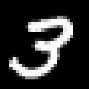
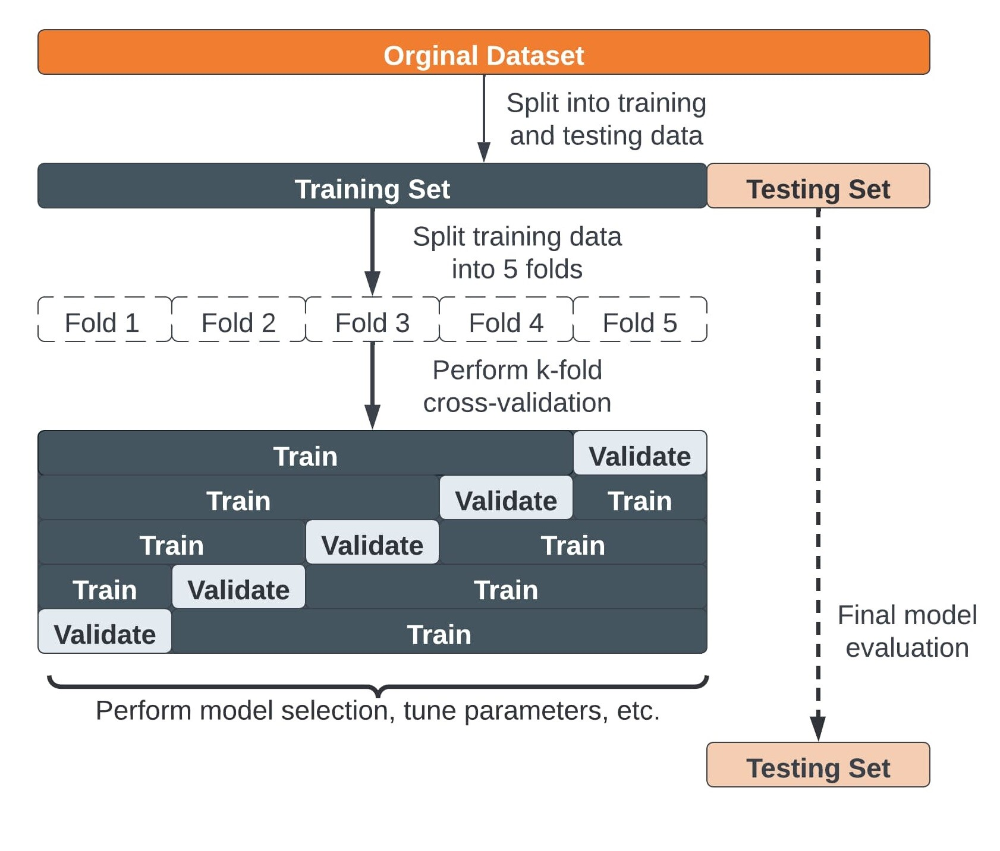
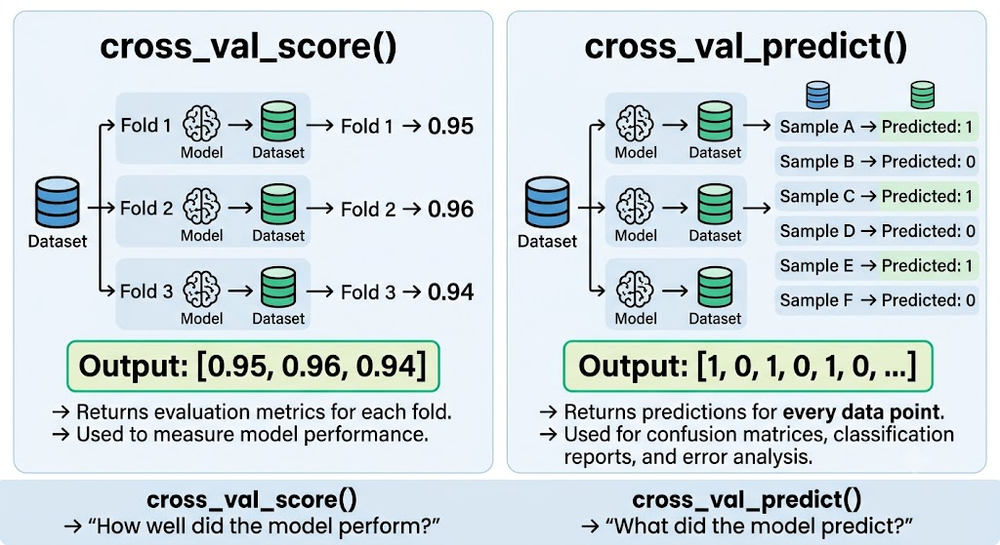
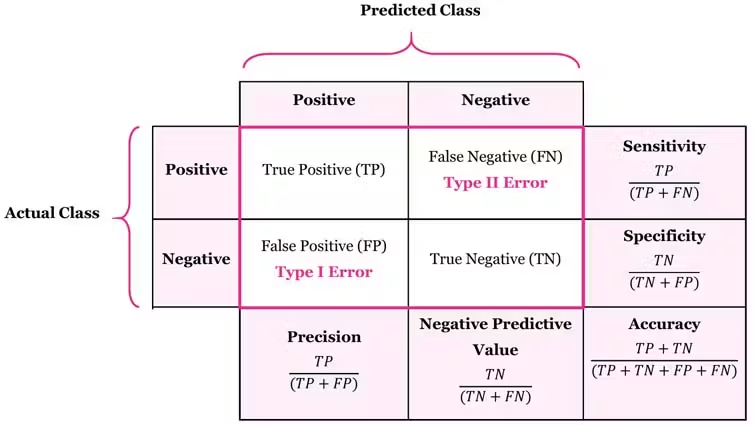
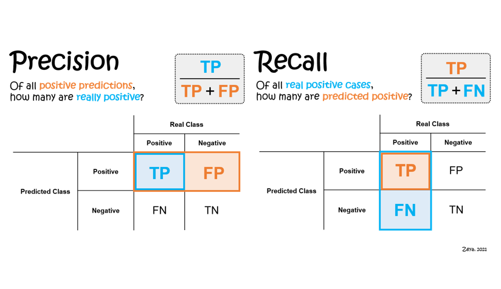

# Matrix Confusion
## Precision and Recall
How to truly measure a classifier: beyond **accuracy**, to the **F1 score.**

- cross-validation
- precision
- recall
- F1 score

---

## A basic example: Is a binary classifier a 3?
Handwritten MNIST digits. The simplest possible task: answer yes or no.

- **Yes** it is a 3 → 1
- **No** it is a 3 → 0

> Based on this example we will build **the entire** class: matrix, precision, recall and F1.

---

## `cross_val_score()` VS `cross_val_predict()`
Both use the same cross-validation strategy internally. The difference lies in what they return at the end.

### `cross_val_score()`
Returns an evaluation metric. How well it performed.
> [0.95, 0.96, 0.94]

### `cross_val_predict()`
Returns the predictions. What it predicted for each data point.

> [1, 0, 1, 0, 1, 0, ...]

> ### One stores scores, the other predictions.

---

## Cross-Validation
A way to evaluate a model **making the most of your data**.

- **Instead of evaluating only once...** splitting the data 80/20 and being at the mercy of which 20% you randomly get.

- **...we evaluate multiple times**, training and testing in several rounds, rotating which part we use for validation. This way we don't depend on chance.

- **NOTE: a new model in each round** It's not just one model: in each fold, a new model is trained **from scratch** and tested with data it **hasn't seen**.

### k-fold, step by step
You choose a number **k** and divide the data into **k** equal groups (**folds**). Then you perform **k** rounds.

Example with k = 3, folds: A, B, C
- Round 1: train [B, C] → test [A]
- Round 2: train [A, C] → test [B]
- Round 3: train [A, B] → test [C]

> Each fold is tested **exactly once**, and always with data that the model **did not see** during training.

---

## Same machinery, different output

---

## Confusion Matrix
A table that shows **how many times your model was correct**, how many times it was wrong, **and in what ways**.

---

## Why "confusion matrix"?
Because it shows exactly **which classes the model is confusing**.
Example: Classifying digits 0-9, you might see:
- 8 → 0: Confuses many 8s with a 0
- 3 → 5: Confuses many 3s with a 5
- 7 → 1: Confuses many 7s with a 1

> With 10 classes, the matrix is ​​**10x10**

## MNIST Confusion Matrix (Example)

Rows = Actual Label  
Columns = Predicted Label

| Actual \ Pred | 0 | 1 | 2 | 3 | 4 | 5 | 6 | 7 | 8 | 9 |
|--------------|---|---|---|---|---|---|---|---|---|---|
| **0** | **975** | 0 | 1 | 0 | 0 | 1 | 2 | 0 | 1 | 0 |
| **1** | 0 | **1125** | 3 | 1 | 0 | 0 | 2 | 1 | 3 | 0 |
| **2** | 2 | 4 | **1005** | 6 | 2 | 1 | 3 | 5 | 4 | 0 |
| **3** | 0 | 0 | 8 | **980** | 0 | 12 | 0 | 4 | 4 | 2 |
| **4** | 1 | 0 | 1 | 0 | **950** | 0 | 4 | 2 | 1 | 23 |
| **5** | 2 | 0 | 0 | 14 | 1 | **865** | 4 | 1 | 4 | 1 |
| **6** | 3 | 2 | 0 | 0 | 2 | 3 | **945** | 0 | 3 | 0 |
| **7** | 0 | 4 | 8 | 2 | 1 | 0 | 0 | **995** | 1 | 17 |
| **8** | 2 | 1 | 2 | 4 | 2 | 3 | 2 | 1 | **952** | 5 |
| **9** | 1 | 0 | 1 | 2 | 15 | 1 | 0 | 8 | 3 | **978** |

### Interpretation

**Correct Predictions (Diagonal)**
Examples:
- Actual 0 → Predicted 0 = **975**
- Actual 1 → Predicted 1 = **1125**
- Actual 9 → Predicted 9 = **978**

These values on the diagonal represent correct classifications.

**Common Misclassifications**
Examples:
- Actual 4 → Predicted 9 = **23**
- Actual 9 → Predicted 4 = **15**
- Actual 3 → Predicted 5 = **12**
- Actual 5 → Predicted 3 = **14**
- Actual 7 → Predicted 9 = **17**

These off-diagonal values represent model mistakes.

**Key Takeaway**
- Large values on the diagonal = good model performance.
- Large values outside the diagonal = classes the model confuses.
- MNIST models commonly confuse visually similar digits such as:
  - 4 ↔ 9
  - 3 ↔ 5
  - 7 ↔ 9

---

## Why does it matter? Accuracy can be deceiving.

A cancer detector that **always says "no cancer"...**

### Cancer Detection Example: Why Accuracy Can Be Misleading

**Scenario**

* Total patients: 1000
* Have cancer: 10
* Do not have cancer: 990

The model always predicts **"No Cancer"**.

**Confusion Matrix**

| Reality \ Prediction | Cancer | No Cancer |
|---------------------|---------|-----------|
| **Cancer** | 0 (TP) | 10 (FN) |
| **No Cancer** | 0 (FP) | 990 (TN) |

**Metrics**

* **Accuracy** = (TP + TN) / Total
  = (0 + 990) / 1000
  = **99.0%**

* **Precision** = TP / (TP + FP)
  = 0 / (0 + 0)
  = **0%** (undefined in practice)

* **Recall (Sensitivity)** = TP / (TP + FN)
  = 0 / (0 + 10)
  = **0%**

* **F1 Score** = 0

## Interpretation

At first glance, the model looks excellent:

> Accuracy = 99%

However, the model completely fails at its actual purpose:

* Detected cancer cases: **0**
* Missed cancer cases: **10**
* Recall: **0%**

The model achieves high accuracy only because cancer is extremely rare (1% prevalence). Simply predicting **"No Cancer"** for everyone produces a high accuracy score while providing zero medical value.

**Accuracy alone can be misleading for imbalanced datasets.**

In problems such as:

* Cancer detection
* Fraud detection
* Defect detection
* Rare disease diagnosis

Metrics like **Recall, Precision, F1 Score, ROC-AUC, and the Confusion Matrix** are often much more informative than Accuracy.

> ⚠️ I don't detect **a single** case of cancer. The matrix details it instantly.

---

## Quick Rule of Mind
When you see a confusion matrix, always read it like this:
1. Rows = reality
2. Columns = prediction
3. Diagonal = correct prediction
4. Off-diagonal = errors.

| Reality \ Prediction | Cancer | No Cancer |
|---------------------|---------|-----------|
| **Cancer** | ✅ TP | ❌ FN |
| **No Cancer** | ❌ FP | ✅ TN |

> This information yields precision, recall, and F1.

---

## Precision

Of all the images the model predicted as **"3"**, what fraction were actually **3**?

Precision measures how **reliable** the model's positive predictions are.

### MNIST Example: "Is it a 3?"

**Objective:**

Build a classifier that answers:

> **"Is this image a 3?"**

- **Positive (Yes)** → The image is a digit **3**
- **Negative (No)** → The image is any other digit

### Example Predictions

| Image | Actual Label | Prediction |
|---------|------------|------------|
| 3 | Yes | Yes |
| 3 | Yes | Yes |
| 3 | Yes | No |
| 8 | No | Yes |
| 1 | No | No |
| 7 | No | Yes |

For Precision, we only look at the images predicted as **"3"**:

| Predicted as "3" | Actually a 3? |
|------------------|--------------|
| Yes | ✅ |
| Yes | ✅ |
| Yes | ❌ |
| Yes | ❌ |

- **True Positives (TP)** = 2
- **False Positives (FP)** = 2

### Precision Formula

$Precision = \frac{TP}{TP + FP}$

Substituting the values:

$Precision = \frac{2}{2 + 2}$

$Precision = \frac{2}{4} = 0.50 = 50\%$

### Interpretation

> When the model says **"It's a 3"**, it is correct about **50% of the time**.

---

## Accuracy Only Punishes **False Alarms**

- ### It punishes: false positives. It doesn't care how many 3s **missed**. It only cares that what I'm stating is correct.

- ### The cheating model: It says "3" only once, with absolute certainty, and is right → **100%** accuracy... ignoring all the other 3s.

> In short: accuracy measures the **quality** of positive predictions, not the **quantity**. It's about "when I speak, am I right?", not "am I talking about everything I should?"

---

## Recall

Of all the images that were actually **3**, how many did the model successfully identify as **"3"**?

Recall measures the model's ability to **find all positive cases** and avoid missing them.

### MNIST Example: "Is it a 3?"

**Objective:**

Build a classifier that answers:

> **"Is this image a 3?"**

- **Positive (Yes)** → The image is a digit **3**
- **Negative (No)** → The image is any other digit

### Example Predictions

| Image | Actual Label | Prediction |
|---------|------------|------------|
| 3 | Yes | Yes |
| 3 | Yes | Yes |
| 3 | Yes | No |
| 8 | No | Yes |
| 1 | No | No |
| 7 | No | Yes |

For Recall, we only look at the images that are **actually 3**:

| Actual 3 | Detected as 3? |
|-----------|---------------|
| Yes | ✅ |
| Yes | ✅ |
| Yes | ❌ |

- **True Positives (TP)** = 2
- **False Negatives (FN)** = 1

### Recall Formula

$Recall = \frac{TP}{TP + FN}$

$Recall = \frac{2}{2 + 1}$

$Recall = 0.67 = 66.7\%
$
### Interpretation

> The model detected **66.7% of all actual 3s** and missed **33.3%** of them.

---

## Precision vs. Recall

### Precision
**Question**: Of the 3s I marked, how many were correct?
**Penalty**: False Positives (FP)
**Look at the matrix**: The **column** "Predicted 3"

### Recall
**Question**: Of the actual 3s, how many were correctly predicted?

**Penalty**: False Negatives (FN)
**Look at the matrix**: The **row** "Actual 3"

> The flawed model: **100%** precision but terrible recall. If there were 100 3s and it detected 1 → recall **1%** _The recall details this_

