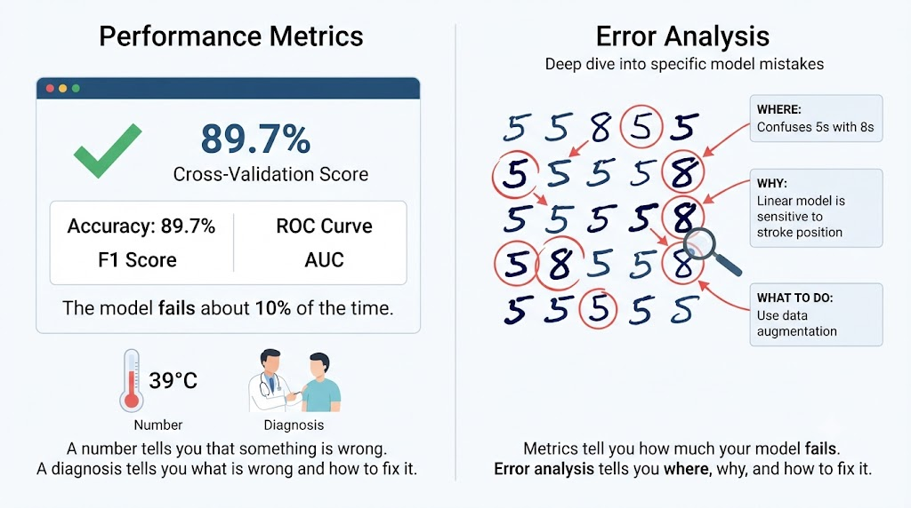
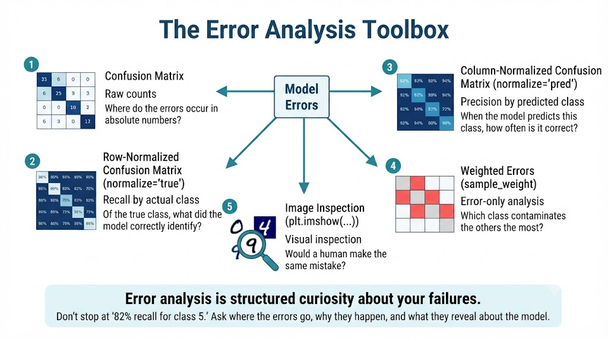
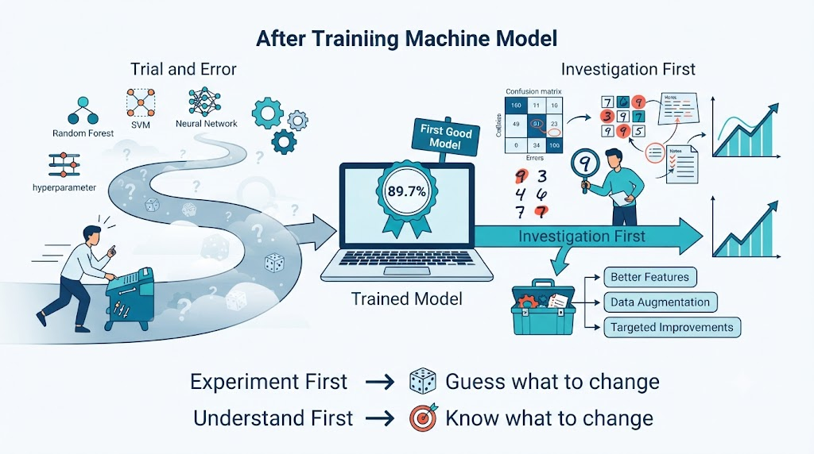
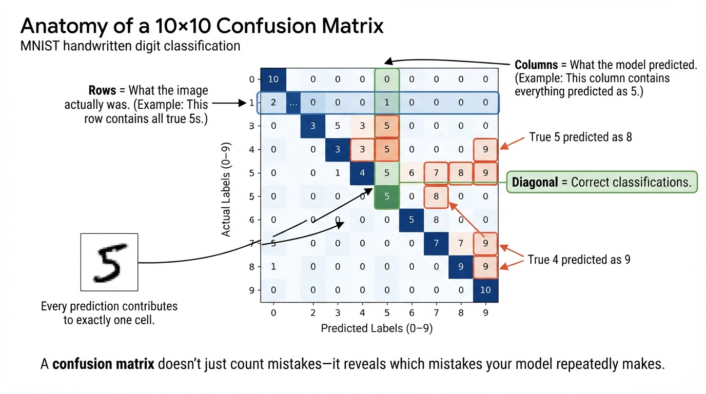
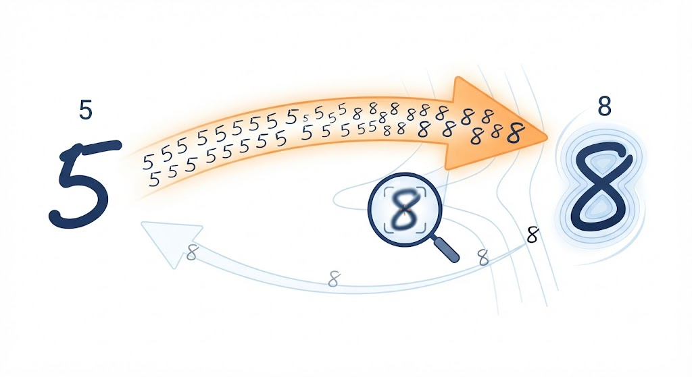
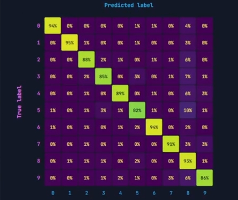
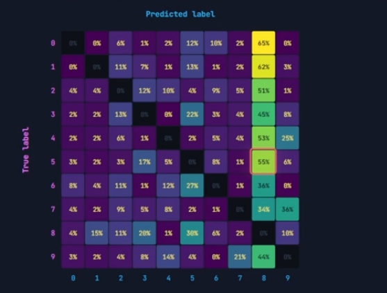
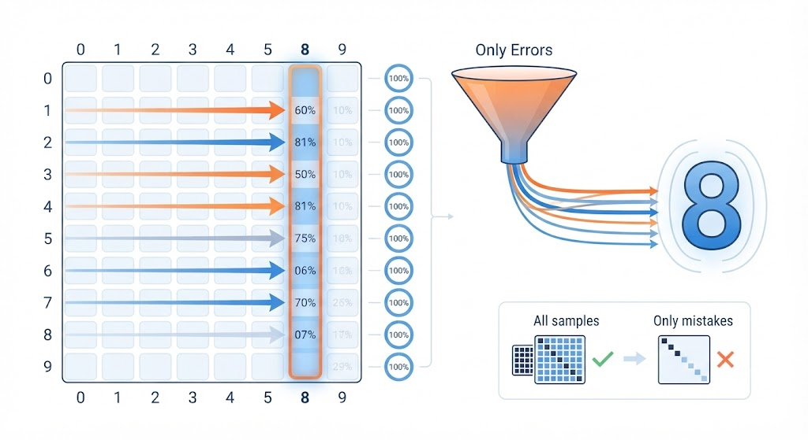
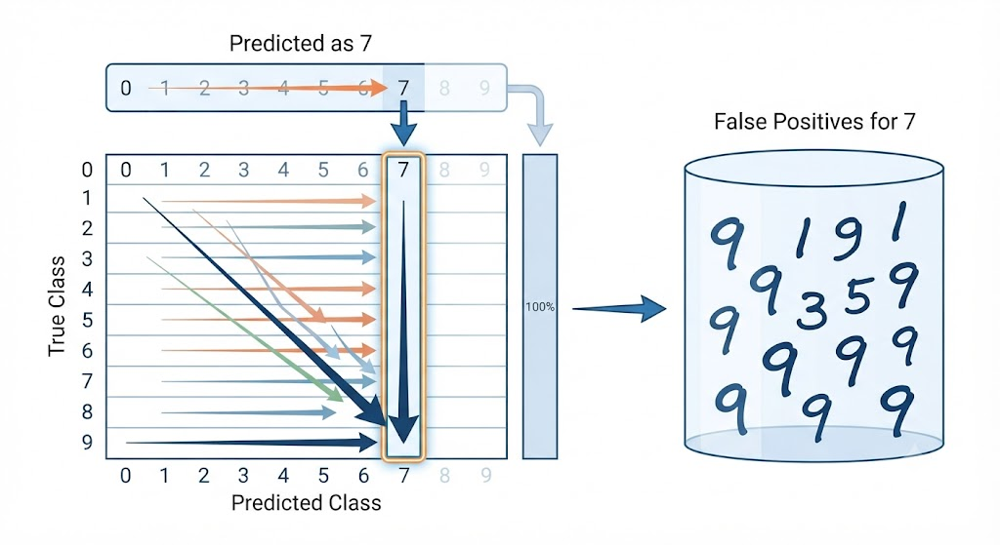

# Error Analysis (Scikit-learn)
Not just **how** your model fails (where and why).
Dissecting the `confusion matrix` with scikit-learn

- SGDClassifier
- MNIST: 60,000 images
- Accuracy: 89.7%

---

## A number is not a diagnosis (Definition)
Error analysis = studying **which** errors your model makes and **why** (don't just focus on the quantity).



---

## The 5 Typical Tools (Toolbox)
Each one answers a different question about the same errors.

### confusion_matrix
Raw, absolute counts
> Answers: where the errors fall in **absolute** terms.

### `normalize = true`
by row (actual class), row total
> Answers: **recall** of the actual errors, what did it find?

### `normalize = "pred"`
by column (predicted), column total
> Answers: **accuracy** of what it predicted, what was correct?

### `sample_weight`
errors only, diagonal with weight 0
> Answers: Which class **contaminates** the others the most.

### `plt.imshow(...)`
individual inspection, would a human fail?

> Answers: **Reasonable** error or **structural** failure?

Error analysis = **structured curiosity** about your failures. Don't accept **"82% recall is 5s"** as an isolated fact (ask **where** those errors are going and **what mechanism** in the model explains it).




---

## We're at 89.7% (Now what?)
A promising SGDClassifier with scaled data. Two possible paths

### Current status: 89.7% accuracy (cross-val)
- **MNIST:** 60,000 train images
- **`StandardScaler`:** scaled features
- **`SGDClassifier`:** final, multi-class model

89.7% How do I improve?

- Reflexive approach: Try another model (Random Forest?, SVM?, tuning?) → Limited gain: if the problem is in the data or features **🎲blindly**

- Today we're going this way: Error analysis: study the errors first → Model or dataset?: that distinction changes everything you do afterward **🎯 directed**

> ⚠️ If **40%** of your errors come from a systematic confusion (5↔8), **no new hyperparameter will fix it**.



---

## Anatomy of the Confusion Matrix
What the model **predicted** vs what **actually was** (counting every combination)



---
## Rows don't carry the same weight (the counting trap)

*"Which digit does the model recognize the worst?"*  
With raw counts, **you cannot answer.**

| Real digit | p0 | p1 | p2 | p3 | p4 | p5 | p6 | p7 | p8 | p9 | Total |
|------------|---:|---:|---:|---:|---:|---:|---:|---:|---:|---:|------:|
| **1** | 0 | 6400 | 37 | 24 | 4 | 44 | 4 | 7 | 212 | 10 | **6742** |
| **5** | 27 | 15 | 30 | 168 | 53 | 4444 | 75 | 14 | 535 | 60 | **5421** |

### △ ≈ 1300

Difference in the number of examples between classes. This is **normal**; MNIST simply doesn't contain the same number of samples for every digit.

### Comparing raw counts = comparing different denominators

- Digit **1**: **6400 / 6742**
- Digit **5**: **4444 / 5421**

Does **6400 > 4444** mean that digit **1** performs better?

**You don't know.** Each row has a different total number of samples.

The fair comparison is to use **percentages**, not raw counts.

> **Solution:** Divide every cell by the total of its row → `normalize="true"`.

---

## Dividing by the row calculates **Recall** (`normalize="true"`)

Instead of asking:

> *"How many images were classified correctly?"*

we ask:

> *"Of all the **real** images of a class, what percentage received each prediction?"*

Each row is divided by its own total, so every row becomes a probability distribution that sums to **100%**.

```python
ConfusionMatrixDisplay.from_predictions(
    y_train,
    y_train_pred,
    normalize="true",
    values_format=".0%"
)
```

### Reading the normalized confusion matrix

- Every **row adds up to 100%**.
- The **diagonal** now represents the **recall** of each class.
- Off-diagonal cells show **where the model confuses that digit**.

For example:

- **Recall(1) ≈ 95%** → the model correctly recognizes almost every real **1**.
- **Recall(5) ≈ 82%** → **5** is the most difficult digit for the model.

### Confusion is directional

One interesting observation is that confusion is **not symmetric**.

- **5 → 8 ≈ 10%**
- **8 → 5 ≈ 2%**

The model mistakes many more **5s as 8s** than **8s as 5s**.

> Confusing **A → B** is **not** the same as confusing **B → A**. Each row answers a different question because it starts from a different **true class**.

---

## Is the matrix not symmetric? This is normal (Asymmetry)

It's not a bug: the matrix doesn't measure "similarity between classes," it measures the behavior of a **decision function**, and that function can have **directional biases**.

### Same pair of classes, two VERY different numbers
same division mechanism, different inputs.


5 → 8: 9.9%
535 of 5421

8 → 5: 2.2%
126 of 5851

### The 8 is a "sink"
A **poorly written 5**, with the lower arc closing, looks like an 8. But a **well-written 8** has two loops that a 5 **never** has → the model rarely confuses an 8 with a 5.

### Classifier bias
If the model has a **slight preference** for predicting "8" (class frequency, boundary geometry), all **ambiguous** cases fall on the side of 8.

> **Practical consequence**: ALWAYS read the matrix in both directions: by row and by column. One direction only gives you half the story.



---

## Focus only on mistakes (`sample_weight`)

A confusion matrix is usually dominated by correct predictions (the diagonal), making errors harder to notice.

By assigning a weight of **0** to correct predictions and **1** to mistakes, the visualization highlights only the errors.

### Error mask

```python
sample_weight = (y_train_pred != y_train)
# Mistake  -> weight = 1
# Correct  -> weight = 0
```

### Example

| True | Predicted | Weight |
|------|-----------|-------:|
| 5 | 5 | 0 |
| 5 | 8 | 1 |
| 3 | 3 | 0 |
| 5 | 5 | 0 |
| 5 | 8 | 1 |

Only the incorrect predictions contribute to the matrix.

### Why the percentages change

**Before**

5 → 8 = **10%** of all samples labeled as **5**.

**After hiding correct predictions**

5 → 8 = **55%** of the mistakes made on class **5**.

normalize = "true" with correct answers (the slash flattens out errors)


The errors are **renormalized**, so the mistakes in each row add up to **100%**.


The percentages are **recalculated**

---

## Where do the errors go? (Errors per row)

Instead of asking **"How often is a 5 confused with an 8?"**, this view asks a different question:

> **Once the model has already made a mistake, which wrong class does it choose?**

For each row, the errors are redistributed so they add up to **100%**.

### Example: destination = 8

Read **column 8** from top to bottom.

- 0 → 8 : **65%**
- 1 → 8 : **62%**
- 2 → 8 : **51%**
- 3 → 8 : **45%**
- 4 → 8 : **53%**
- 5 → 8 : **55%**
- 6 → 8 : **36%**
- 7 → 8 : **34%**
- 9 → 8 : **44%**

### What does this reveal?

Across almost every class, **8 is the most common destination once an error occurs.**

This consistent pattern suggests that **8 acts like a "sink"**, attracting ambiguous predictions from many different classes.

> ⚠️ **55% does not mean that 55% of all 5s become 8s.**
>
> It means that **among the predictions that were already wrong for class 5**, **55% ended up being predicted as 8**.



---

## Who contaminates each prediction? (Errors per column)

This view answers a different question:

> **If the model predicted a class and was wrong, what was the true class?**

Instead of following the errors made by a true class, we now inspect **who contributes the false positives** for a prediction.

### Example: prediction = 7

Among everything the model predicted as **7**, keep only the incorrect predictions.



| True class | Count |
|------------|------:|
| 0 | 6 |
| 1 | 7 |
| 2 | 36 |
| 3 | 40 |
| 4 | 27 |
| 5 | 14 |
| 6 | 3 |
| 9 | 179 |

Total false positives = **322**

### What does this reveal?

More than half of the incorrect predictions labeled as **7** actually came from **9**.

**179 / 322 = 56%**

So, when the model predicts **7** and is wrong, the most likely true digit is **9**.

> Here, the denominator is **all false positives for the predicted class**. Each column is normalized independently, so the percentages describe **where the incorrect predictions came from**, not how often the model predicts that class.

---

## Same cell, two different questions

The cell **(true = 9, predicted = 7)** contains the **same 179 images** in both matrices.

**Nothing changes in the numerator.**

Only the **denominator** changes.

### View 1: Where do the errors of 9 go?

```
179 / 842 = 21%
```

- Numerator: the same **179** images.
- Denominator: **all mistakes made on class 9** (false negatives).

> **Among the mistakes involving digit 9, 21% were predicted as 7.**

---

### View 2: Who contaminates prediction 7?

```
179 / 322 = 56%
```

- Numerator: the same **179** images.
- Denominator: **all incorrect predictions labeled as 7** (false positives).

> **Among the incorrect predictions of 7, 56% actually came from 9.**

---

### Key idea

The data is identical.

Only the **question** changes.

- **By row:** *Where do the errors go?*
- **By column:** *Where did the wrong predictions come from?*

That's why **21%** and **56%** are both correct—they describe **different perspectives of the same errors.**