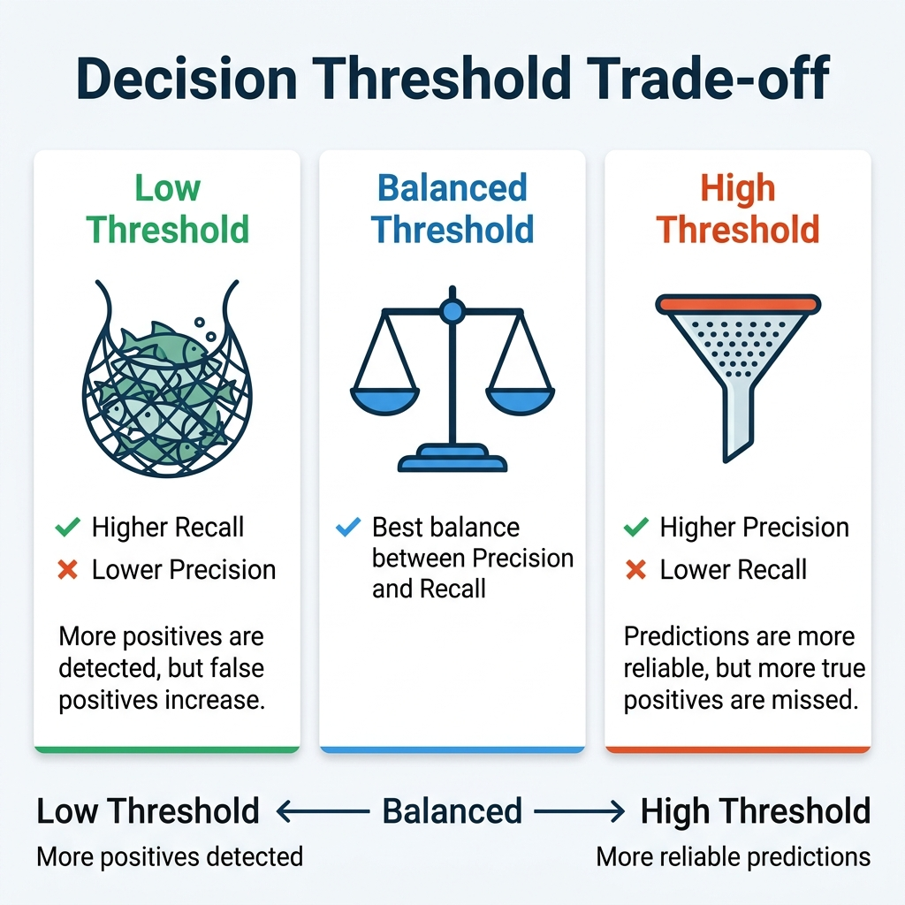

# F1-Score (Trade-off & thresholds)
How to combine precision and recall into a single metric, why *trade-off* exists, and how the **threshold knob** controls both.

---

## Two numbers complicate the comparison
With precision and recall measured separately, which classifier is better? It's not easy to argue.

- Classifier A:
  - precision 85%
  - recall 78%

- Classifier B:
  - precision 80%
  - recall 82%

> Which is better? 🤔

### The F1 test solves it
It collapses the two numbers into **one**. This allows you to rank directly.

- A → F1 = 0.81
- B → F1 = 0.81

Useful when you need to **choose between models** quickly and there's no reason to prioritize one metric over the other

---

## The **Harmonic Mean** of Precision and Recall
Designed so that the result is only high when **both** are high simultaneously.

$$F_1 = 2 * \frac{\text(precision * recall)}{\text(precision + recall)}$$

> Unlike the normal average, the harmonic mean **gives much more weight to the low value**. If one metric is poor, the F1 score plummets, even if the other is excellent.

### Example
**precision 90%**

**recall 10%**

Normal Average:
$$\frac{(90+10)}{2} = 50\%$$
50% misleading ✖️

**F1 (harmonic mean)**
$$F_1 = 2 * \frac{(0.9 * 0.1)}{(0.9 + 0.1)} = 18\%$$
18% reflects the truth ✅

---

## F1 favors **balance**... and that's not always what you want. It rewards classifiers with **similar** accuracy and recall. Which to prioritize **depends on the problem**.

### Child-Friendly Videos (Content Moderation)
**You prioritize accuracy**
> It's better to reject many good videos than to let **one bad one** through. Each False Positive is tolerable; a False Negative is unacceptable.

### Medical Diagnosis
**You prioritize recall**
> Don't miss **any real** cases. False Positives are ruled out later with follow-up tests; an undetected case can be fatal.

---

## The threshold is a knob (and moves in both opposite directions)
The classifier calculates a score and compares it to a threshold. If **the score is greater than or equal to the threshold**, "it's a 3". Moving this single knob affects both metrics.

### Raising the Threshold
Becoming **demanding** (only very high scores)
- ✅ **Accuracy increases:** Almost everything you claim is correct → FP decreases.

- ✖️ **Recall decreases:** Many questionable 3s are missed → FN increases.

### Lowering the Threshold
Becoming **permissive** (you accept moderate scores)
- ✅ **Recall increases:** You catch almost all 3s, even the questionable ones → FN decreases.

- ✖️ **Accuracy decreases:** Other digits slip through (8, 6...) → FP increases.

> The same knob you use to **catch more 3s** is the one that lets in _more errors_. What you gain in one, you pay for in another. That's the **trade-off**.



---

## `predict()` vs `decision_function()` They ultimately achieve the same result. The difference lies in the **control**.

### `decision_function()` It gives you the **raw score**, without making any decision yet.

```python
clf.decision_function(X)
→ 2164.22
```

> You use it when you want to **choose the threshold** yourself.

### `predict()` It takes the score, compares it to a **fixed threshold of 0**, and makes a decision.
```python
clf.predict(X)
→ True
```

>
``` python
predict() = decision_function() > 0
```

---

## How to choose the threshold with `precision_recall_curve`
Instead of testing ONE threshold, it tests **many** and tells you the precision and recall you would get with each one.

### Step 1: Scores for all images
```python
y_scores = cross_val_predict(sgd_clf, X_train, y_train, cv=3, method="decision_function")
```

### Step 2: Precision and Recall for ALL thresholds
```python
precisions, recalls, thresholds = precision_recall_curve(y_train_5, y_scores)
```

> Returns three lists: precision, recalls, thresholds.

---

## Extremely high precision is **easy...**
You just raise the threshold enough and that's it. But in the example from the book, that **90% precision** came with only **~48% recall**:** it misses **more than half** of the 5

### Precision: 90% → Recall: ~48%

> ## If someone says **"let's get to 99% precision",** you have to ask:
> ### with what recall?

> Extremely high precision is useless if the **recall rate is very low**.