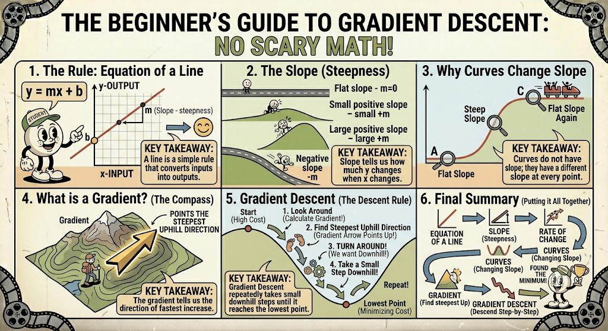
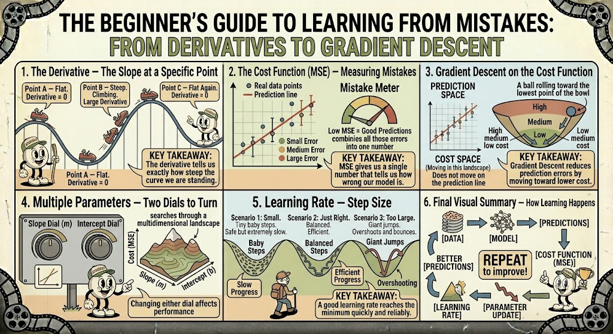

---

## 1. The Equation of a Line ($y = mx + b$)

Think of this equation as a "recipe" for drawing a straight line on a graph.

* **$x$:** The input (like the time you've been driving).
* **$y$:** The output (like the total distance you've traveled).
* **$m$ (The Slope):** This tells you how steep the line is.
* **$b$ (The Intercept):** This is where the line starts on the vertical axis when $x$ is zero (like your starting head-start).

---

## 2. Slope ($m$): How $y$ changes when $x$ changes

The slope is simply the "steepness." It answers: "For every one step I move to the right, how many steps do I move up or down?"

* **Steep slope:** You go up a lot for every step right.
* **Flat slope:** You don't go up at all.
* **Negative slope:** You go down instead of up.

---

## 3. Rate of Change: Real-World Intuition

"Rate of change" is just a fancy way of saying **speed**.

* **Climbing a hill:** If you climb 5 meters of height for every 10 meters of horizontal distance, your rate of change is 0.5.
* **Price increase:** If a coffee cup price goes up $1 every 2 years, the "rate of change" is $0.50 per year.

---

## 4. Why Straight Lines are Constant

A straight line is "well-behaved." Because it is straight, the angle of the hill never changes. If you are halfway up the hill, the steepness is exactly the same as it was at the bottom. The slope ($m$) is a fixed number that never changes.

---

## 5. Why Curves Change Slope

A curve, like a roller coaster, is different. At the bottom of a dip, it is flat. On the way up, it gets steeper. At the top, it flattens out again.

Because the steepness changes constantly, we don't have one single slope for the whole curve. Instead, we have a **different slope at every single point**. If you stood at any spot on that curve, your personal "steepness" would depend entirely on exactly where you are standing.

---

## 6. Gradient: The Direction of Steepest Increase

Think of a **gradient** as a compass for a hiker. Imagine you are lost in a mountain range at night. You can't see the whole map, but you can feel the ground beneath your feet.

The **gradient** is the direction that feels steepest if you were to walk "up." It tells you: "If you want to go up as fast as possible, move in this direction."

---

## 7. Gradient Descent: Moving Toward the Minimum

Now, imagine you want to find the **bottom** of that valley. You don't want the steepest *increase* (which is the gradient); you want the opposite.

**Gradient Descent** is a simple strategy:

1. Look at the ground beneath your feet.
2. Find the direction of the steepest *uphill* (the gradient).
3. Turn 180 degrees (the opposite direction).
4. Take a small step downhill.
5. Repeat until the ground feels flat.

By taking small, repetitive steps in the opposite direction of the gradient, you eventually arrive at the very bottom—the "minimum" point. In machine learning, this is how computers "learn" to make the fewest errors possible!

---

## 8. The Derivative: The Slope at a Specific Point

Remember how a straight line has a constant slope? A curve is different—it’s like a roller coaster. At any given moment, your "steepness" depends entirely on where you are on the track.

The **derivative** is simply the math term for "the slope at one specific point."

* **At the bottom (Point A):** The track is flat. You aren't going up or down. The slope (derivative) is **zero**.
* **On the side (Point B):** The track is tilted. You are climbing. The slope (derivative) is **large**.
* **At the peak (Point C):** For a split second before you go over, you are level again. The slope (derivative) is **zero**.

**Key Takeaway:** The derivative tells us exactly how steep the hill is right where we are standing.

---

## 9. The Cost Function (MSE)

A machine needs to know if it's doing a good job. We measure this with a "score" called **Mean Squared Error (MSE)**. Think of it as a **"Mistake Score."**

If we are predicting house prices:

* **Current Price:** $300,000
* **Predicted Price:** $280,000
* **Error:** $20,000 (We are off by $20k)

MSE adds up all those vertical error lines. If the lines are short, the MSE is low (great!). If the lines are long, the MSE is high (bad!).

**Key Takeaway:** The MSE is just a way to put a single number on how wrong our guess is.

---

## 10. Gradient Descent on the Cost Function

Gradient descent doesn't happen on the "prediction line." Instead, it happens on a **"Cost Landscape."** Imagine a bowl-shaped valley where the height represents how many mistakes the computer is making.

* **High Cost:** You are high up on the bowl rim (many mistakes).
* **Low Cost:** You are near the bottom of the bowl (few mistakes).

**Key Takeaway:** Gradient descent is just a ball rolling toward the bottom of the bowl to find the lowest possible number of mistakes.

---

## 11. Multiple Parameters

Usually, we aren't just adjusting one thing. In $y = mx + b$, we have to find the best $m$ **and** the best $b$ at the same time.

Imagine you are adjusting two dials on a machine to get the best result. Moving one dial changes the slope, and the other changes the starting height.

**Key Takeaway:** With more parameters, the landscape becomes 3D. The computer searches this terrain for the best combination of values ​​to reach the lowest cost.

---

## 12. Learning Rate: The Step Size

The **learning rate** is how far you move in each step toward the bottom.

* **Too Small:** You take tiny, baby steps. You will eventually get to the bottom, but it takes forever.
* **Just Right:** You take confident, efficient steps that reach the bottom quickly and settle there.
* **Too Large:** You take giant, clumsy leaps. You jump right over the bottom and end up on the other side of the valley, bouncing back and forth.

---

## Final Visual Summary: How Learning Happens

1. **Cost Function** calculates how wrong we are.
2. **Gradient** tells us the direction to move to reduce that error.
3. **Learning Rate** tells us how big of a step to take in that direction.
4. **Repeat** until we reach the minimum error!