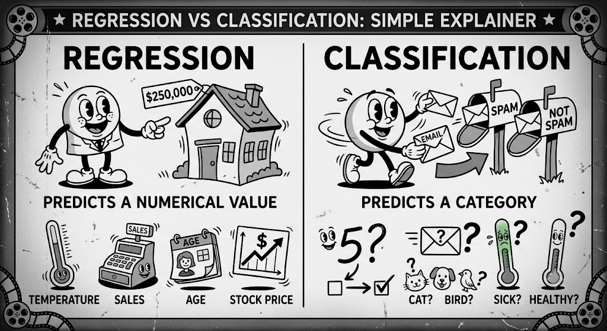
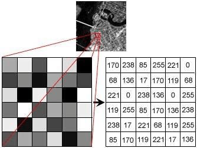
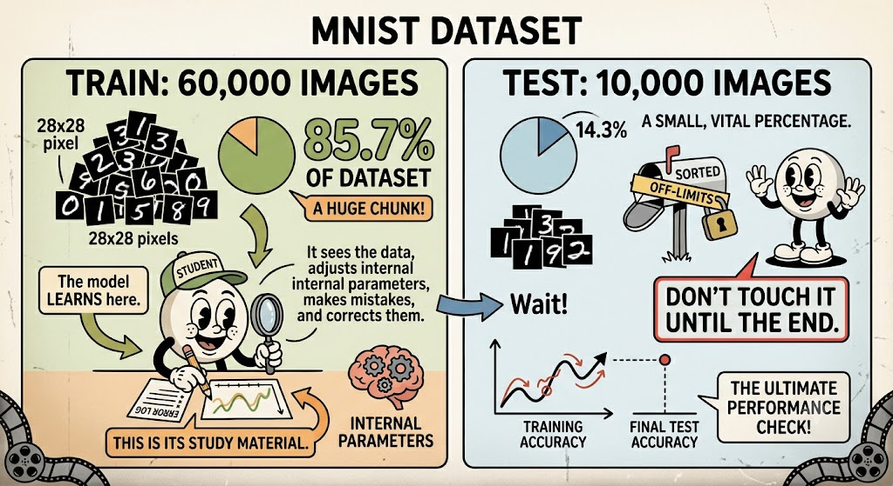
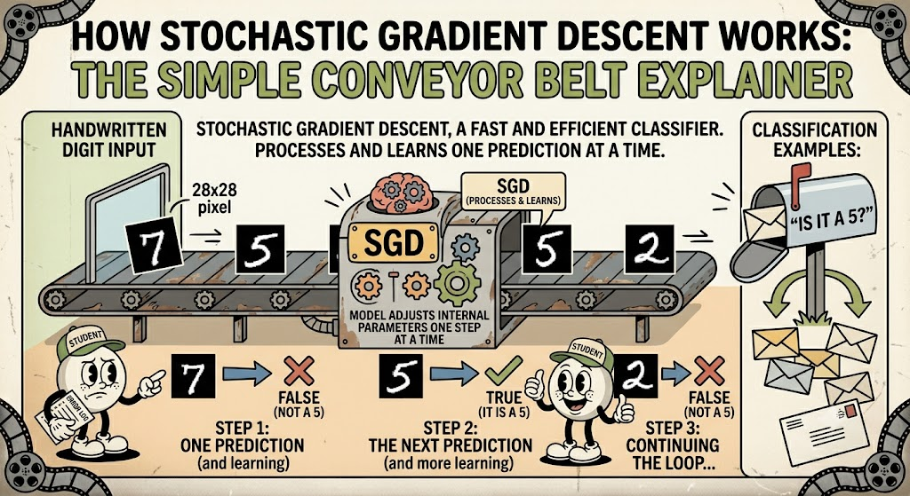
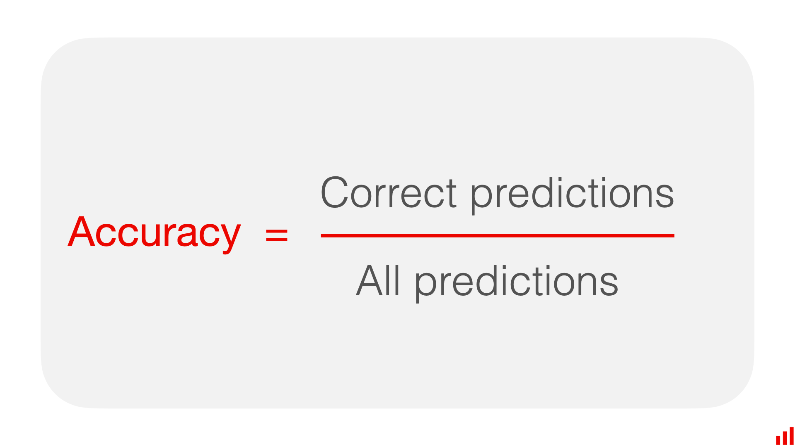
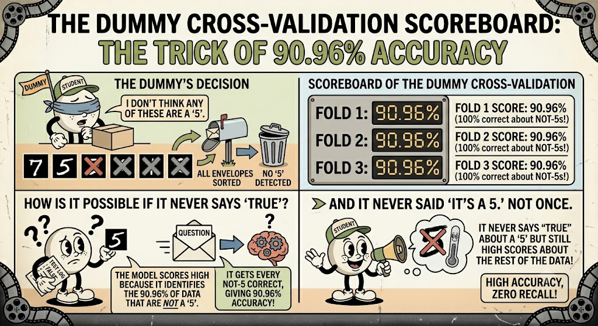
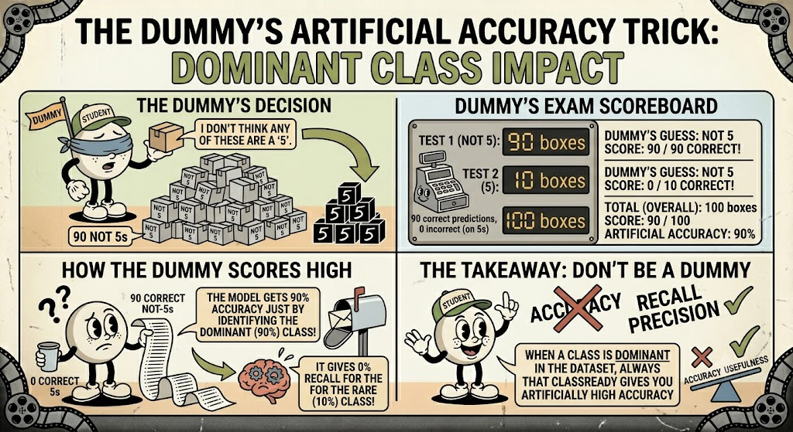
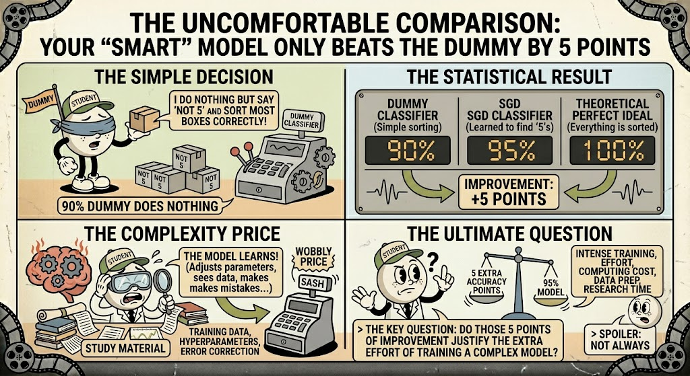
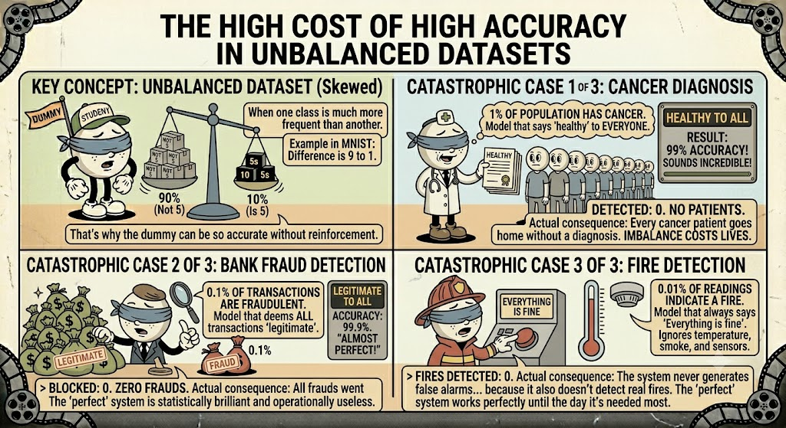
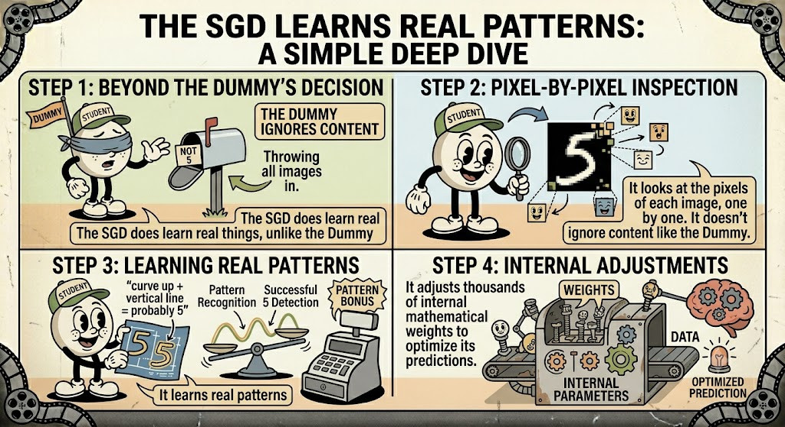

# MNIST: Classify images with Python from scratch

How to train and evaluate models that **predict categories**, and why **accuracy can deceive you**.

## Regression VS Classification
The two main types of problems in supervised learning




## The MNIST Dataset

70,000 Images of Handwritten Digits (0-9)

28x28
> 784 features
pixels per image

0 → 255
value of each pixel
> (white → black)

An Example Image:


---

## An image is just a matrix of numbers

### 1. Step 1: The image
Original

> 28x28 px

### 2. Step 2: Numbers
Each pixel = one value


> 784 values ​​in total (28x28 matrix)

### 3. Step 3: Model input
Flattened vector
```python
array([[  0,   0,   0,   0,   0,   0,   0,   0,   0,   0,   0,   0,   0,   0,   0,   0,   0,   0,   0,   0,   0,   0,   0,   0,   0,   0,   0,   0],
       [  0,   0,   0,   0,   0,   0,   0,   0,   0,   0,   0,   0,   0,   0,   0,   0,   0,   0,   0,   0,   0,   0,   0,   0,   0,   0,   0,   0],
       [  0,   0,   0,   0,   0,   0,   0,   0,   0,   0,   0,   0,   0,   0,   0,   0,   0,   0,   0,   0,   0,   0,   0,   0,   0,   0,   0,   0],
       [  0,   0,   0,   0,   0,   0,   0,   0,   0,   0,   0,   0,   0,   0,   0,   0,   0,   0,   0,   0,   0,   0,   0,   0,   0,   0,   0,   0],
       [  0,   0,   0,   0,   0,   0,   0,   0,   0,   0,   0,   0,   0,   0,   0,   0,   0,   0,   0,   0,   0,   0,   0,   0,   0,   0,   0,   0],
       [  0,   0,   0,   0,   0,   0,   0,   0,   0,   0,   0,   0,   0,   0,   0,   0,   0,   0,   0,   0,  67, 232,  39,   0,   0,   0,   0,   0],
       [  0,   0,   0,   0,  62,  81,   0,   0,   0,   0,   0,   0,   0,   0,   0,   0,   0,   0,   0,   0, 120, 180,  39,   0,   0,   0,   0,   0],
       [  0,   0,   0,   0, 126, 163,   0,   0,   0,   0,   0,   0,   0,   0,   0,   0,   0,   0,   0,   2, 153, 210,  40,   0,   0,   0,   0,   0],
       [  0,   0,   0,   0, 220, 163,   0,   0,   0,   0,   0,   0,   0,   0,   0,   0,   0,   0,   0,  27, 254, 162,   0,   0,   0,   0,   0,   0],
       [  0,   0,   0,   0, 222, 163,   0,   0,   0,   0,   0,   0,   0,   0,   0,   0,   0,   0,   0, 183, 254, 125,   0,   0,   0,   0,   0,   0],
       [  0,   0,   0,  46, 245, 163,   0,   0,   0,   0,   0,   0,   0,   0,   0,   0,   0,   0,   0, 198, 254,  56,   0,   0,   0,   0,   0,   0],
       [  0,   0,   0, 120, 254, 163,   0,   0,   0,   0,   0,   0,   0,   0,   0,   0,   0,   0,  23, 231, 254,  29,   0,   0,   0,   0,   0,   0],
       [  0,   0,   0, 159, 254, 120,   0,   0,   0,   0,   0,   0,   0,   0,   0,   0,   0,   0, 163, 254, 216,  16,   0,   0,   0,   0,   0,   0],
       [  0,   0,   0, 159, 254,  67,   0,   0,   0,   0,   0,   0,   0,   0,   0,  14,  86, 178, 248, 254,  91,   0,   0,   0,   0,   0,   0,   0],
       [  0,   0,   0, 159, 254,  85,   0,   0,   0,  47,  49, 116, 144, 150, 241, 243, 234, 179, 241, 252,  40,   0,   0,   0,   0,   0,   0,   0],
       [  0,   0,   0, 150, 253, 237, 207, 207, 207, 253, 254, 250, 240, 198, 143,  91,  28,   5, 233, 250,   0,   0,   0,   0,   0,   0,   0,   0],
       [  0,   0,   0,   0, 119, 177, 177, 177, 177, 177,  98,  56,   0,   0,   0,   0,   0, 102, 254, 220,   0,   0,   0,   0,   0,   0,   0,   0],
       [  0,   0,   0,   0,   0,   0,   0,   0,   0,   0,   0,   0,   0,   0,   0,   0,   0, 169, 254, 137,   0,   0,   0,   0,   0,   0,   0,   0],
       [  0,   0,   0,   0,   0,   0,   0,   0,   0,   0,   0,   0,   0,   0,   0,   0,   0, 169, 254,  57,   0,   0,   0,   0,   0,   0,   0,   0],
       [  0,   0,   0,   0,   0,   0,   0,   0,   0,   0,   0,   0,   0,   0,   0,   0,   0, 169, 254,  57,   0,   0,   0,   0,   0,   0,   0,   0],
       [  0,   0,   0,   0,   0,   0,   0,   0,   0,   0,   0,   0,   0,   0,   0,   0,   0, 169, 255,  94,   0,   0,   0,   0,   0,   0,   0,   0],
       [  0,   0,   0,   0,   0,   0,   0,   0,   0,   0,   0,   0,   0,   0,   0,   0,   0, 169, 254,  96,   0,   0,   0,   0,   0,   0,   0,   0],
       [  0,   0,   0,   0,   0,   0,   0,   0,   0,   0,   0,   0,   0,   0,   0,   0,   0, 169, 254, 153,   0,   0,   0,   0,   0,   0,   0,   0],
       [  0,   0,   0,   0,   0,   0,   0,   0,   0,   0,   0,   0,   0,   0,   0,   0,   0, 169, 255, 153,   0,   0,   0,   0,   0,   0,   0,   0],
       [  0,   0,   0,   0,   0,   0,   0,   0,   0,   0,   0,   0,   0,   0,   0,   0,   0,  96, 254, 153,   0,   0,   0,   0,   0,   0,   0,   0],
       [  0,   0,   0,   0,   0,   0,   0,   0,   0,   0,   0,   0,   0,   0,   0,   0,   0,   0,   0,   0,   0,   0,   0,   0,   0,   0,   0,   0],
       [  0,   0,   0,   0,   0,   0,   0,   0,   0,   0,   0,   0,   0,   0,   0,   0,   0,   0,   0,   0,   0,   0,   0,   0,   0,   0,   0,   0],
       [  0,   0,   0,   0,   0,   0,   0,   0,   0,   0,   0,   0,   0,   0,   0,   0,   0,   0,   0,   0,   0,   0,   0,   0,   0,   0,   0,   0]], dtype=int64)
```
> 784 values ​​- 1 row

> Key insight: The model doesn't "see" an image; it only sees a long list of 784 numbers between 0 and 255. Your job is to help it find patterns in that list.

---

## **NON-NEGOTIABLE GOLDEN RULE** Split `train / test`
Never evaluate your model with the same data you trained it on.



> ✅**Good news:** MNIST already comes split and mixed.

> ⚠️ **If you evaluate with training data:** The model "memorizes" and lies about its performance.

---

## Simplifying the Problem: Binary Classification
To begin, we reduce the Yes/No problem.

Instead of asking:

"What digit is it?"

0, 1, 2, 3, 4, 5, ... 9
> 10 categories, more difficult

### A simple question
"Is it a 5?"

- True: Yes, it is a 5
- False: No, it is not a 5

---

## The classifier: Our model `SGDClassifier`
Stochastic Gradient Descent, a fast and efficient classifier.



### One by one
Processes instances individually, not all at once

### Large datasets
Excellent for massive volumes of data

### Good for beginners
Ideal for exploring and rapid prototyping

### Online learning
Learn in real time with new data

---
How do I know if my model is really **good**?
Training a model is easy. **Evaluating it properly** is the hard part.

- **We need metrics** to measure performance.
- The most intuitive is _accuracy_.
- But... **it can be very misleading!**

---

## Metric, the most intuitive: What is **accuracy**?
The percentage of correct predictions in the model

The formula:



### Practical Example
100 images → 95 correct answers

$\frac{95}{100} = 95\%$

---

## More Reliable Evaluation: What is Cross-Validation?

### ⚠️ Problem
If I evaluate only once, I might get lucky (good or bad) with the data I receive.

### ✅ Solution
Evaluate **multiple times** with different partitions of the data.

> **The final result** = average of the 3 accuracies
> ### $\frac{(acc_1 + acc_2 + acc_3)}{3}$

---

## The surprising plot twist: A model that does nothing gets 90%



---

## The Mathematical Explanation: If **90%** are NOT 5, saying "not 5" to everything... **is correct 90%**








