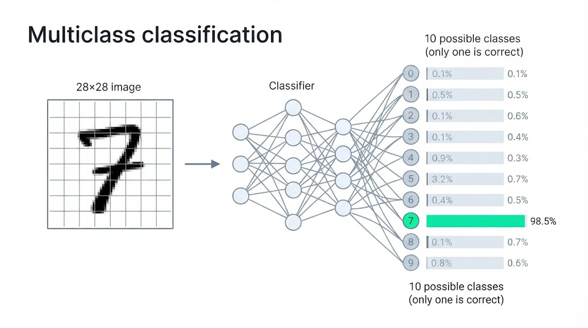
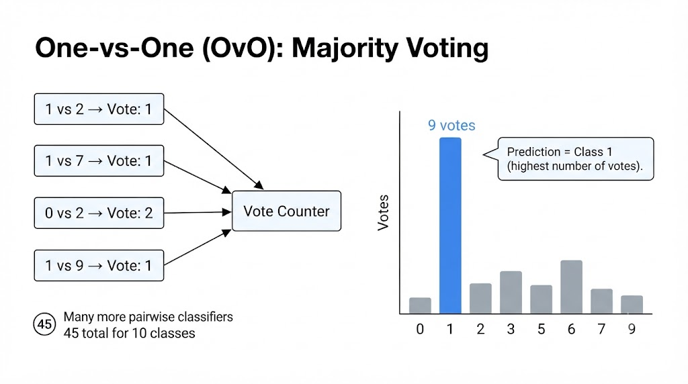
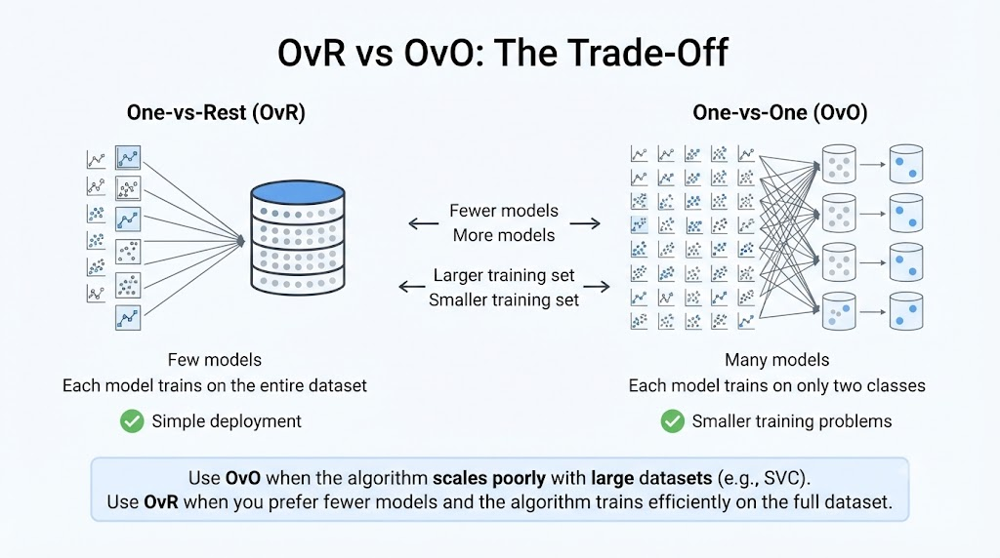
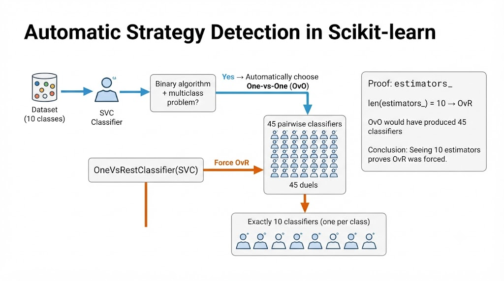

# Multiclass Classifier
How a model chooses **one class from 3 or more**. From binary to multiclass with **One-vs-Rest** and **One-vs-One**.

```text
model predict image

Prediction = 7 # One in 10 classes
```




---

## From Binary to Multiclass (Where We Were → Where We're Going)
So far, we've simplified the real problem: instead of 10 classes, we've reduced it to two (is it a 5 or not?).

### Binary Classification (before)
A yes/no question about a single class.

- ✅ Is it a 5?
- ✖️ Is it not a 5?

> 2 Classes: The output is a single bit: belongs or doesn't belong.

### Multiclass Classification (now)
Choosing one class from ten possible classes.

> 10 Classes: The challenge is that many classifiers only know how to say yes/no. How do we get to 10?

> ## The solution: OvR and OvO

---

## Not all classifiers are the same (which ones support multiclassing?)

### Native multiclassing
They work directly with N classes.

- RandomForestClassifier
- GradientBoostingClassifier
- KNeighborsClassifier
- MLPClassifier
- LogisticRegression
- HistGradientBoostingClassifier
- DecisionTreeClassifier
- GaussianNB

### Binary only
They natively separate 2 classes.
- SGDClassifier
- SVC

> With techniques like **OvR** and **OvO**, we can force them to work with many classes.

---

## One Specialist per Class (One-vs-Rest "One-vs-All")

Instead of a model that recognizes all 10 numbers, we train **10 binary classifiers**. Each one answers a single question.

### Each module is a specialist
Model #0 → Is it a 0 or the **rest**?

> Each classifier pits **one class** against **all the others**

## The image is sent to all classifiers:
OneSpecialistperClass.png)

### The 10 models respond (OvR in action - Scores)
Each specialist gives a **score.** The highest score wins.

> Everyone sees the same image and responds simultaneously.

---

## One classifier per pair (One-vs-One "OvO")
Instead of one class against all the others, each model learns to distinguish **only two numbers**.

The number faces **each** of the other 9 classes:
OneClassifierperPair.png)

The 1 fights **9 duels**. Each class does the same → this is how all the pairs are formed.

"1vs2" and "2vs1" are the **same duel**: that's why it's divided by 2.

### Number of classifiers with N=10 classes
$$\frac{N (N-1)}{2} = \frac{10 \times 9}{2} = 45$$
**45 binary classifiers**, each expert in 2 digits.

---

## All 45 duels cast votes (OvO in action "votes")

Each duel awards one vote. The class with the most votes wins.

### Example duels


---

## OvR vs OvO: When to Use Each? (The Trade-Off)

The same tension: **few models / many models** vs **many models / few models**

### One-vs-Rest
**Few** models, but each one trains on **the entire dataset** (that class vs. all of them).

### One-vs-One
**Many** models, but each one trains on **only 2 classes** (a small subset).

### The Rule of thumb
- **OvO** when the algorithm **scales poorly with large amounts of data** (like SVC)
- **OvR** when you prefer **few models** and the algorithm handles the entire dataset well.



---

## Automatic Strategy Detection (Scikit-learn decides for you)
With a binary algorithm and 10 classes, scikit-learn **chooses for itself** how to slice the problem.

SVC: binary algorithm → Detects the **mismatch** → chooses **OvO** for SVM → trains and predicts 45 duels

### Forcing the Strategy
Wrappers impose the strategy you choose, ignoring the automatic one:
```text
ovr_clf OneVSRestClassifier:
    SVC random_state 42
```
> We force **OvR** on an SVC that would have only used **OvO**

### The proof: **estimators_**
The number of classifiers confirms the strategy used:
- `len(estimators_)`: 10 OvR, one per class
- OvO would have yielded 45, one per pair

That **10** (and not 45) proves that you forced OvR

