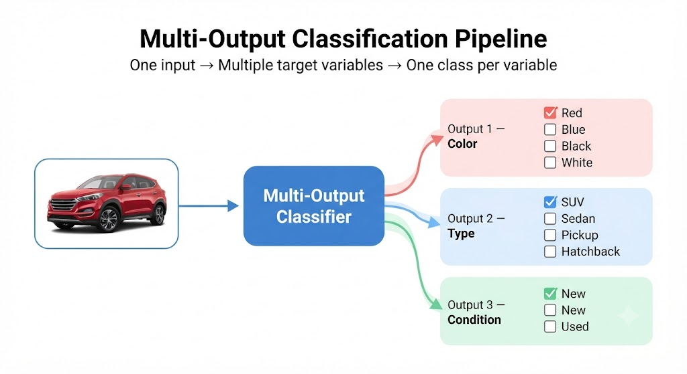

# Multilabel And Multioutput Classification

When a single answer is no longer enough: multiple labels and multiple target variables per instance
- binary
- multiclass
- multilabel
- multioutput

---

## Four Ways to Classify

### 1. Binary Classification
**One question, two possible answers.**

**Example:** Is this image a **5**?

- ✅ Yes
- ❌ No

---

### 2. Multiclass Classification
**One question, one answer chosen from many classes.**

**Example:** What number is this?

**Possible classes:**  
`0 1 2 3 4 5 6 7 8 9`

---

### 3. Multilabel Classification
**One example can belong to multiple classes at the same time.**

**Example:**

| Label | Prediction |
|-------|------------|
| 🐶 Dog | ✅ Yes |
| 👤 Person | ✅ Yes |
| 🌳 Tree | ❌ No |

---

### 4. Multi-output Classification
**Predict multiple independent target variables at once.**

**Example:**

| Target | Prediction |
|--------|------------|
| 🎨 Color | Red |
| 🚙 Type | SUV |
| ✨ Condition | New |

---

## 1. Binary Classification

**One question, two possible answers.**

**Target:** `y ∈ {True, False}`

**Question:** *Is the input a 5?*

**Model:** `SGDClassifier` trained **only** to answer this question.

### Examples

| Input | Prediction |
|------:|:----------:|
| 3 | False ❌ |
| 7 | False ❌ |
| 5 | True ✅ |
| 5 | True ✅ |

**Interpretation**

- `True` → The input **is** a 5.
- `False` → The input **is not** a 5.

---

### Same Pattern, Different Question

A binary classifier always answers **one Yes/No question**.

To ask multiple questions, we train **one binary classifier per class**. Each model is trained **independently**.

### Example

The same image is evaluated by all three models:

| Model | Question | Prediction |
|-------|----------|:----------:|
| `SGDClassifier #1` | Is it a **3**? | ❌ False |
| `SGDClassifier #2` | Is it a **9**? | ✅ True |
| `SGDClassifier #3` | Is it a **0**? | ❌ False |

> Each model produces one binary prediction (`True` or `False`).
>
> **Multilabel classification extends this idea by asking many binary questions at the same time.**

---

## 2. Multiclass
**One answer, 10 options**

**Target:** `y ∈ {0, 1, ..., 9}` **and if it can be wrong**


---

## 3. Multilabel
Multiple labels **at once**
You no longer choose **one** class out of 10. Now you answer **multiple Yes/No** questions about the same instance (and the labels **are not mutually exclusive**).


- Is there a mountain? Score 0.96 Yes
- Is there a tree? Score 0.97 Yes
- Is there a dog? Score 0.94 Yes
- Is there a cat? Score 0.02 No

### Target of this observation
```python
y = [1, 1, 1, 0] # ← mountain, tree, dog, cat
```

---

### You already use it **every day**

- Gmail (One email → 3 labels)
    Electronic billing: due today

    I've attached the supplier's invoice for approval

    > Work, Urgent, Invoices

- Spotify (One song → 3 labels)
    Neffex Rumors 2017

    > Rock/Alternative, English, Neffex

- TikTok: Moderation (One video → 3 labels)
    > Suitable for minors, educational content, copyrighted music

- Search keywords: Your world data (One keyword → 3 labels)

    Nike Air Max 98 men's
    > Branded, high intent, specific product

---

### Multiple Questions per Instance

Each observation (`X`) is evaluated against **multiple Yes/No questions**.

Each column represents **one label** (one binary question).

Example:


| Image | Dog | Person | Tree | Car |
|------|:---:|:------:|:----:|:---:|
| x₁ | ✅ | ❌ | ✅ | ❌ |
| x₂ | ❌ | ✅ | ❌ | ✅ |


> Every column asks the **same type of question**:
> **"Is this label present in the image?"**

### Target Shape

```python
y.shape = (3,4)
# (n_instances, n_labels)
```

Each value is binary:

- `1` (True) → Label is present.
- `0` (False) → Label is absent.

> Each column behaves like an independent **binary classification** problem.  
> **Multilabel classification simply combines many binary classifiers, one for each label.**

---

## 4. Multi-Output Classification

Predict **multiple target variables** for the same instance.

Each target variable is an **independent classification problem** with **its own set of classes**.

### Example

**Input:** A photo of a vehicle

The model predicts:

| Target Variable | Predicted Class |
|-----------------|-----------------|
| Color | 🔴 Red |
| Type | 🚙 SUV |
| Condition | ✨ New |

---

### Possible Classes

**Color**
- 🔴 Red ✅
- 🔵 Blue
- ⚫ Black
- ⚪ White

**Type**
- 🚙 SUV ✅
- 🚗 Sedan
- 🛻 Pickup
- 🚘 Hatchback

**Condition**
- ✨ New ✅
- ♻️ Used

---

### One photo, three predictions
They are not labels from the same set: they are **three different classification problems** solved **simultaneously** on the same photo.



```python
y = ["Red", "SUV", "New"] # ← One row, three targets with their own classes
```

---

### Key Difference vs. Multilabel

| Multilabel | Multi-output |
|------------|--------------|
| One set of labels | Multiple target variables |
| Each label is a **Yes/No** question | Each variable has **its own classes** |
| Output example: `[1, 0, 1, 0]` | Output example: `(Red, SUV, New)` |
| One binary classifier per label | One multiclass classifier per target variable |
| All answers come from the **same set of labels**. Each one is binary. | Each variable has **its own set** of classes. No longer just Yes/No|

> **Multi-output generalizes multi-label:** You continue to answer multiple questions per instance, but now each answer can have **more than two possible values.** Multi-label is the case where all output is Yes/No.

---
## The 4 types, in a table

| Classification Type | Target Variables          | Response per Instance            | Options per Response                    | Example                                  |
| ------------------- | ------------------------- | -------------------------------- | --------------------------------------- | ---------------------------------------- |
| **Binary**          | 1                         | 1 answer                         | 2 (`True` / `False`)                    | **Is it a 5?** → `True`                  |
| **Multiclass**      | 1                         | 1 answer                         | One class out of *N*                    | **Digit** → `7`                          |
| **Multilabel**      | 1 vector of labels        | Multiple answers (one per label) | 2 per label (`Yes` / `No`)              | Dog = Yes, Person = Yes, Tree = No       |
| **Multi-output**    | Multiple target variables | One answer per target variable   | One class out of *Nᵢ* for each variable | Color = Red, Type = SUV, Condition = New |

> From **binary** to **multilabel**: the same Yes/No question, repeated in parallel.
> 
> From **multiclass** to **multioutput**: several multiclass questions, answered simultaneously.

---

## 🚀 Deep Learning Preview

These concepts **reappear later** in Deep Learning, but with different output layers.

---

### Multiclass → Softmax Output

The output layer uses **softmax**.

| Class | Probability |
|--------|------------:|
| 🐶 Dog | **0.71** |
| 🐱 Cat | 0.14 |
| 🌳 Tree | 0.09 |
| 🚗 Car | 0.06 |

> The probabilities **sum to 1**.
>
> **Softmax enforces mutual exclusivity:** exactly **one class** is selected.

---

### Multilabel → One Sigmoid per Label

The output layer uses **one sigmoid neuron for each label**.

| Label | Probability |
|--------|------------:|
| 🐶 Dog | **0.94** |
| 🐱 Cat | 0.08 |
| 🌳 Tree | **0.81** |
| 🚗 Car | **0.62** |

Using a threshold of **0.5**:

- Dog ✅
- Cat ❌
- Tree ✅
- Car ✅

> Each sigmoid neuron makes an **independent Yes/No decision**.
>
> Unlike softmax, sigmoid outputs **do not compete**, so **multiple labels can be predicted simultaneously**.

---

## Looking Ahead

The **denoising** example from Chapter 3 will also return.

The KNN denoiser was a **toy example**.

Later, you'll learn **Denoising Autoencoders**, which solve the same problem using a much more powerful neural network architecture.