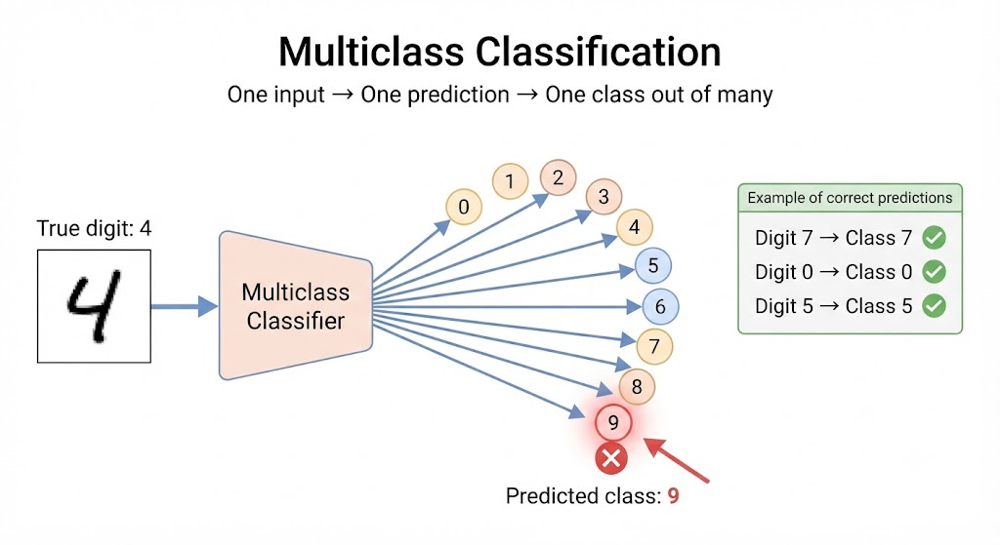
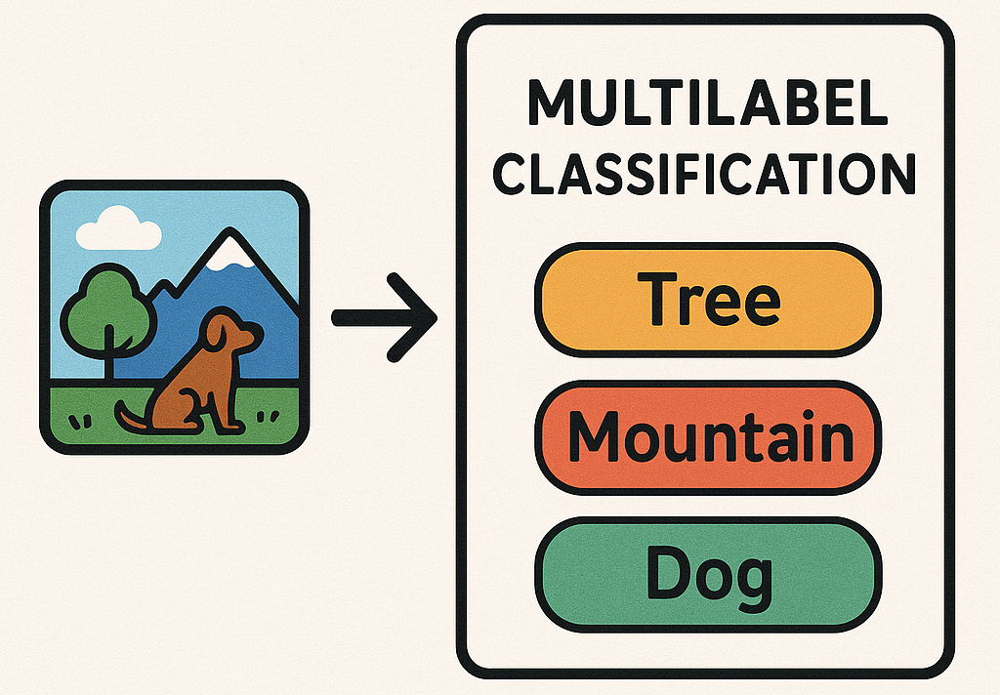
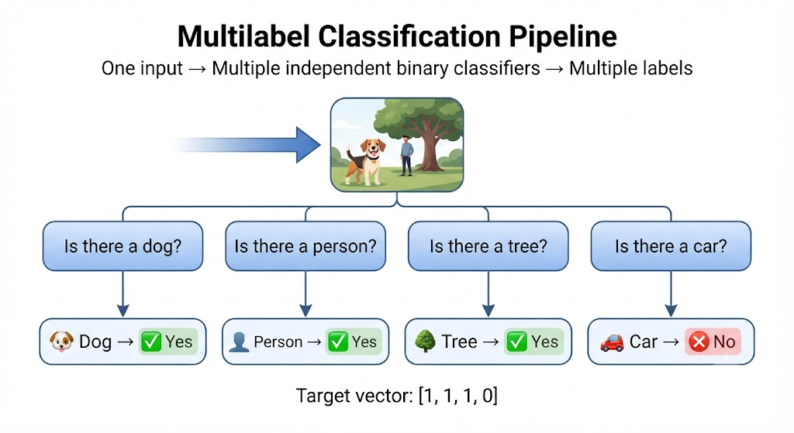

# Multilabel And Multioutput Classification

When a single answer is no longer enough: multiple labels and multiple target variables per instance
- binary
- multiclass
- multilabel
- multioutput

---

## Four Ways to Classify

### 1. Binary Classification
**One question, two possible answers.**

**Example:** Is this image a **5**?

- ✅ Yes
- ❌ No

---

### 2. Multiclass Classification
**One question, one answer chosen from many classes.**

**Example:** What number is this?

**Possible classes:**  
`0 1 2 3 4 5 6 7 8 9`

---

### 3. Multilabel Classification
**One example can belong to multiple classes at the same time.**

**Example:**

| Label | Prediction |
|-------|------------|
| 🐶 Dog | ✅ Yes |
| 👤 Person | ✅ Yes |
| 🌳 Tree | ❌ No |

---

### 4. Multi-output Classification
**Predict multiple independent target variables at once.**

**Example:**

| Target | Prediction |
|--------|------------|
| 🎨 Color | Red |
| 🚙 Type | SUV |
| ✨ Condition | New |

---

## 1. Binary Classification

**One question, two possible answers.**

**Target:** `y ∈ {True, False}`

**Question:** *Is the input a 5?*

**Model:** `SGDClassifier` trained **only** to answer this question.

### Examples

| Input | Prediction |
|------:|:----------:|
| 3 | False ❌ |
| 7 | False ❌ |
| 5 | True ✅ |
| 5 | True ✅ |

**Interpretation**

- `True` → The input **is** a 5.
- `False` → The input **is not** a 5.

---

### Same Pattern, Different Question

A binary classifier always answers **one Yes/No question**.

To ask multiple questions, we train **one binary classifier per class**. Each model is trained **independently**.

### Example

The same image is evaluated by all three models:

| Model | Question | Prediction |
|-------|----------|:----------:|
| `SGDClassifier #1` | Is it a **3**? | ❌ False |
| `SGDClassifier #2` | Is it a **9**? | ✅ True |
| `SGDClassifier #3` | Is it a **0**? | ❌ False |

> Each model produces one binary prediction (`True` or `False`).
>
> **Multilabel classification extends this idea by asking many binary questions at the same time.**

---

## 2. Multiclass
**One answer, 10 options**

**Target:** `y ∈ {0, 1, ..., 9}` **and if it can be wrong**



---

## 3. Multilabel
Multiple labels **at once**
You no longer choose **one** class out of 10. Now you answer **multiple Yes/No** questions about the same instance (and the labels **are not mutually exclusive**).


- Is there a mountain? Score 0.96 Yes
- Is there a tree? Score 0.97 Yes
- Is there a dog? Score 0.94 Yes
- Is there a cat? Score 0.02 No

### Target of this observation
```python
y = [1, 1, 1, 0] # ← mountain, tree, dog, cat
```

---

### You already use it **every day**

- Gmail (One email → 3 labels)
    Electronic billing: due today

    I've attached the supplier's invoice for approval

    > Work, Urgent, Invoices

- Spotify (One song → 3 labels)
    Neffex Rumors 2017

    > Rock/Alternative, English, Neffex

- TikTok: Moderation (One video → 3 labels)
    > Suitable for minors, educational content, copyrighted music

- Search keywords: Your world data (One keyword → 3 labels)

    Nike Air Max 98 men's
    > Branded, high intent, specific product

---

### Multiple Questions per Instance

Each observation (`X`) is evaluated against **multiple Yes/No questions**.

Each column represents **one label** (one binary question).

Example:

| Image | Dog | Person | Tree | Car |
|------|:---:|:------:|:----:|:---:|
| x₁ | ✅ | ❌ | ✅ | ❌ |
| x₂ | ❌ | ✅ | ❌ | ✅ |

> Every column asks the **same type of question**:
> **"Is this label present in the image?"**

### Target Shape

```python
y.shape = (3,4)
(n_instances, n_labels)
```

Each value is binary:

- `1` (True) → Label is present.
- `0` (False) → Label is absent.

> Each column behaves like an independent **binary classification** problem.  
> **Multilabel classification simply combines many binary classifiers, one for each label.**

