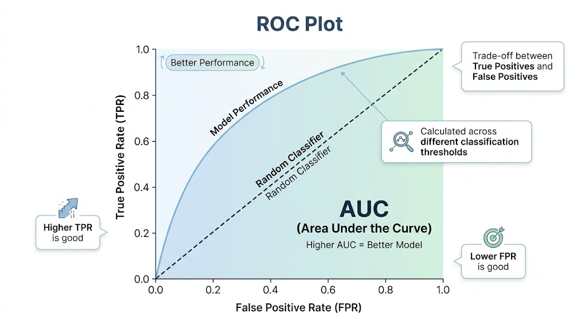
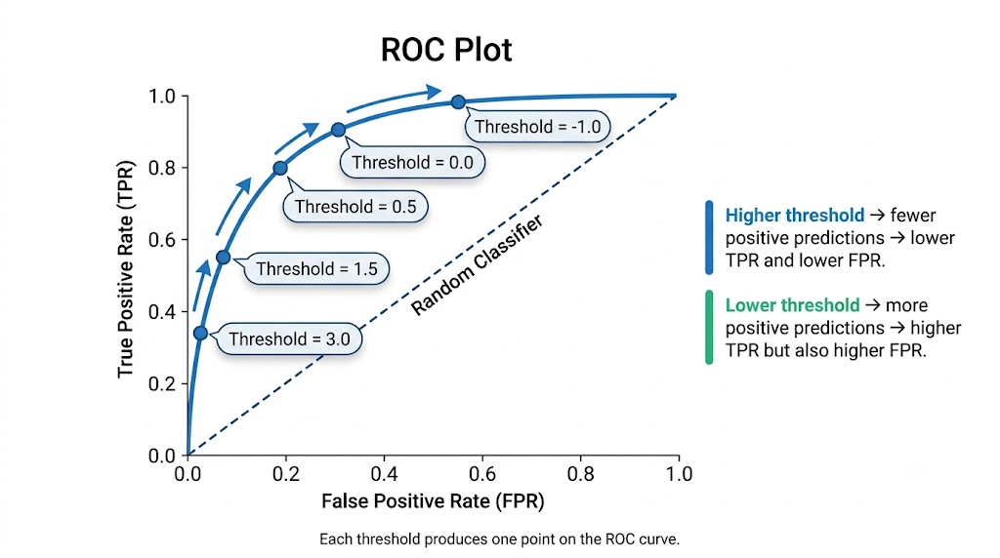
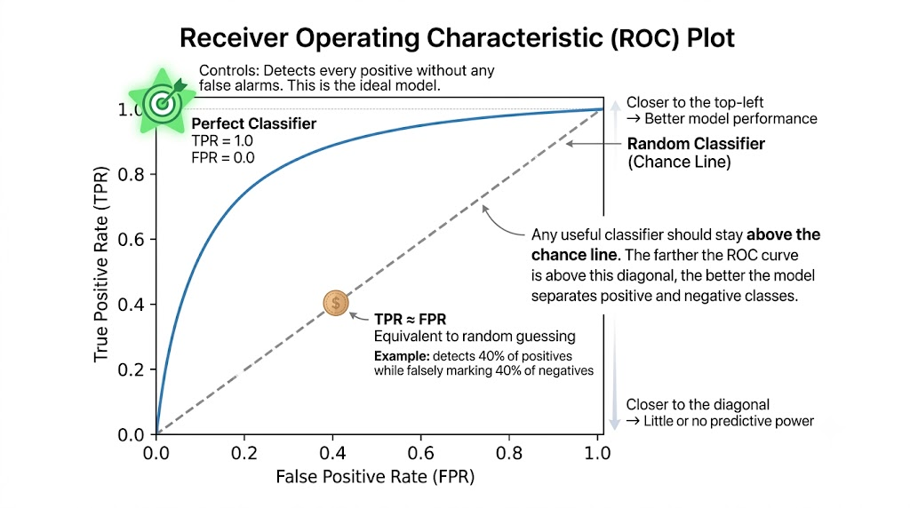
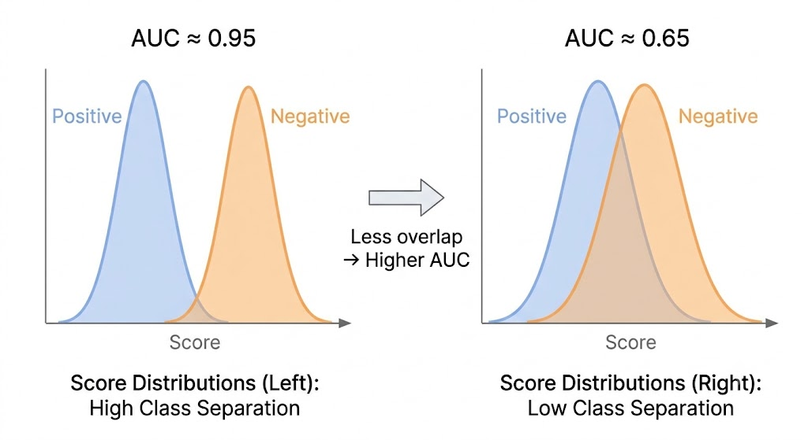
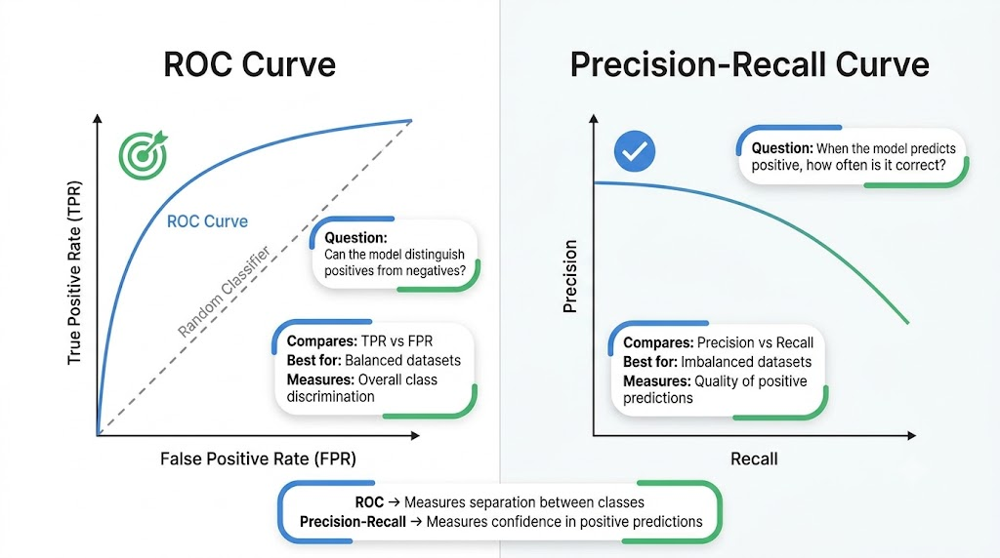

# Roc Curve
How the same model's performance changes when the **threshold** is adjusted, and why the ROC sometimes **deceives**

---

## `FixedThreshold Classifier`
A wrapper that changes the decision threshold of an already trained model (without retraining, without modifying the model).

- The model continues to calculate the same scores. Nothing changes internally.

- The only thing that changes is the rule for converting that score into a class.

### Same score = 1.8 (two thresholds)

**decision_score: 1.8**

- thresholds = 0 (default)
1.8 ≥ 0 → ✅ Positive

- thresholds = 2.5
1.8 < 2.5 → ✖️ Negative

> Same score, same network. **Only the cutoff point changes**

---

## `TunedThresholdClassifierCV`
Scikit-learn **finds the best threshold for you** using cross-validation, optimizing the metric of your choice.

### 1. Model Scores

| Sample | Model Score | True Class |
| ------ | ----------: | ---------: |
| 1      |         2.8 |          1 |
| 2      |         1.6 |          1 |
| 3      |         0.7 |          0 |
| 4      |        -0.5 |          0 |
| 5      |         3.4 |          1 |

The model outputs a **score** for each sample. Higher scores indicate a higher likelihood of belonging to the positive class (`1`).

### 2. Threshold Evaluation

| Decision Threshold | F1 Score |
| -----------------: | -------: |
|               -1.0 |     0.71 |
|                0.0 |     0.82 |
|                0.7 |     0.87 |
|          **1.5** ⭐ | **0.91** |
|                2.5 |     0.84 |

**Selected Threshold:** **1.5**

**Reason:** This threshold achieved the **highest F1 score** during **cross-validation (CV)**, providing the best balance between precision and recall.


> Unlike FixedThresholdClassifier (where you choose), here **scikit-learn finds it automatically** and uses **cross-validation** to avoid over-adjusting.

---

## The metric depends on your objective (Which metric do you want to optimize?)

By default, it optimizes **balanced_accuracy**, but you can request any scorer from scikit-learn.

### ✅ I want to reduce
False positives → accuracy

### 🕵🏽 I want to detect
The maximum number of positives → recall

### ⚖️ I want a
balance between both → f1

Supported scores:
- accuracy
- balanced_accuracy (default)
- precision
- recall
- f1
- roc_auc

---

## Fixed vs. Tuned Thresholds: Which Should You Use?

Choosing between these two approaches depends on whether you already know the optimal decision threshold.

| Feature | `FixedThresholdClassifier` | `TunedThresholdClassifierCV` |
|--------|-----------------------------|-------------------------------|
| Who chooses the threshold? | 🫵 You | 🤖 Scikit-learn |
| Searches for the best threshold | ❌ No | ✅ Yes |
| Uses cross-validation | ❌ No | ✅ Yes |
| Best use case | You already know the optimal threshold. | You want the model to find the optimal threshold automatically. |

### `FixedThresholdClassifier`

Use this classifier when you have already determined the decision threshold (for example, from previous experiments or business requirements).

**Characteristics:**
- Uses the threshold you specify.
- Does not evaluate alternative thresholds.
- Does not perform cross-validation.

### `TunedThresholdClassifierCV`

Use this classifier when the optimal threshold is unknown.

**Characteristics:**
- Evaluates multiple candidate thresholds.
- Uses cross-validation to estimate performance.
- Selects the threshold that maximizes the chosen evaluation metric (e.g., F1 score).

> **Rule of thumb**
>
> - Use **`FixedThresholdClassifier`** when the threshold is already known.
> - Use **`TunedThresholdClassifierCV`** when you want Scikit-learn to automatically determine the best threshold.


---

## What is the ROC curve?

**Receiver Operating Characteristic**. It shows how the model changes when the threshold is moved: instead of a single threshold, **it tests them all.**

- ✅ **TPR**: True Positive Rate (Recall)
- ✖️ **FPR**: False Positive Rate
- Each **point** = a different threshold.



---

## TPR and FPR (the two metrics)
Example: classifying the digit **5** against the rest.

### TPR (Recall, Sensitivity)
Of all the numbers **that are 5**, what percentage did the model correctly detect?

$$
\text{TPR} = \frac{\text{TP}}{\text{TP} + \text{FN}}
$$

> **⬆️High TPR:** You detect almost all the 5s. ✅

### FPR (False Positive Rate)
Of all the numbers **that are not 5**, what percentage did you mistakenly mark as 5?

$$
\text{FPR} = \frac{\text{FP}}{\text{FP} + \text{TN}}
$$

> **⬆️High FPR:** You mistakenly identified many numbers as 5s. ✖️

Where:

- **TP** = True Positives
- **FN** = False Negatives
- **FP** = False Positives
- **TN** = True Negatives

---

## Why does a curve form? (One model, many points)
They are not different models. It is **the same model** using **different thresholds**. Each one gives a pair (FPR, TPR) = one point.

### I try various thresholds
```
Threshold = 3.0  → TPR = 0.34, FPR = 0.01
Threshold = 1.5  → TPR = 0.55, FPR = 0.04
Threshold = 0.5  → TPR = 0.80, FPR = 0.12
Threshold = 0.0  → TPR = 0.90, FPR = 0.23
Threshold = -1.0 → TPR = 0.99, FPR = 0.54
```



---

## The Perfect Corner and the Line of Chance (Two Key References)

### Top Left Corner
You detected **all the positives** and didn't mistake **any negatives**. The perfect classifier. Everyone wants to get close to that point.

### The Dotted Diagonal
A model that **guesses randomly** (coin toss): detects 40% of positives and incorrectly marks 40% of negatives → **TPR ≈ FPR**. Models whose ROC curve stays close to this diagonal have little or no discriminative ability.



---

## AUC: Area Under the ROC Curve

The **Area Under the Curve (AUC)** summarizes the entire ROC curve into a **single number**.

Instead of evaluating the model at one specific threshold, **AUC measures how well the model separates positive and negative examples across all possible thresholds.**

> **Higher AUC → Better separation between the two classes.**

### Intuition

Imagine randomly selecting:

- one **positive** example ✅
- one **negative** example ❌

The **AUC is the probability that the model assigns a higher score to the positive example than to the negative one.**

For example:

- **AUC = 0.92** means there is about a **92% chance** that the positive example receives a higher prediction score than the negative one.

### Interpretation

| AUC | Interpretation |
|-----|----------------|
| **1.00** | Perfect classifier |
| **0.90 – 0.99** | Excellent discrimination |
| **0.80 – 0.89** | Good |
| **0.70 – 0.79** | Fair / Acceptable |
| **0.60 – 0.69** | Poor |
| **0.50** | No better than random guessing |

### Visual intuition

- **Large area** → ROC curve stays close to the **top-left corner** → the model separates the classes well.
- **Small area** → ROC curve stays close to the **diagonal** → the model struggles to distinguish the classes.

### Example

**AUC = 0.92**

The ROC curve remains close to the **top-left corner**, meaning the model achieves **high True Positive Rates while keeping False Positive Rates low** over a wide range of thresholds.

> AUC evaluates the **overall ranking ability** of a classifier, not the performance at one particular threshold.



---

## ROC vs Precision-Recall
Both evaluate binary classifiers, but they answer **different questions**.

| ROC Curve | Precision-Recall Curve |
|-----------|------------------------|
| **Can the model distinguish positives from negatives?** | **When the model predicts positive, how often is it correct?** |

### ROC Curve

The ROC curve evaluates **how well the model separates the two classes**.

It compares:

- **True Positive Rate (Recall):** How many actual positives did the model detect?
- **False Positive Rate:** How many actual negatives were incorrectly classified as positive?

> ROC measures the model's **ability to discriminate** between positive and negative classes.

### Precision-Recall Curve

The Precision-Recall curve focuses on the **quality of positive predictions**.

It compares:

- **Precision:** Of all predicted positives, how many were actually positive?
- **Recall:** Of all actual positives, how many did the model find?

> Precision-Recall ignores True Negatives and focuses almost entirely on the positive class.

### When should you use each?

✅ **Use ROC when:**

- The classes are relatively balanced.
- You care about the model's overall ability to separate the classes.

✅ **Use Precision-Recall when:**

- Positive examples are rare (class imbalance).
- False positives are expensive.
- Finding reliable positive predictions is more important than classifying negatives correctly.

### Example

Suppose only **1 out of every 100 emails is spam.**

A classifier can achieve an excellent ROC AUC because it correctly classifies almost every non-spam email.

However, if half of the emails it marks as spam are actually legitimate, the **Precision-Recall curve immediately reveals this weakness**, while the ROC curve may still look very good.

> **Rule of thumb:** ROC tells you **how well the model separates classes.** Precision-Recall tells you **how trustworthy the positive predictions are.**



---

## Why Can the ROC Curve Be Misleading?
Imagine a fraud detector monitoring:

- **999,000 legitimate transactions**
- **1,000 fraudulent transactions**

### Confusion Matrix

|                   | **Predicted Normal** | **Predicted Fraud 🚨** |
|-------------------|---------------------:|-----------------------:|
| **Actual Normal** | **994,000 (TN)** ✅ | **5,000 (FP)** ❌ |
| **Actual Fraud**  | **100 (FN)** ❌ | **900 (TP)** ✅ |

> The **huge number of True Negatives (TN)** makes the False Positive Rate look much smaller than the real operational impact.

### From the ROC Perspective

The False Positive Rate is

$$
\text{FPR}
=
\frac{\text{FP}}{\text{FP}+\text{TN}}
=
\frac{5000}{5000+994000}
\approx
0.005
=
0.5\%
$$

An **FPR of only 0.5%** sounds outstanding.

But in reality, that means **5,000 legitimate transactions are incorrectly flagged as fraud.**

Imagine an analyst having to manually investigate **5,000 false alerts every day.**

> ROC only tells us that the **rate** is small—not that the **absolute number** of false alarms is huge.

---

## Looking at Precision

Now ask a different question:

> **When the model predicts fraud, how often is it actually fraud?**

$$
\text{Precision}
=
\frac{\text{TP}}{\text{TP}+\text{FP}}
=
\frac{900}{900+5000}
=
0.153
=
15.3\%
$$

This means that only **15% of fraud alerts are real fraud.**

### Out of every 100 fraud alerts

- ✅ **15** are actual fraud.
- ❌ **85** are false alarms.

> Suddenly, the problem becomes obvious.

Although the ROC curve looks excellent, **most fraud alerts are incorrect**.

That's why **Precision-Recall is usually preferred for highly imbalanced datasets**, such as fraud detection, spam filtering, and rare disease diagnosis.

---

## When Should You Use Each Curve?

Both curves evaluate binary classifiers, but they are designed for **different situations**.

### ✅ Use the ROC Curve when...

- The classes are **relatively balanced**.
- You want to evaluate the model's **overall ability to distinguish** positives from negatives.
- False positives and false negatives have a similar cost.

**Examples**

- 🐶 Dogs vs. Cats (50% / 50%)
- 🛒 Buyers vs. Non-buyers (45% / 55%)
- 😊 Positive vs. Negative movie reviews

> **ROC asks:** *"How well can the model separate the two classes?"*

---

### ✅ Use the Precision-Recall Curve when...

- The positive class is **rare**.
- False positives are expensive.
- You care more about the **quality of positive predictions** than classifying negatives correctly.

**Examples**

- 💳 Fraud detection
- 🩺 Cancer screening
- 📧 Spam detection
- 🔐 Cyberattack detection
- 🏭 Manufacturing defect detection
- ✍️ Digit **5** vs. all other digits

> **Precision-Recall asks:** *"When the model predicts positive, how often is it correct?"*

---

### Rule of Thumb

| If your goal is... | Use... |
|--------------------|---------|
| Evaluate **overall class separation** | **ROC Curve** |
| Evaluate **how trustworthy positive predictions are** | **Precision-Recall Curve** |

> **Balanced dataset → ROC**  
> **Highly imbalanced dataset → Precision-Recall**