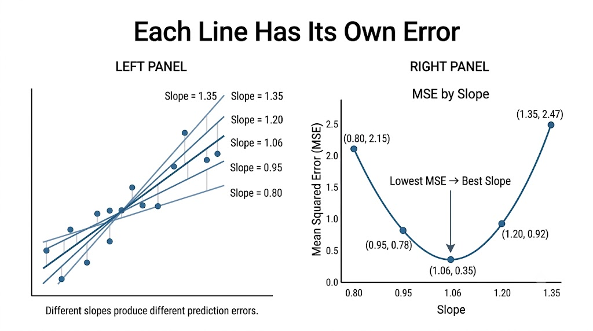
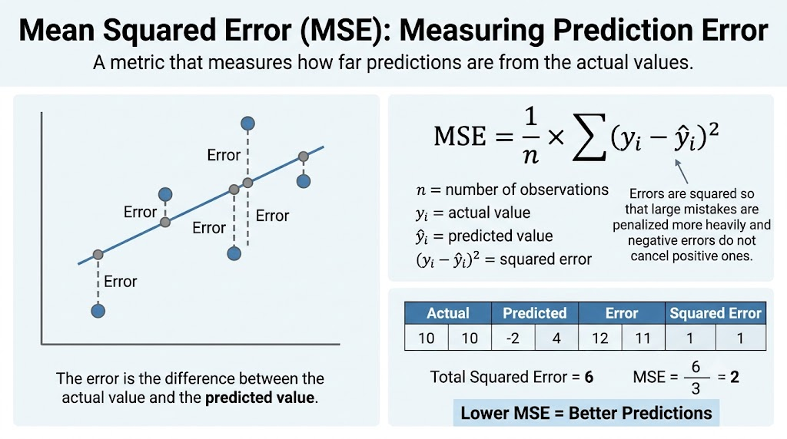
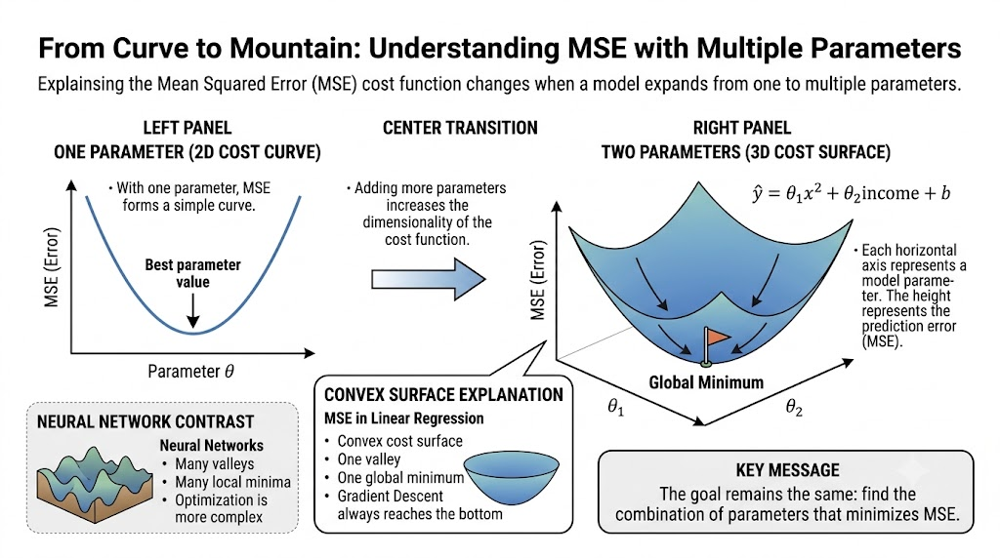
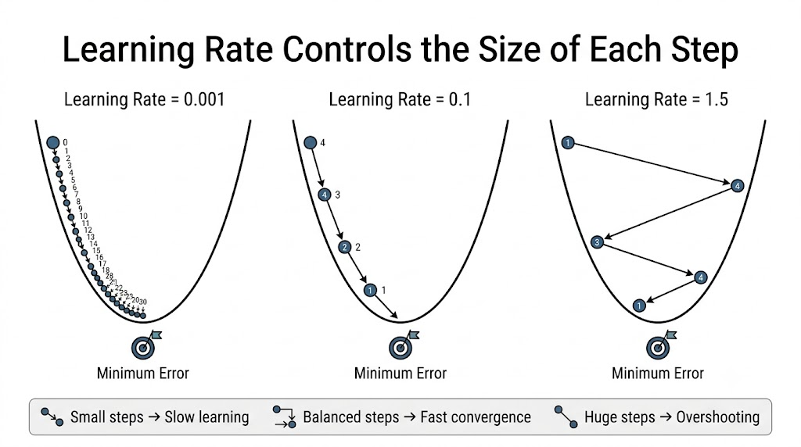
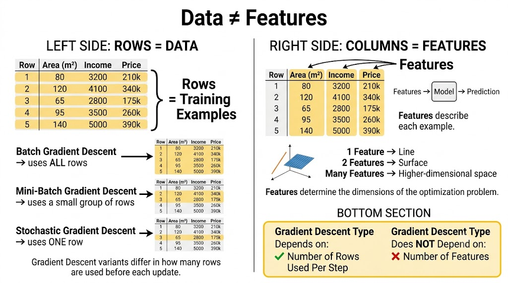
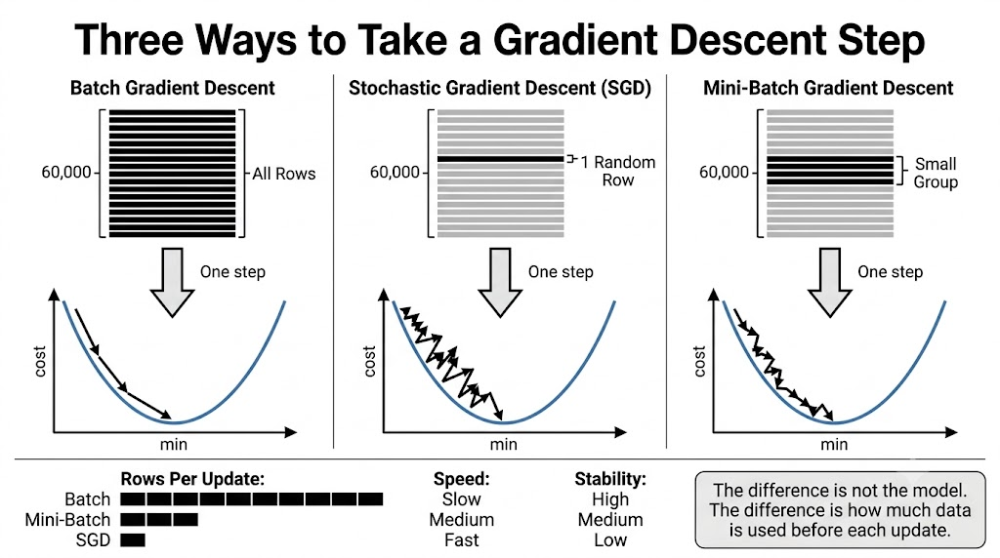
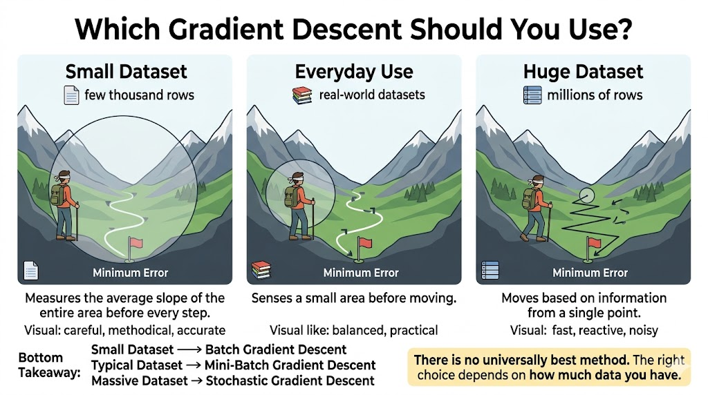

# The three types of gradient descent

1. Batch
2. Stochastic
3. Mini-batch

> Same algorithm, three ways to walk it.

---

## Finding the Best Line
We use a **linear regression** problem: as **x** increases, the **y** we are predicting also increases.

### Example:
More $\text square^2$ in a house → higher **price** we are predicting.

> I can draw **n different lines** through the same points.

But **only one** minimizes the prediction error. Finding it is the goal.

---

## Each line has its own error
Every possible line (every slope value) produces different predictions, and therefore a different error.

To compare them, we calculate the **Mean Squared Error (MSE)** for each slope. As the slope gets closer to the optimal value, the MSE decreases. Once we move past the optimal slope, the MSE starts increasing again.

Example
| Slope | MSE  |
| ----- | ---- |
| 0.80  | 2.15 |
| 0.95  | 0.78 |
| 1.06  | 0.35 |
| 1.20  | 0.92 |
| 1.35  | 2.47 |

In this example, a slope of 1.06 produces the lowest MSE (0.35), making it the best candidate among the tested values.


> ### **MSE by slope**
> If we plot the MSE against the slope values, we obtain a **U-shaped curve**. The lowest point of this curve represents the optimal slope—the value that minimizes the prediction error.

---

## How badly is it performing?
The cost function is the formula that assigns a number to the model's error. The most commonly used form in regression is the **MSE**.



> Each possible line of the model has its own error: high, drops to a certain point, then rises again.
> 
> Training adjusts the parameters to **reduce** that number: to find the minimum.
> 
> Algorithms like **Gradient Descent** perform this adjustment, step by step, until the lowest value is reached.

---

## From Curve to Mountain
If we add a second parameter, the cost function is no longer a curve: it's a 3D surface.

> ### Model Parameters
>
> $$
> \hat{y} = \theta_1 x^2 + \theta_2 \,\text{income} + b
> $$
>
> Each axis of the plane is a parameter. The height is the **error**.

- The goal is the same: to reach the **bottom**, the best combination of parameters.

- With **MSE** in linear regression, the surface is **convex**: a single valley, a single bottom. It's always reached.

> NOTE: this only applies here. In **neural networks**, the surface has many valleys; that's where local minima appear.



---

## Going Down Step by Step

> ### The Key Idea
> The machine **never builds the entire mountain.** It only feels the slope beneath its feet and takes a step downhill.
> It doesn't see the map. The path isn't planned: it's just the **trace** of the steps it has already taken.

## Update Rule

$$\theta_{new} = \theta - \eta \triangledown J (\theta)$$

Where:

* **θ** = current parameter value
* **$θ_{new}$** = updated parameter value
* **η** = learning rate (step size)
* **J(θ)** = cost function (MSE in our case)
* **∇J(θ)** = gradient of the cost function with respect to θ
* **−∇J(θ)** = direction of steepest descent

> The gradient tells us which direction increases the error the fastest. By moving in the opposite direction (−∇J(θ)), we reduce the error and get closer to the minimum.

```text
New Parameter
      =
Current Parameter
      -
(Learning Rate × Gradient)
```
> Imagine standing on a mountain. The gradient points uphill (the direction of greatest increase). Gradient Descent simply turns around and walks downhill. The learning rate controls how large each step is.

---

## How big is each step?
The **learning rate** is defined by the engineer. Not too small, not too big: the ideal is in the middle.

### Very low (`learning_rate = 0.001`)
Tiny steps. Reaches the bottom, but needs many iterations. Slow.

### Intermediate (`learning_rate = 0.1`)
Just the right size steps. Drops straight to the bottom in a few iterations. Ideal.

### Very high (`learning_rate = 1.5`)
Huge steps. Jumps from one side of the valley to the other and never converges.



> There's no magic number: the right value is found through experimentation. It's one of the most important training settings.

---

## Data ≠ Features

The three types of descent **don't** depend on features. They depend on how many **rows** we look at before each step.

### Rows = data (samples, examples)
Each **row** is a training example. In **MNIST**: 60,000 images = 60,000 data points.

> The three types change **how many rows** I use in each step.

### Features = columns (variables, characteristics)
Each **column** is a characteristic. They define the **dimensions** of the mountain, not the type of descent.

> More columns = more **dimensions**, not more speed.



---

## Batch Gradient Descent
Look at **all the rows** before taking a single step.

> At each step
> Scans **all 60,000 rows** → averages the error → calculates the gradient → takes **ONE** step. And starts again.

- ✅ Precise: Sees everything, so the direction is exact. The path to the bottom is smooth and direct.

- ✖️ Extremely slow: That entire scan is repeated at **every step**. With 10 million rows, impractical.

> Few steps, all in the right direction. **Slow but sure**.

---

## Stochastic Gradient Descent ("Stochastic" = Random)
One random row per step.

> At each step
> It picks **1 random row** → calculates the gradient with that single piece of data → takes the step. (The `**SGDClassifier**`)

- ✅ Speed: It takes many steps in the time it takes a batch method to take one. Scales with huge datasets.

- ✖️ Noisy: A single piece of data provides little information: the path zigzags, sometimes even going uphill.

> 👍 This shakiness has a good side: it allows it to **escape potholes** where a more orderly method would get stuck.

> Many steps, but shaky. **Fast but unsteady.**

---

## Mini-batch Gradient Descent
Not one row, not all: a **small group** per step.

> Grabs a group and takes the step:
> `batch_size = 32`

- More stable than stochastic: it averages several rows, so it's less erratic.

- Faster than batch: it doesn't traverse all the rows before moving.

> The standard for **almost all deep learning** today.

---



---

## Which one should I use?

It depends on the size of your dataset. A quick guide:

### 1. Small dataset
A few thousand rows, fits in memory.
BATCH
Precise, and with small amounts of data, the slowness is barely noticeable.

### 2. Everyday use
The vast majority of projects.
Mini-Batch
Almost all the speed of SGD with almost all the stability of batch.

### 3. Huge dataset
Millions of rows, doesn't fit in memory.
Stochastic
Learns gradually, without loading everything at once.

> ## Going down the mountain blindfolded
> ### 1. Batch: measures the average slope of the entire area before each step → slow but steady.
> ### 2. SGD: takes a step based on what it senses at a single point → fast but unsteady.
> ### 3. Mini: sense a small area around you → balance.


