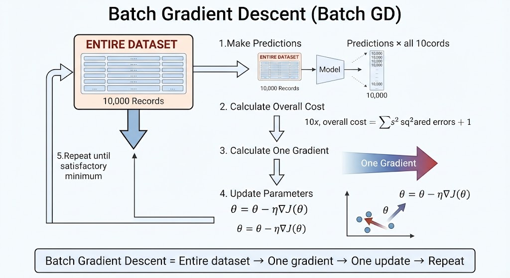
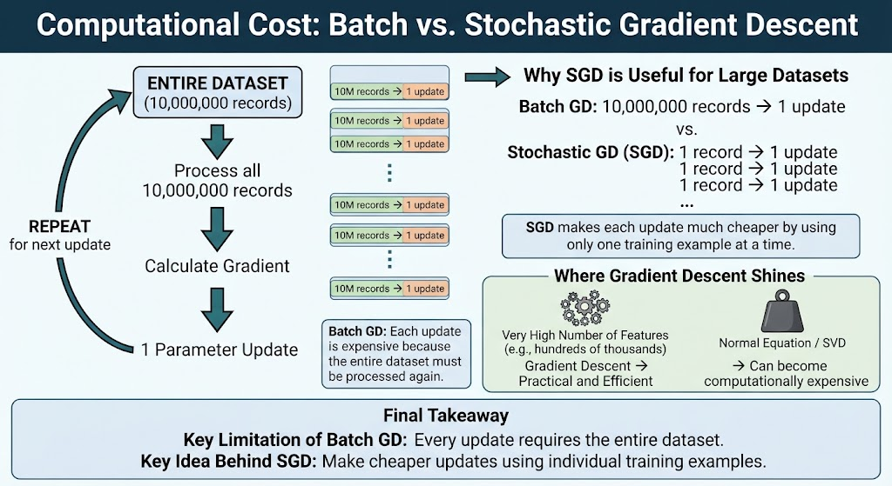
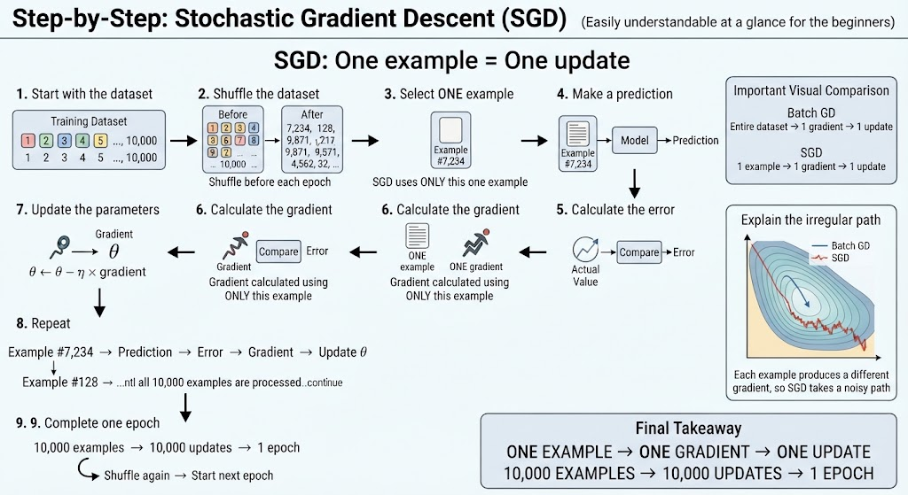
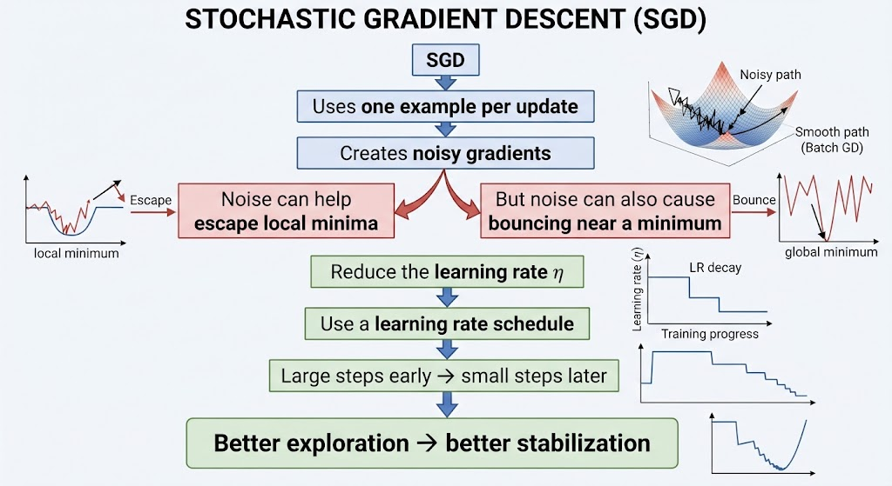
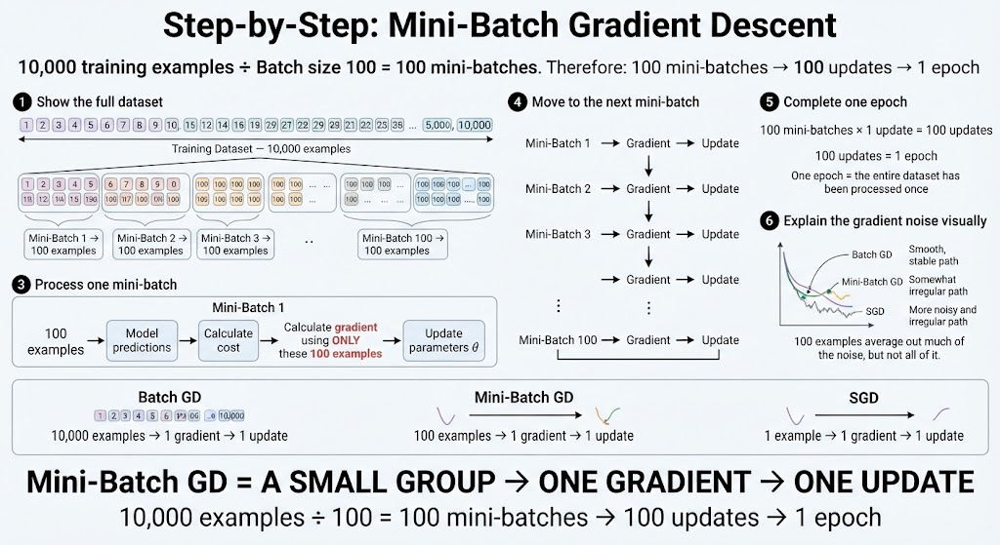

# Gradient Descent
The algorithm that adjusts a model's parameters, step by step, in the direction that **reduces error**.

- Gradient descent
- Cost function
- Learning rate
- MSE

---

## What We're Going to Explore (Down the Mountain)

1. **The Introduction:**
Descending a mountain in dense fog: feel the slope and take one step at a time.

2. **The Algorithm in Action:**
The complete animated descent on a 3D surface, step by step with buttons.

3. **The Formula:** $\theta := \theta - \alpha \nabla J(\theta)$
Each symbol with its role, interactive on the surface.

4. **The Cost Function:**
The example of the houses: from a 4-row table to the MSE parabola...

5. **Gradient & Learning Rate:**
The direction of the step ($\nabla J$) and its size ($\eta$): the compass and the stride.

6. **When It Fails:**
Local minima, plateaus, premature stopping, and the starting point

---

## Descending the Mountain Blindly (Intuition)

Imagine you are standing somewhere on a mountain, but a dense fog prevents you from seeing the landscape around you. **You don't know where the lowest point is, or even what the entire terrain looks like.**

However, you can **sense the slope beneath your feet**. You can determine which direction goes downhill and how steep the terrain is.

So you take **a small step in the direction of the steepest descent**.

Then you stop, sense the slope again, and take another step.

You repeat this process over and over, **gradually moving toward a low point in the landscape**.

You don't need to see the entire mountain. You only need **local information about the slope at your current position**.

That is the basic intuition behind **gradient descent**:
**use the gradient to determine which direction increases the cost the most, then move in the opposite direction to reduce it.**

In other words:

> **The gradient tells you which way is uphill; gradient descent takes you in the opposite direction, one step at a time.**

---

### The Process in 5 Steps

* **Step 1 — Initialize the Parameters:** We start with initial values of $\theta$, often chosen randomly. These parameters place us at a particular point on the mountain.

* **Step 2 — Measure the Error:** The **cost function** $J(\theta)$ tells us how large the error is at our current position—in other words, **how high we are on the mountain**.

* **Step 3 — Calculate the Gradient:** The **gradient** $\nabla J(\theta)$ tells us the direction in which the cost increases most rapidly. It points **uphill**.

* **Step 4 — Move in the Opposite Direction:** We move in the direction of $-\nabla J(\theta)$, **downhill**, so that the cost decreases.

* **Step 5 — Repeat:** We evaluate the cost, calculate the gradient, and take another step. We repeat this process until we **approach a minimum** of the cost function.

> **The entire loop can be summarized in a single line:**
>
> $$\theta \leftarrow \theta - \eta \nabla J(\theta)$$
>
> where $\eta$ is the **learning rate**, which controls the size of each step.

---

## In a nutshell

**Gradient descent adjusts the model's parameters little by little, moving in the direction that reduces the cost.**

And this is **VERY important**:

* ❎ **DOES NOT** directly search for the “best prediction.”
* ✅ **DOES** iteratively adjust $\theta$ to **minimize the cost function** $J(\theta)$.

In other words:

> **Gradient descent doesn't ask, “What is the best prediction?”**
>
> **It asks, “Which parameter values $\theta$ will make the cost as small as possible?”**

Once we find good parameter values, the model can use them to make better predictions.

---

## The Rule That Measures **How Badly We're Doing**

The **cost function** is the rule we use to measure how well—or how badly—our model is performing.

For **regression**, one of the most common cost functions is **Mean Squared Error (MSE)**.

$$
MSE = \frac{1}{n} \sum_{i=1}^{n} (y_i - \hat{y}_i)^2
$$

Where:

* $y_i$ = the **actual value**
* $\hat{y}_i$ = the **prediction**
* $y_i - \hat{y}_i$ = the **error**
* $(y_i - \hat{y}_i)^2$ = the **squared error**
* $n$ = the number of training examples

In our example, we want to predict the **price of a house** using only its **size $x$**.

Our model is:

$$
\hat{y} = \theta x
$$

Here, $\theta$ is the **parameter we can adjust**.

Different values of $\theta$ produce different predictions—and therefore different values of the MSE.

So the goal of gradient descent is to find a value of $\theta$ that makes the **MSE as small as possible**.

### But why do we **square** the error?

At first, squaring the error might seem arbitrary.

But it gives us an intuitive geometric interpretation:

> **The squared error can be visualized as the area of a square whose side length is the prediction error.**

If the prediction is off by **$20,000**, the error has a magnitude of $20,000.

Squaring it gives:

$$
20{,}000^2 = 400{,}000{,}000
$$

The number itself is not the important part of the mountain analogy. What matters is that **larger errors produce disproportionately larger penalties**.

That is why MSE strongly penalizes predictions that are far from the actual value.

---

## Let's Try with $\theta = 1$

Let's see what happens when we choose:

$$
\theta = 1
$$

Our model is:

$$
\hat{y} = \theta x = 1x = x
$$

| House | Size $x$ | Actual Price $y$ | Prediction $\hat{y}=1x$ | Error |
| ----: | -------: | ---------------: | ----------------------: | ----: |
|     1 |        1 |                2 |                       1 |     1 |
|     2 |        2 |                4 |                       2 |     2 |
|     3 |        3 |                6 |                       3 |     3 |
|     4 |        4 |                8 |                       4 |     4 |

Now we calculate the **Mean Squared Error**:

$$
MSE = \frac{1^2 + 2^2 + 3^2 + 4^2}{4}
$$

$$
MSE = \frac{1 + 4 + 9 + 16}{4}
= \frac{30}{4}
= 7.5
$$

So, with $\theta = 1$, our model has a **cost of 7.5**.

> **The important idea:** $\theta = 1$ is just one possible choice.
> We can try other values of $\theta$ and see whether the MSE gets smaller or larger.

---

---

## Gradient & Learning Rate

We now know that gradient descent moves **downhill** toward a minimum of the cost function.

But there are two important questions:

1. **Which direction should we move?**
2. **How big should the step be?**

These are answered by two different components:

* **The gradient $\nabla J(\theta)$** tells us **the direction**.
* **The learning rate $\eta$** tells us **the size of the step**.

Think of them as a **compass and a stride**:

> 🧭 **Gradient = compass:** tells us which way to go.
>
> 👣 **Learning rate = stride:** tells us how far to go.

### The Gradient: Which Way?

The gradient $\nabla J(\theta)$ points in the direction where the cost function increases the fastest—**uphill**.

Since gradient descent wants to reduce the cost, we move in the **opposite direction**:

$$
-\nabla J(\theta)
$$

So:

$$
\nabla J(\theta) \rightarrow \text{uphill}
$$

$$
-\nabla J(\theta) \rightarrow \text{downhill}
$$

### The Learning Rate: How Far?

The **learning rate $\eta$** controls how large each step is.

* **Small $\eta$** → small steps → slower progress.
* **Large $\eta$** → large steps → we may overshoot the minimum.
* **A suitable $\eta$** → controlled steps toward the minimum.

The gradient gives us the **direction**, while the learning rate determines the **distance** we move in that direction.

### Put Them Together

The two components appear together in the gradient descent update rule:

$$
\theta \leftarrow \theta - \eta\nabla J(\theta)
$$

Think of it this way:

> **The gradient tells us WHERE to go.**
>
> **The learning rate tells us HOW FAR to go.**

---

## Why Can Gradient Descent **Fail?**

So far, we have imagined a very simple landscape.

### What We Imagine

Imagine the cost function as a clean parabola:

* There is **one valley**.
* There is **one minimum**.
* Every downhill path eventually reaches the same point.

In this idealized case, gradient descent is easy:

> **Start anywhere → follow the slope downhill → reach the same minimum.**

But real machine-learning models are often much more complicated.

### What Happens in Real Models

The cost function can have a **complex, non-convex landscape** with:

* several valleys,
* almost flat regions,
* and a deeper minimum hidden somewhere else.

This creates several challenges for gradient descent.

### ⚠️ Fault 1 — Local Minimum

A **local minimum** is a point that is lower than the surrounding points, but **not necessarily the lowest point of the entire landscape**.

Gradient descent can reach this small valley and stop because:

$$
\nabla J(\theta) \approx 0
$$

From the algorithm's local perspective, there is no obvious downhill direction.

> **It found a good point nearby—but not necessarily the best point overall.**

### ⚠️ Fault 2 — Plateau

A **plateau** is a region where the cost function is almost flat.

The gradient becomes very small:

$$
\nabla J(\theta) \approx 0
$$

Because gradient descent updates the parameters using the gradient,

$$
\theta \leftarrow \theta - \eta\nabla J(\theta)
$$

a tiny gradient produces **tiny steps**.

> **The algorithm is still moving in the right direction, but progress can become very slow.**

### ⚠️ Fault 3 — Stopping Too Early

Sometimes gradient descent is working perfectly.

The cost is decreasing, the parameters are improving, and the algorithm is getting closer to a minimum.

But if we stop the training process too soon, we may never reach it.

> **It was still improving—we simply stopped the iterations too early.**

This is why we usually monitor the training process rather than choosing an arbitrary stopping point.

### ⚠️ Fault 4 — The Starting Point Matters

In a complex cost landscape, **where we start can affect where we end up**.

Two different starting points can follow different downhill paths:

$$
\theta_0^{(A)} \rightarrow \text{Minimum A}
$$

$$
\theta_0^{(B)} \rightarrow \text{Minimum B}
$$

One path might reach a shallow local minimum, while another might reach a deeper one.

> **Different starting points can lead to different destinations.**

### In a Nutshell

Gradient descent only knows about the **slope around its current position**. It does not see the entire cost landscape.

That's why:

> **The algorithm can follow the slope correctly and still end up somewhere we don't want.**

The main challenges are:

| Problem               | What happens?                                       |
| --------------------- | --------------------------------------------------- |
| **Local minimum**     | Gets stuck in a nearby valley                       |
| **Plateau**           | The gradient is tiny → progress becomes slow        |
| **Stopped too early** | Training ends before reaching a good minimum        |
| **Starting point**    | Different starts can lead to different destinations |

---

# Gradient Descent
Three ways to descend the same mountain
- Batch GD: 10,000 examples → **1 update**
- Stochastic GD: 1 example → **1 update**
- Mini-Batch GD: 180 examples → **1 update**

---

### Batch Gradient Descent (Batch GD)

Trains the model by adjusting its parameters to **minimize the cost function**.

> ### Defining characteristic
>
> For **each parameter update**, Batch GD uses the **entire training dataset**.

The update rule is:

$$\theta = \theta - \eta\nabla J(\theta)$$

Where:

* $\theta$ = model parameters
* $\eta$ = learning rate
* $\nabla J(\theta)$ = gradient of the cost function with respect to the parameters

> **Example:**
> With 10,000 training records, the model makes predictions for **all 10,000 records**, calculates the cost based on **all 10,000 predictions**, computes **one gradient**, and then performs **one parameter update**.
>
> It then repeats the process for the next update.

**In short:**
**Entire dataset → one gradient → one parameter update.**

---

## 100 Parameters → 100 Derivatives → 1 Gradient Vector

### 1. The model parameters

The model has **100 parameters** that we want to adjust:

$$
\theta_0,\theta_1,\theta_2,\ldots,\theta_{99}
$$

Each parameter can be changed independently.

### 2. One partial derivative per parameter

For each parameter, we calculate **one partial derivative**.

It answers:

> **“If I change only this parameter slightly, how does the cost function $J$ change?”**

So, with 100 parameters, we get **100 partial derivatives**:

$$
\frac{\partial J}{\partial\theta_0},
\frac{\partial J}{\partial\theta_1},
\ldots,
\frac{\partial J}{\partial\theta_{99}}
$$

### 3. The derivatives are grouped into one vector: the gradient

All 100 partial derivatives are combined into a single vector called the **gradient**:

$$
\nabla J(\theta)=
\begin{bmatrix}
\frac{\partial J}{\partial\theta_0}\
\frac{\partial J}{\partial\theta_1}\
\vdots\
\frac{\partial J}{\partial\theta_{99}}
\end{bmatrix}
$$

The gradient tells us the direction in which the **cost increases most rapidly**.

Think of it as a **compass pointing uphill**.

### 4. The negative sign points us downhill

In Gradient Descent, we don't want to increase the cost—we want to **minimize** it.

That's why the update uses a negative sign:

$$
\theta=\theta-\eta\nabla J(\theta)
$$

The **$-\nabla J(\theta)$** points in the opposite direction of the gradient, toward **lower cost**.

> **In summary**
>
> **100 parameters → 100 partial derivatives → 1 gradient vector → direction of greatest cost increase → negative step → lower cost**

---

## The Components Are Combined into the Gradient $\nabla J(\theta)$

### 1. One component per parameter

Each parameter has its own partial derivative, which measures how the cost $J$ changes when **only that parameter changes**.

For two parameters:

$$
\frac{\partial J}{\partial\theta_0}
\qquad
\frac{\partial J}{\partial\theta_1}
$$

Each partial derivative represents the **slope along its own parameter axis**.

### 2. Combine the components

The partial derivatives are placed together to form a vector:

$$
\nabla J(\theta)=
\begin{bmatrix}
\frac{\partial J}{\partial\theta_0}\
\frac{\partial J}{\partial\theta_1}
\end{bmatrix}
$$

These two values are the **two components of the gradient**.

### 3. The gradient points uphill

When we draw the two components together, they form one diagonal vector:

$$
\nabla J(\theta)
$$

This vector points in the direction where the cost $J$ **increases most rapidly**.

In other words, it points **uphill, away from the minimum**.

That is **not** the direction Gradient Descent wants to follow.

### 4. Gradient Descent uses the opposite direction

Gradient Descent reverses the gradient by multiplying it by $-1$:

$$
-\nabla J(\theta)
$$

Now the arrow points in the direction where the cost **decreases most rapidly**—toward the minimum.

That is the direction Gradient Descent uses to update the parameters:

$$
\theta=\theta-\eta\nabla J(\theta)
$$

### 5. Two parameters vs. 100 parameters

With **2 parameters**, the gradient has **2 components**, so we can visualize it as an arrow on a 2D graph.

With **100 parameters**, the gradient has **100 components**:

$$
\nabla J(\theta)=
\begin{bmatrix}
\frac{\partial J}{\partial\theta_0}\
\frac{\partial J}{\partial\theta_1}\
\vdots\
\frac{\partial J}{\partial\theta_{99}}
\end{bmatrix}
$$

We can't easily draw a 100-dimensional vector, but **the mathematical idea is exactly the same**.

> **In summary**
>
> **Partial derivatives → components → gradient vector $\nabla J(\theta)$ → direction of greatest increase → reverse it → $-\nabla J(\theta)$ → direction of greatest decrease.**
>
> **Gradient Descent does not move in the direction of $\nabla J(\theta)$. It moves in the direction of $-\nabla J(\theta)$.**

---

## The Cost of Using the Entire Dataset — and Where Batch GD Shines

### The Problem: Very Large Datasets

Imagine you have **10 million training records**.

With Batch Gradient Descent:

* **10,000,000 records → calculate the gradient → 1 update**
* **10,000,000 records → calculate the gradient → 1 update**
* **10,000,000 records → calculate the gradient → 1 update**
* And so on...

To make **just one parameter update**, the algorithm must process **all 10 million records**.

Then it has to process all 10 million records **again** for the next update.

This makes **each update computationally expensive**.

### The Key Idea

The problem isn't necessarily **how many updates** Gradient Descent needs.

The problem is **how expensive each update is**.

> **Batch GD:**
> Entire dataset → calculate gradient → 1 update
> Entire dataset → calculate gradient → 1 update
> Entire dataset → calculate gradient → 1 update

This limitation is what motivates **Stochastic Gradient Descent (SGD)**, which calculates an update using **one training example at a time**.

### Where Gradient Descent Shines

Despite this limitation, Gradient Descent is especially useful when a model has a **very large number of features**.

For example, with **hundreds of thousands of features**, training a linear regression model using Gradient Descent can be much more computationally efficient than solving it with the **Normal Equation** or using **SVD (Singular Value Decomposition)**.

> **In summary**
>
> **Batch GD:** Each update is expensive because it uses the entire dataset.
> **SGD:** Makes updates using individual examples, making each update much cheaper.
> **High-dimensional models:** Gradient Descent can be much more practical than direct methods such as the Normal Equation or SVD.

---

## SGD: One Example → One Update

### Defining Feature

Instead of using the **entire training set** to calculate the gradient, **Stochastic Gradient Descent (SGD)** uses **only one training example per update**.

### Step 1: Shuffle the Dataset

Before training, the examples are shuffled:

**Before:**

1, 2, 3, 4, 5, …, 10,000

**After:**

7,234, 128, 9,871, 4,562, 32, …

Shuffling helps prevent the model from seeing the training examples in a potentially problematic order.

The dataset is typically **reshuffled at the beginning of each epoch**.

### Step 2: Process One Example

For each training example:

**One example → Prediction → Calculate error → Calculate gradient → Update $\theta$**

For example:

**Example 7,234**
→ Make a prediction
→ Calculate its error
→ Calculate the gradient based on **that example**
→ Update $\theta$

Then move to the next example and repeat.

### Step 3: Repeat for the Entire Dataset

If there are **10,000 examples**, the model performs:

**10,000 examples → 10,000 updates → 1 epoch**

After the epoch is complete, the dataset is shuffled again and the process starts over.

### Why the Path Is More Irregular

Each training example produces a gradient based on **its own error**.

Therefore, different examples can produce **different gradients**.

Instead of moving smoothly toward the minimum, SGD takes a more **irregular, noisy path**:

> **Batch GD:** Many examples → one gradient → smooth(er) direction
> **SGD:** One example → one gradient → noisy direction

The noise can sometimes help SGD **move around local irregularities** and explore the cost function more effectively.

> **In summary**
>
> **1 example → 1 gradient → 1 update**
> **10,000 examples → 10,000 updates → 1 epoch**
> **Shuffle → process all examples → shuffle again → repeat**

---

## Same 10,000 Examples — Very Different Update Behavior

Both **Batch Gradient Descent (Batch GD)** and **Stochastic Gradient Descent (SGD)** process the same **10,000 training examples per epoch**.

|                            |    **Batch GD** |           **SGD** |
| -------------------------- | --------------: | ----------------: |
| Examples processed / epoch |          10,000 |            10,000 |
| Updates / epoch            |           **1** |        **10,000** |
| Examples per gradient      |          10,000 |                 1 |
| Cost of each update        |            High |          Very low |
| Typical path               | Smooth / direct | Noisy / irregular |

### The Important Difference

The key difference is **how often the model updates its parameters**.

**Batch GD:**

10,000 examples → calculate one gradient → **1 update**

**SGD:**

1 example → calculate one gradient → **1 update**

Then it immediately moves to the next example.

### After Processing Only 500 Examples

This makes the difference especially clear.

**SGD:**

500 examples processed → **500 updates**

The model has already adjusted its parameters 500 times.

**Batch GD:**

500 examples processed → **0 updates**

It is still collecting information for its **first gradient** because it must process all 10,000 examples before making an update.

> **After 500 examples:**
>
> **SGD → 500 updates**
> **Batch GD → 0 updates**

### Important: More Updates Does Not Automatically Mean Less Time

The number of updates per epoch **does not mean that SGD always finishes an epoch faster in wall-clock time**.

Batch GD can take very good advantage of **vectorized operations and matrix computations**, making its single update highly efficient.

The main advantage of SGD becomes particularly important when the dataset is **extremely large** or when processing the entire dataset for every update becomes too expensive.

### The Practical Intuition

Think of it this way:

**Batch GD:**

> “Let me look at **everything** before I make a decision.”

**SGD:**

> “Let me look at **one example**, make a small adjustment, and keep going.”

Because SGD updates the parameters much more frequently, it can often **progress toward a good solution faster**, especially with very large datasets.

> **In summary**
>
> **Same 10,000 examples.**
> **Batch GD:** 10,000 examples → 1 update.
> **SGD:** 10,000 examples → 10,000 updates.
>
> **SGD usually makes faster progress toward a good solution, especially when the dataset is very large—but that does not mean every SGD epoch is necessarily faster on the clock.**

---

## Why Batch GD Can Get Stuck — and Why SGD May Escape

### The Cost Function Has a Local and a Global Minimum

Imagine the cost function $J(\theta)$ as a **mountain landscape** with several valleys.

* **Global minimum:** the lowest point in the entire landscape
  $J = -0.522$
* **Local minimum:** a lower point nearby, but not the lowest point overall
  $J = 0.104$

Batch GD starts at some initial point and follows the gradient downhill.

If it reaches the local minimum, the gradient becomes approximately zero:

$$
\nabla J(\theta) \approx 0
$$

So there is almost no direction telling Batch GD where to go next.

> **Batch GD can get stuck at a local minimum.**

### Why Batch GD Gets Stuck

Batch GD calculates its gradient using the **entire dataset**.

This produces a relatively **stable and smooth gradient**.

Its path might look like:

**Start → downhill → local valley → $\nabla J(\theta) \approx 0$ → STOP**

Once it reaches a local minimum, the gradient provides almost no push to move away from it.

### Why SGD Can Escape

SGD calculates the gradient using **only one example at a time**.

Each example can produce a slightly different gradient:

**Example 1 → gradient ↗**
**Example 2 → gradient →**
**Example 3 → gradient ↘**
**Example 4 → gradient ↗**

Because the gradients vary from example to example, SGD follows a **noisier and more irregular path**.

That noise can sometimes give SGD a **push out of a local valley**, allowing it to continue searching for a better solution.

### Visual Intuition

**Batch GD:**

> Smooth gradient → smooth path → local minimum → $\nabla J \approx 0$ → **stuck**

**SGD:**

> Noisy gradients → irregular path → local valley → **random-like push → escape → continue**

The important point is that SGD does **not guarantee** that it will escape every local minimum. Rather, its noisy updates make it **less likely to remain stuck** in some local minima.

> **In summary**
>
> **Batch GD:** entire dataset → stable gradient → smooth path → can get stuck at a local minimum.
>
> **SGD:** one example → varying gradient → noisy path → may receive a push that helps it escape a local minimum.

---

## Is Noise Good or Bad? Both.

The **noise in SGD** has both advantages and disadvantages.

### Good: It Can Help Escape Local Minima

Because SGD uses **one example at a time**, each update can produce a slightly different gradient.

This creates a **noisy, irregular path**.

That noise can give SGD an extra push when it reaches a local minimum, helping it **escape and continue searching for a better solution**.

### Bad: It Makes SGD Less Stable

The same noise can also make it difficult for SGD to **settle exactly at the minimum**.

Instead of moving smoothly toward the lowest point, it may keep jumping around it:

> **Approach the minimum → overshoot → move back → overshoot again → keep bouncing**

So SGD can get close to a good solution without completely settling down.

### The Solution: Gradually Reduce the Learning Rate

This is why SGD typically starts with a **relatively large learning rate** and gradually decreases it.

**At the beginning:**

Large steps → faster movement → easier to escape poor regions

**Near the minimum:**

Smaller steps → less bouncing → better stabilization

The idea is:

> **Large steps early → smaller steps later**

This is called **learning-rate scheduling** or **learning-rate decay**.

### In summary

**Noise is both a strength and a weakness:**

**Noise → helps escape local minima**
**Noise → makes convergence less stable**

Therefore:

**Large learning rate → explore**
**Smaller learning rate → stabilize**

> **The goal is to keep enough movement to explore early, then reduce the step size so the model can settle near a good minimum.**

---

## Learning Rate Schedule: Large Steps → Small Steps

A **learning rate schedule** gradually changes the learning rate $\eta$ during training.

The basic idea is:

> **Larger learning rate at the beginning → smaller learning rate toward the end**

### At the Beginning: Larger $\eta$

Early in training, the model is usually far from a good solution.

A relatively **large learning rate** allows the model to take bigger steps and explore the cost function more quickly.

> **Large steps → faster exploration**

### Toward the End: Smaller $\eta$

As the model gets closer to a good minimum, large steps can become a problem.

The model may **overshoot the minimum or keep bouncing around it**.

So we gradually reduce $\eta$ to make the updates smaller and more precise.

> **Small steps → better stabilization**

### Example Schedule

A learning rate might decrease like this:

$$
0.1 \rightarrow 0.08 \rightarrow 0.05 \rightarrow 0.02 \rightarrow 0.01 \rightarrow 0.005
$$

The model therefore moves from:

**Explore → move toward a good region → stabilize near the minimum**

### Important Correction

It is more accurate to say **“large steps at the beginning and small steps at the end.”**

The phrase **“At the beginning: small $\eta$”** in the original definition should be **“At the end: small $\eta$.”**

> **In summary**
>
> **Beginning:** larger $\eta$ → explore quickly
> **End:** smaller $\eta$ → reduce bouncing and stabilize
>
> **Learning-rate schedule = gradually decreasing $\eta$ during training.**

---

## The Learning Rate Schedule: $\eta$ as a Function of Iteration

A **learning rate schedule** is a rule that determines **which learning rate $\eta$ to use at each iteration**.

Instead of keeping $\eta$ constant throughout training, we gradually reduce it as training progresses.

### Example

| Iteration | Learning Rate $\eta$ |
| --------: | -------------------: |
|         1 |                 0.10 |
|       100 |                 0.08 |
|       500 |                 0.05 |
|     1,000 |                 0.02 |
|     2,000 |                 0.01 |

So, as the number of iterations increases:

$$
\text{Iteration} \uparrow
\quad\Rightarrow\quad
\eta \downarrow
$$

### Why Do We Reduce $\eta$?

At the beginning of training, SGD benefits from **larger steps** because they allow it to explore the cost function and potentially escape poor local minima.

However, SGD's noisy updates can make it **bounce around** near a good minimum.

Reducing $\eta$ makes those updates progressively smaller:

> **Large $\eta$ → more exploration**
> **Small $\eta$ → more stability**

### How Everything Connects

The concepts form one continuous chain:

> **In summary**
>
> A learning rate schedule controls **how large each SGD update is as training progresses**.
>
> **Early training:** larger $\eta$ → explore
> **Later training:** smaller $\eta$ → stabilize

---

## Mini-Batch Gradient Descent: Neither All nor One

**Mini-Batch Gradient Descent** is the middle ground between Batch GD and SGD.

Instead of using the **entire dataset** or **just one example**, it uses a **small group of examples** to calculate each gradient and update the parameters.

### The 3 Variants

| Method            | Examples per update | Main characteristic                    |
| ----------------- | ------------------: | -------------------------------------- |
| **Batch GD**      |              10,000 | Accurate but computationally expensive |
| **SGD**           |                   1 | Fast updates but very noisy            |
| **Mini-Batch GD** |      32, 64, 128, … | Balance between the two                |

### The Same Dataset, Three Ways

Imagine a dataset with **10,000 examples**.

**Batch GD — all at once**

> 10,000 examples → 1 gradient → 1 update

It uses the entire dataset to calculate each update.

**SGD — one by one**

> 1 example → 1 gradient → 1 update
> 
> 1 example → 1 gradient → 1 update
> 
> 1 example → 1 gradient → 1 update

It makes a new update after every example.

**Mini-Batch GD — one group at a time**

For a batch size of 32:

> 32 examples → 1 gradient → 1 update
> 
> 32 examples → 1 gradient → 1 update
> 
> 32 examples → 1 gradient → 1 update
> …

With 10,000 examples and a batch size of 32, one epoch requires approximately **313 updates**.

### Why Mini-Batch Is a Good Compromise

Mini-Batch GD combines advantages from both approaches:

* **More stable than SGD** because each gradient is based on multiple examples.
* **Much cheaper per update than Batch GD** because it doesn't process the entire dataset.
* Works very well with **vectorized and parallel computations**, especially on GPUs.

The gradient is still an estimate, so the path is not as perfectly smooth as Batch GD, but it is generally **less noisy than SGD**.

> **In summary**
>
> **Batch GD:** all at once
> **SGD:** one by one
> **Mini-Batch GD:** one small group at a time
>
> **All three use the same basic Gradient Descent idea—the difference is simply how many training examples are used to calculate each update.**

---

## 10,000 Examples ÷ Batch Size 100 = 100 Mini-Batches

If the dataset contains **10,000 examples** and the mini-batch size is **100**:

$$
\frac{10,000}{100}=100
$$

So, one epoch contains **100 mini-batches**.

### 100 Mini-Batches → 100 Updates → 1 Epoch

The process looks like this:

**Mini-batch 1 (100 examples)** → Gradient → Update $\theta$
**Mini-batch 2 (100 examples)** → Gradient → Update $\theta$
**Mini-batch 3 (100 examples)** → Gradient → Update $\theta$
**…**
**Mini-batch 100 (100 examples)** → Gradient → Update $\theta$

Therefore:

> **100 mini-batches → 100 parameter updates → 1 epoch**

### What Happens in Each Mini-Batch?

For every group of 100 examples:

1. **Select the mini-batch** — take the next 100 examples.
2. **Make predictions** — the model predicts the outputs for those 100 examples.
3. **Calculate the cost** — measure how wrong those predictions are.
4. **Calculate the gradient** — use **only those 100 examples** to calculate the gradient.
5. **Update the parameters** — adjust $\theta$ using that gradient.
6. **Move to the next mini-batch** — repeat the process.

The key point is that the model **updates after every group of 100 examples**, rather than waiting for all 10,000.

### Why Is the Path in the Middle?

Each mini-batch produces an **estimate of the full gradient**.

Because the gradient is calculated from 100 examples rather than all 10,000, it contains some noise.

But averaging information from **100 examples** reduces a significant amount of that noise compared with using just one example.

So the optimization path is generally:

> **Batch GD → smoothest path**
> **Mini-Batch GD → moderately irregular path**
> **SGD → noisiest path**

**Mini-Batch GD is the middle ground:** enough examples to make the gradient relatively stable, but few enough to make each update computationally efficient.

---

## Mini-Batch GD: The Best of Both Worlds

Mini-Batch Gradient Descent combines important advantages of **Batch GD** and **SGD**.

### The Three Approaches

**Batch GD**

* Uses the **entire dataset** for each update.
* Produces a very **stable gradient**.
* But each update can be **computationally expensive**.

**SGD**

* Uses **one example** per update.
* Updates are **very frequent**.
* Each update is **cheap**, but the gradient is **very noisy**.

**Mini-Batch GD**

* Uses a **small group of examples** per update, such as 32, 64, or 100.
* Updates are **frequent**, like SGD.
* The gradient is **more stable** because it is calculated from multiple examples.

### Why Mini-Batches Work So Well

Suppose the batch size is **100**.

Instead of processing:

**10,000 examples → 1 update**

or:

**1 example → 1 update**

we process:

**100 examples → 1 update**

Then:

**100 examples → 1 update**

and so on.

The 100 examples provide more information than a single example, so their gradients tend to **average out some of the noise**.

At the same time, we don't have to wait for the entire dataset before updating the parameters.

### Another Major Advantage: Hardware Efficiency

Mini-batches can be represented as **matrix blocks**, which work very well with **vectorized operations**.

Modern hardware, especially **GPUs**, can process many examples in parallel.

So a mini-batch allows the algorithm to:

> **Process many examples at once → use parallel hardware efficiently → calculate one gradient → update frequently**

This is one of the major reasons mini-batch training is so effective for **neural networks**.

### The Big Picture

| Method            | Gradient stability | Update frequency | Computational efficiency            |
| ----------------- | ------------------ | ---------------- | ----------------------------------- |
| **Batch GD**      | Very stable        | Low              | Expensive per update                |
| **Mini-Batch GD** | **Fairly stable**  | **High**         | **Excellent for parallel hardware** |
| **SGD**           | Very noisy         | Very high        | Cheap per update                    |

> **In summary**
>
> **Batch GD:** stable but expensive updates.
> **SGD:** cheap and frequent but noisy updates.
> **Mini-Batch GD:** **frequent updates + relatively stable gradients + efficient hardware utilization.**
>
> **Mini-Batch GD = small groups for frequent updates, large enough for a stable gradient and efficient use of parallel hardware.**

---

## All Three in One Table

Assume a dataset of **10,000 examples** and a mini-batch size of **100**.

|                         | **Batch GD** | **Mini-Batch GD** |      **SGD** |
| ----------------------- | -----------: | ----------------: | -----------: |
| **Examples per update** |       10,000 |               100 |            1 |
| **Updates per epoch**   |            1 |               100 |       10,000 |
| **Gradient**            |  Very stable | Moderately stable |   Very noisy |
| **Memory required**     |         High |            Medium |          Low |
| **GPU utilization**     |         Good |     **Excellent** |        Lower |
| **Optimization path**   |       Smooth |  Moderately noisy | Very erratic |
| **Update frequency**    |          Low |              High |    Very high |

### How to Read the Table

**Batch GD**

> Uses everything → very stable gradient → few updates → expensive updates.

**Mini-Batch GD**

> Uses small groups → relatively stable gradient → frequent updates → efficient parallel computation.

**SGD**

> Uses one example → very noisy gradient → extremely frequent updates → very cheap individual updates.

### Which One Is Better?

There is **no universal winner**.

The best choice depends on the **dataset, model, hardware, and training requirements**.

> **Batch GD:** useful when stable, full-dataset gradients are desirable.
> **Mini-Batch GD:** often the practical default, especially for neural networks and GPU-based training.
> **SGD:** useful when very cheap, frequent updates and low memory usage are important.

> **In summary**
>
> **Batch GD = all at once**
> **Mini-Batch GD = small groups**
> **SGD = one at a time**
>
> **Different problems → different trade-offs → no single method is always best.**

---

| Method | When to use it | Main advantage | Main problem |
|---|---|---|---|---|
| **Batch GD** | When the dataset is relatively small enough to process efficiently in full batches | Very stable and precise gradient | Each update can be expensive |
| **Mini-Batch GD** | When training larger models or datasets, especially with GPUs/parallel hardware | Good balance between stability, speed, and hardware efficiency | Requires choosing a suitable batch size |
| **SGD** | When the dataset is very large or when you need very frequent, low-cost updates | Low memory usage and fast updates | Very noisy and less stable convergence |

> **Simple rule of thumb**
>
> **Small dataset → Batch GD may be fine**
> **Most modern ML training → Mini-Batch GD is often the default choice**
> **Huge datasets or strict memory constraints → SGD can be useful**
>
> The choice depends on the **dataset size, model, available hardware, memory, and training objective**.

