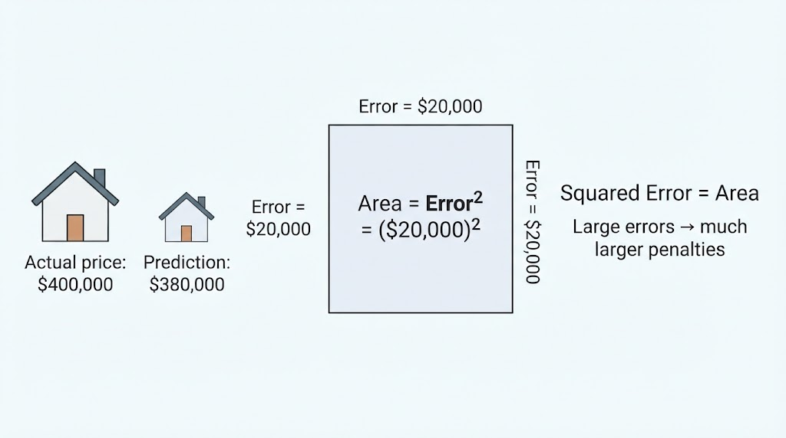
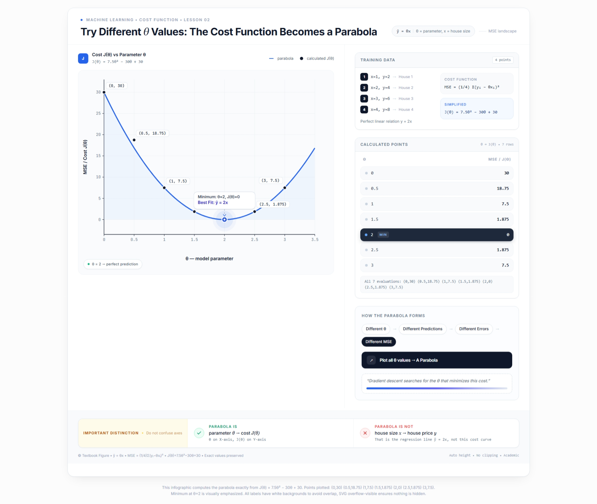
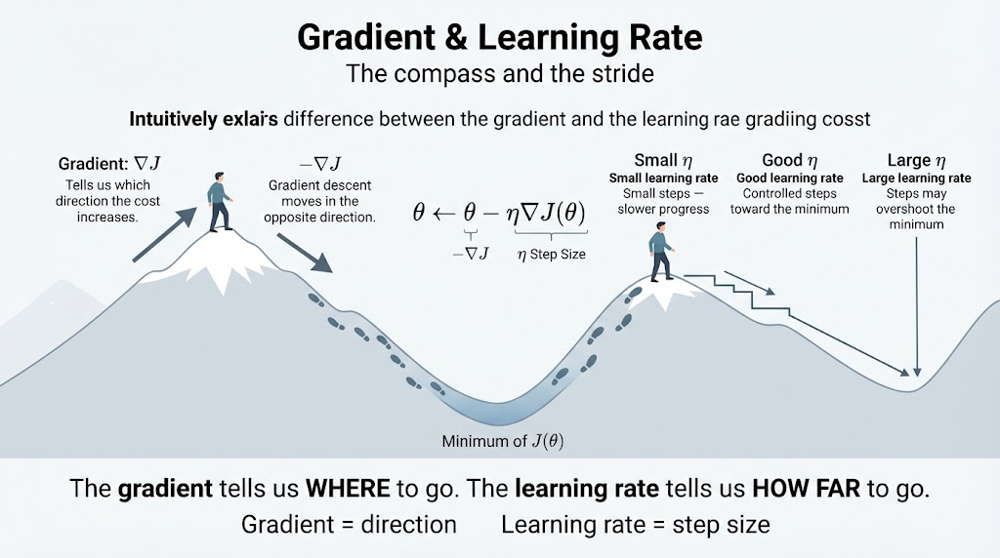
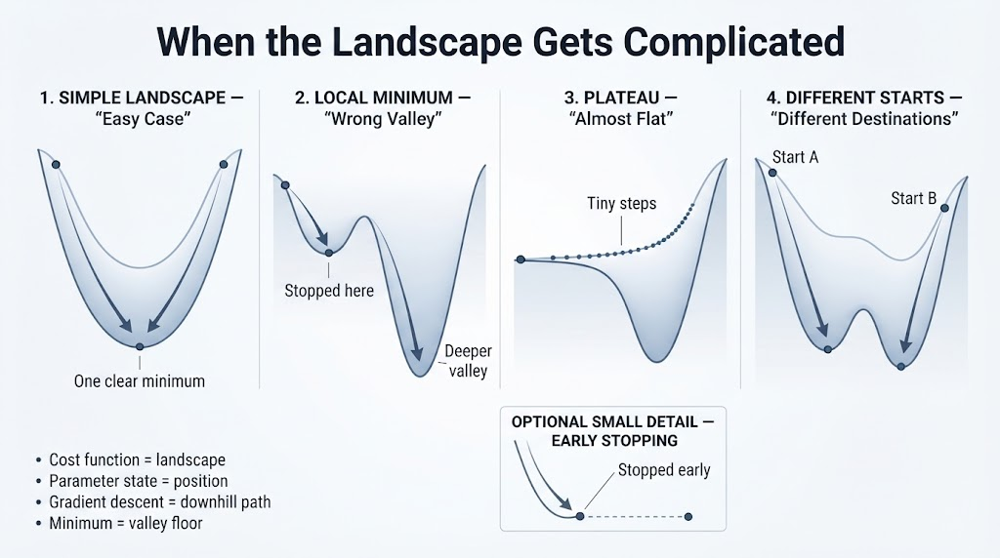

# Gradient Descent
The algorithm that adjusts a model's parameters, step by step, in the direction that **reduces error**.

- Gradient descent
- Cost function
- Learning rate
- MSE

---

## What We're Going to Explore (Down the Mountain)

1. **The Introduction:**
Descending a mountain in dense fog: feel the slope and take one step at a time.

2. **The Algorithm in Action:**
The complete animated descent on a 3D surface, step by step with buttons.

3. **The Formula:** $\theta := \theta - \alpha \nabla J(\theta)$
Each symbol with its role, interactive on the surface.

4. **The Cost Function:**
The example of the houses: from a 4-row table to the MSE parabola...

5. **Gradient & Learning Rate:**
The direction of the step ($\nabla J$) and its size ($\eta$): the compass and the stride.

6. **When It Fails:**
Local minima, plateaus, premature stopping, and the starting point

---

## Descending the Mountain Blindly (Intuition)

Imagine you are standing somewhere on a mountain, but a dense fog prevents you from seeing the landscape around you. **You don't know where the lowest point is, or even what the entire terrain looks like.**

However, you can **sense the slope beneath your feet**. You can determine which direction goes downhill and how steep the terrain is.

So you take **a small step in the direction of the steepest descent**.

Then you stop, sense the slope again, and take another step.

You repeat this process over and over, **gradually moving toward a low point in the landscape**.

You don't need to see the entire mountain. You only need **local information about the slope at your current position**.

That is the basic intuition behind **gradient descent**:
**use the gradient to determine which direction increases the cost the most, then move in the opposite direction to reduce it.**

In other words:

> **The gradient tells you which way is uphill; gradient descent takes you in the opposite direction, one step at a time.**

---

### The Process in 5 Steps

* **Step 1 — Initialize the Parameters:** We start with initial values of $\theta$, often chosen randomly. These parameters place us at a particular point on the mountain.

* **Step 2 — Measure the Error:** The **cost function** $J(\theta)$ tells us how large the error is at our current position—in other words, **how high we are on the mountain**.

* **Step 3 — Calculate the Gradient:** The **gradient** $\nabla J(\theta)$ tells us the direction in which the cost increases most rapidly. It points **uphill**.

* **Step 4 — Move in the Opposite Direction:** We move in the direction of $-\nabla J(\theta)$, **downhill**, so that the cost decreases.

* **Step 5 — Repeat:** We evaluate the cost, calculate the gradient, and take another step. We repeat this process until we **approach a minimum** of the cost function.

> **The entire loop can be summarized in a single line:**
>
> $$\theta \leftarrow \theta - \eta \nabla J(\theta)$$
>
> where $\eta$ is the **learning rate**, which controls the size of each step.

---

## In a nutshell

**Gradient descent adjusts the model's parameters little by little, moving in the direction that reduces the cost.**

And this is **VERY important**:

* ❎ **DOES NOT** directly search for the “best prediction.”
* ✅ **DOES** iteratively adjust $\theta$ to **minimize the cost function** $J(\theta)$.

In other words:

> **Gradient descent doesn't ask, “What is the best prediction?”**
>
> **It asks, “Which parameter values $\theta$ will make the cost as small as possible?”**

Once we find good parameter values, the model can use them to make better predictions.

---

## The Rule That Measures **How Badly We're Doing**

The **cost function** is the rule we use to measure how well—or how badly—our model is performing.

For **regression**, one of the most common cost functions is **Mean Squared Error (MSE)**.

$$
MSE = \frac{1}{n} \sum_{i=1}^{n} (y_i - \hat{y}_i)^2
$$

Where:

* $y_i$ = the **actual value**
* $\hat{y}_i$ = the **prediction**
* $y_i - \hat{y}_i$ = the **error**
* $(y_i - \hat{y}_i)^2$ = the **squared error**
* $n$ = the number of training examples

In our example, we want to predict the **price of a house** using only its **size $x$**.

Our model is:

$$
\hat{y} = \theta x
$$

Here, $\theta$ is the **parameter we can adjust**.

Different values of $\theta$ produce different predictions—and therefore different values of the MSE.

So the goal of gradient descent is to find a value of $\theta$ that makes the **MSE as small as possible**.

### But why do we **square** the error?

At first, squaring the error might seem arbitrary.

But it gives us an intuitive geometric interpretation:

> **The squared error can be visualized as the area of a square whose side length is the prediction error.**

If the prediction is off by **$20,000**, the error has a magnitude of $20,000.

Squaring it gives:

$$
20{,}000^2 = 400{,}000{,}000
$$

The number itself is not the important part of the mountain analogy. What matters is that **larger errors produce disproportionately larger penalties**.

That is why MSE strongly penalizes predictions that are far from the actual value.

---

## Let's Try with $\theta = 1$

Let's see what happens when we choose:

$$
\theta = 1
$$

Our model is:

$$
\hat{y} = \theta x = 1x = x
$$

| House | Size $x$ | Actual Price $y$ | Prediction $\hat{y}=1x$ | Error |
| ----: | -------: | ---------------: | ----------------------: | ----: |
|     1 |        1 |                2 |                       1 |     1 |
|     2 |        2 |                4 |                       2 |     2 |
|     3 |        3 |                6 |                       3 |     3 |
|     4 |        4 |                8 |                       4 |     4 |

Now we calculate the **Mean Squared Error**:

$$
MSE = \frac{1^2 + 2^2 + 3^2 + 4^2}{4}
$$

$$
MSE = \frac{1 + 4 + 9 + 16}{4}
= \frac{30}{4}
= 7.5
$$

So, with $\theta = 1$, our model has a **cost of 7.5**.

> **The important idea:** $\theta = 1$ is just one possible choice.
> We can try other values of $\theta$ and see whether the MSE gets smaller or larger.

---

---

## Gradient & Learning Rate

We now know that gradient descent moves **downhill** toward a minimum of the cost function.

But there are two important questions:

1. **Which direction should we move?**
2. **How big should the step be?**

These are answered by two different components:

* **The gradient $\nabla J(\theta)$** tells us **the direction**.
* **The learning rate $\eta$** tells us **the size of the step**.

Think of them as a **compass and a stride**:

> 🧭 **Gradient = compass:** tells us which way to go.
>
> 👣 **Learning rate = stride:** tells us how far to go.

### The Gradient: Which Way?

The gradient $\nabla J(\theta)$ points in the direction where the cost function increases the fastest—**uphill**.

Since gradient descent wants to reduce the cost, we move in the **opposite direction**:

$$
-\nabla J(\theta)
$$

So:

$$
\nabla J(\theta) \rightarrow \text{uphill}
$$

$$
-\nabla J(\theta) \rightarrow \text{downhill}
$$

### The Learning Rate: How Far?

The **learning rate $\eta$** controls how large each step is.

* **Small $\eta$** → small steps → slower progress.
* **Large $\eta$** → large steps → we may overshoot the minimum.
* **A suitable $\eta$** → controlled steps toward the minimum.

The gradient gives us the **direction**, while the learning rate determines the **distance** we move in that direction.

### Put Them Together

The two components appear together in the gradient descent update rule:

$$
\theta \leftarrow \theta - \eta\nabla J(\theta)
$$

Think of it this way:

> **The gradient tells us WHERE to go.**
>
> **The learning rate tells us HOW FAR to go.**

---

## Why Can Gradient Descent **Fail?**

So far, we have imagined a very simple landscape.

### What We Imagine

Imagine the cost function as a clean parabola:

* There is **one valley**.
* There is **one minimum**.
* Every downhill path eventually reaches the same point.

In this idealized case, gradient descent is easy:

> **Start anywhere → follow the slope downhill → reach the same minimum.**

But real machine-learning models are often much more complicated.

### What Happens in Real Models

The cost function can have a **complex, non-convex landscape** with:

* several valleys,
* almost flat regions,
* and a deeper minimum hidden somewhere else.

This creates several challenges for gradient descent.

### ⚠️ Fault 1 — Local Minimum

A **local minimum** is a point that is lower than the surrounding points, but **not necessarily the lowest point of the entire landscape**.

Gradient descent can reach this small valley and stop because:

$$
\nabla J(\theta) \approx 0
$$

From the algorithm's local perspective, there is no obvious downhill direction.

> **It found a good point nearby—but not necessarily the best point overall.**

### ⚠️ Fault 2 — Plateau

A **plateau** is a region where the cost function is almost flat.

The gradient becomes very small:

$$
\nabla J(\theta) \approx 0
$$

Because gradient descent updates the parameters using the gradient,

$$
\theta \leftarrow \theta - \eta\nabla J(\theta)
$$

a tiny gradient produces **tiny steps**.

> **The algorithm is still moving in the right direction, but progress can become very slow.**

### ⚠️ Fault 3 — Stopping Too Early

Sometimes gradient descent is working perfectly.

The cost is decreasing, the parameters are improving, and the algorithm is getting closer to a minimum.

But if we stop the training process too soon, we may never reach it.

> **It was still improving—we simply stopped the iterations too early.**

This is why we usually monitor the training process rather than choosing an arbitrary stopping point.

### ⚠️ Fault 4 — The Starting Point Matters

In a complex cost landscape, **where we start can affect where we end up**.

Two different starting points can follow different downhill paths:

$$
\theta_0^{(A)} \rightarrow \text{Minimum A}
$$

$$
\theta_0^{(B)} \rightarrow \text{Minimum B}
$$

One path might reach a shallow local minimum, while another might reach a deeper one.

> **Different starting points can lead to different destinations.**

### In a Nutshell

Gradient descent only knows about the **slope around its current position**. It does not see the entire cost landscape.

That's why:

> **The algorithm can follow the slope correctly and still end up somewhere we don't want.**

The main challenges are:

| Problem               | What happens?                                       |
| --------------------- | --------------------------------------------------- |
| **Local minimum**     | Gets stuck in a nearby valley                       |
| **Plateau**           | The gradient is tiny → progress becomes slow        |
| **Stopped too early** | Training ends before reaching a good minimum        |
| **Starting point**    | Different starts can lead to different destinations |

