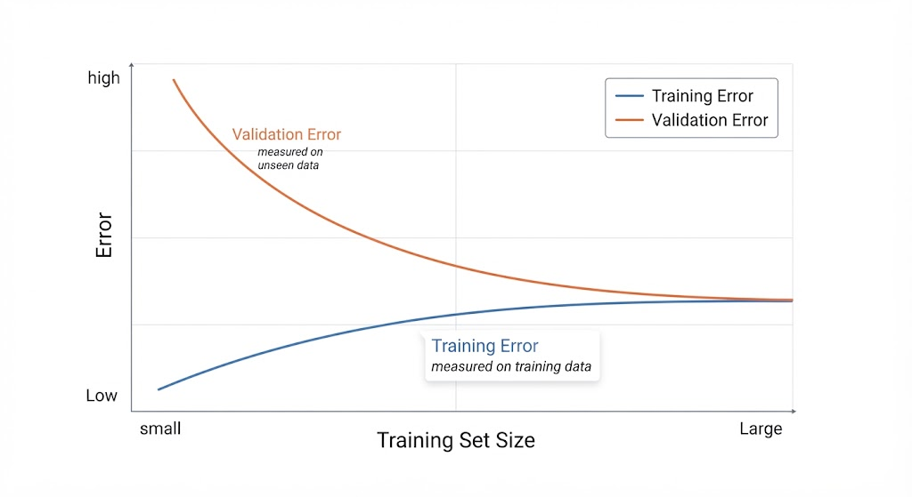
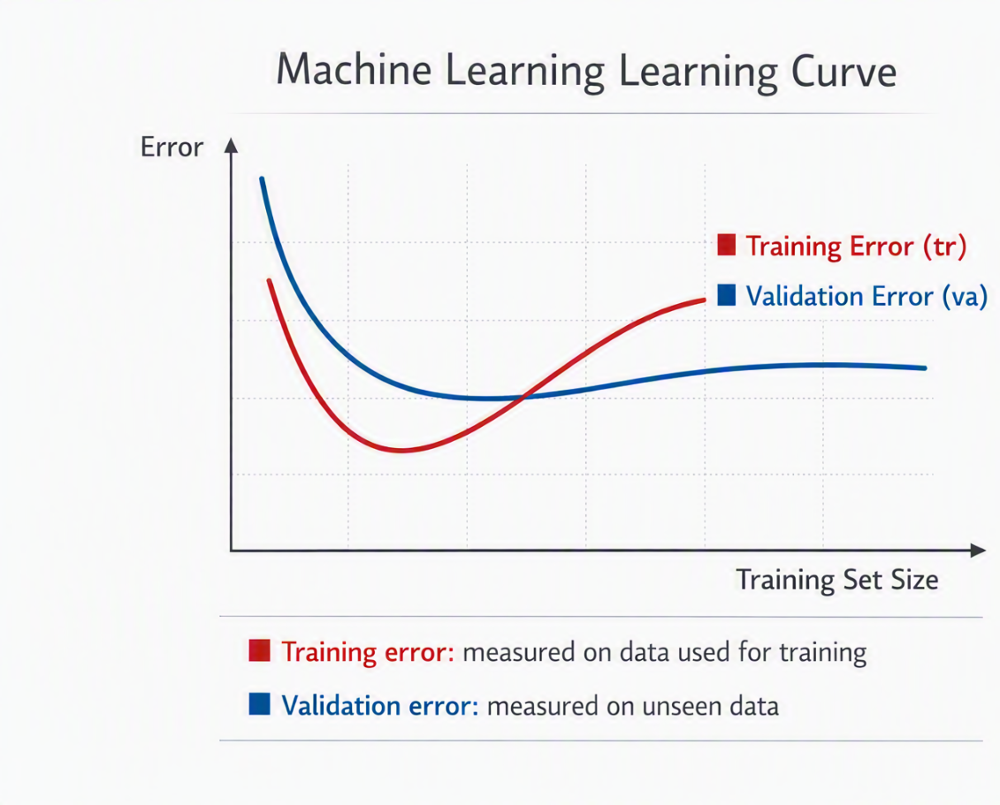

# Learning Curve

A **learning curve** is a graph that shows how a model’s performance changes as the amount of **training data increases**. It helps identify whether a model is **underfitting, overfitting, or performing well**.

* **Training error:** The error measured on the data used to train the model.
* **Validation error:** The error measured on unseen data, usually using a validation set or cross-validation.

### Underfitting

The model is too simple to capture the patterns in the data.

* **Training error:** High and usually decreases only slightly as more data is added.
* **Validation error:** High and remains close to the training error.
* **Typical sign:** Both errors are high and converge.

### Overfitting

The model learns the training data too closely, including noise or irrelevant patterns.

* **Training error:** Very low and may remain low as more data is added.
* **Validation error:** Higher than the training error, but usually decreases as more data is added.
* **Typical sign:** There is a noticeable gap between training and validation errors.

### Good Fit

The model generalizes well to unseen data.

* **Training error:** Low.
* **Validation error:** Also low and close to the training error.
* **Typical sign:** The two curves converge at a relatively low error.

### Cross-Validation

**Cross-validation** is a technique for evaluating how well a model generalizes to unseen data. Instead of relying on a single train/validation split, the data is divided into multiple parts and the model is trained and evaluated several times.

### K-Fold Cross-Validation

**K-Fold Cross-Validation** is a common type of cross-validation.

1. Split the dataset into **K equally sized folds**.
2. Train the model using **K − 1 folds**.
3. Evaluate it on the remaining fold.
4. Repeat this process until every fold has been used as the validation set.
5. Average the results to obtain a more reliable estimate of model performance.

For example, with **5-Fold Cross-Validation**, the model is trained and evaluated **5 times**, with each fold serving as the validation set once.

---

## Training Error Is Not Enough

You cannot determine which model is better simply by choosing the one with the **lowest training error**.

A highly complex model can fit the training data extremely well, including **noise and random patterns**. As a result, it may have a very low training error but perform poorly on unseen data.

**Example:**

* **Simple model:** Higher training error, but it may generalize well.
* **Complex model:** Very low training error, but it may overfit the training data.

Therefore, you should also evaluate the model on **unseen validation data**.

---

## Observing Error as Data Increases

You do not need to know the **true underlying function** to detect underfitting or overfitting.

Instead, you can observe how the model's **training and validation errors change as the amount of training data increases**.

### Process

1. Train the model using a small number of examples.
2. Measure the **training error** and **validation error**.
3. Add more training examples.
4. Train and evaluate the model again.
5. Repeat this process for different training set sizes.
6. Plot the **training error** and **validation error** against the number of training examples.

The resulting graph is called a **learning curve**.

**Example:**



The relationship between the two curves helps you identify whether the model is **underfitting or overfitting**.

---

## A Single Split Can Lie

**Cross-validation** is a technique used to evaluate how well a Machine Learning model **generalizes to unseen data**.

Instead of relying on just one train/validation split, we divide the training data into several parts called **folds**.

1. Divide the training set into **K folds**.
2. Train the model using **K − 1 folds** and validate it on the remaining fold.
3. Repeat the process until every fold has been used as the validation set.
4. Calculate the **average validation score** across all folds.

This gives a more reliable estimate of model performance and helps us compare **models or hyperparameter configurations**.

---

## What Is Cross-Validation Used For?

Cross-validation uses the same basic mechanism, but it can help with several different tasks.

### 1. Evaluate the Model

It gives us a better idea of how the model performs on different subsets of the available data instead of relying on a single potentially lucky or unlucky validation split.

```python
cross_val_score(
    model,
    X_train,
    y_train,
    cv=5,
    scoring="neg_root_mean_squared_error"
)
```

With `cv=5`, the model is evaluated using **5 different validation folds**.

For RMSE, remember that scikit-learn returns the **negative RMSE** when using `neg_root_mean_squared_error`, so you normally negate the results to interpret them as positive RMSE values.

---

### 2. Detect Overfitting

Cross-validation can reveal a large difference between how well a model fits the training data and how well it performs on unseen validation folds.

Example:

```text
Training RMSE = 0.88
CV RMSE       = 4.30  ← Large gap → possible overfitting
```

The model fits the training data very well, but its performance on unseen data is much worse.

**Important:** A large train-vs-CV gap is a **warning sign of overfitting**, not by itself absolute proof. The difference should be interpreted together with the model, dataset, and evaluation setup.

---

### 3. Choose Hyperparameters

Cross-validation is commonly used to compare different **hyperparameter values** and determine which configuration generalizes better.

For example, when choosing the degree of a polynomial regression:

| Polynomial Degree | CV RMSE |
| ----------------: | ------: |
|                 1 |    1.65 |
|                 2 |    1.03 |
|                10 |    0.97 |

A lower RMSE indicates better validation performance **on this cross-validation procedure**.

However, you should not automatically keep increasing the degree just because the CV RMSE keeps decreasing:

```text
Degree 1  → 1.65
Degree 2  → 1.03
Degree 10 → 0.97
Degree 20 → 0.96
Degree 50 → 0.95
...
```

A very complex model can eventually become sensitive to noise and produce poor generalization. Also, repeatedly searching many hyperparameters against the same cross-validation results can itself lead to **overfitting to the validation procedure**.

A common workflow is:

```text
Training data
     │
     ├── Cross-validation
     │       └── Choose hyperparameters
     │
     └── Final model
             │
             ▼
       Test set → Final evaluation
```

The **test set should remain untouched during model and hyperparameter selection** so that it can provide an unbiased final estimate of generalization.

---

## What Is a Learning Curve?

A **learning curve** is a graph that shows how a model’s **performance changes as the amount of training data increases**.

### X-axis: Training Set Size

The number of examples used to train the model.

* Small training set → few examples
* Large training set → many examples

### Y-axis: Model Error

A measure of how wrong the model’s predictions are.

For example:

* **RMSE** (Root Mean Squared Error)
* **MSE** (Mean Squared Error)

For error metrics, **lower is better**.

### Training Error (tr)

The error measured on the **same data used to train the model**.

With very few examples, especially just one, a sufficiently flexible model can often fit the training data almost perfectly.

```text
1 training example → Training error ≈ 0
```

This does **not** mean the model generalizes well. A model can memorize the training examples while performing poorly on new data.

### Validation Error (va)

The error measured on **data that the model did not use for training**.

With very little training data, the model usually has limited information to learn from, so the validation error can be high.

As more training examples are added, the model generally has more information to learn from, so the validation error often **decreases and eventually stabilizes**.

### Typical Learning Curve



The important idea is to **observe the relationship between training error and validation error as more training data is added**. Their behavior can provide clues about whether the model is **underfitting or overfitting**.
