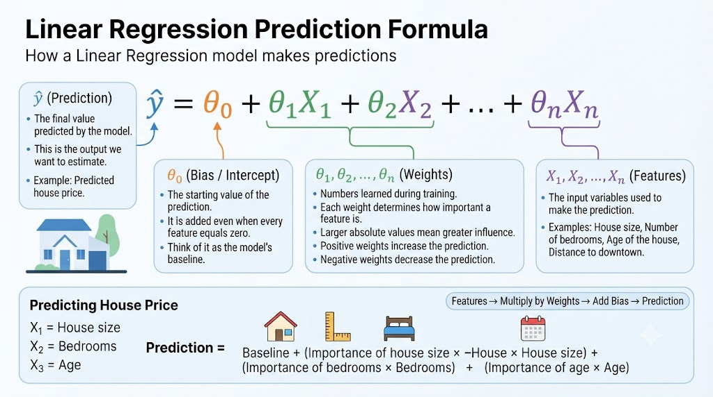
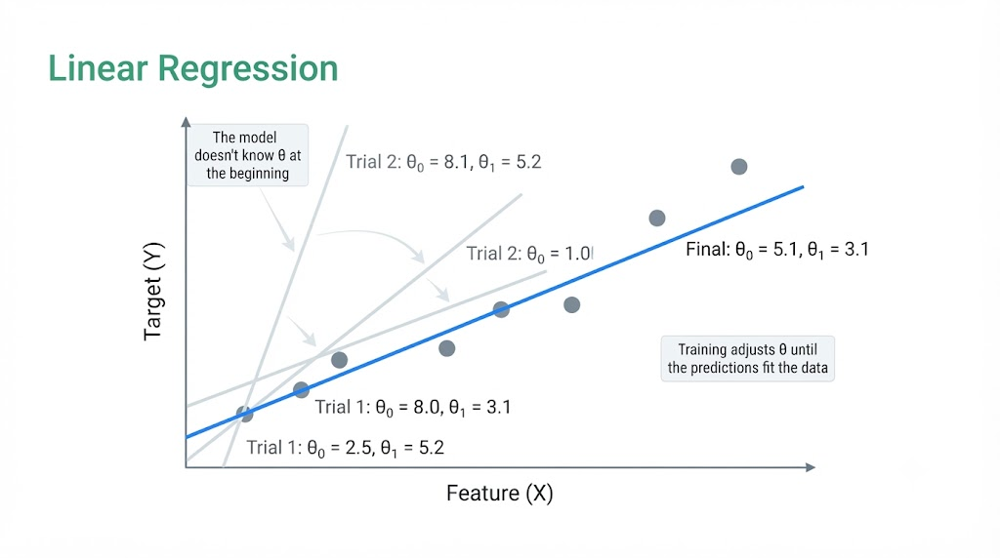
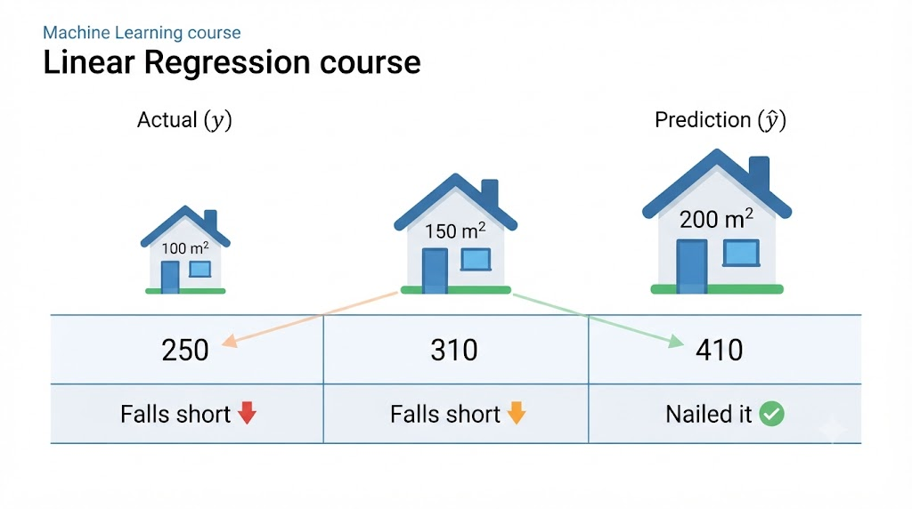
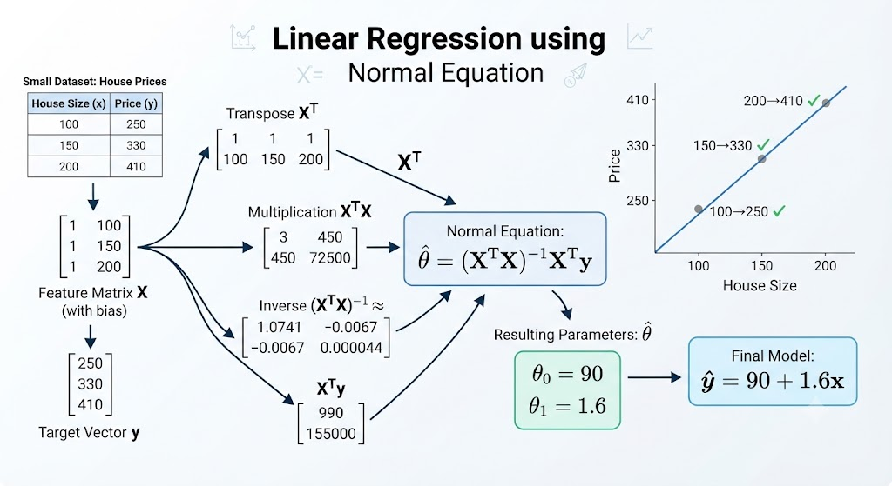

# Linear Regression
The algorithm that learns a formula: from **features** to a **prediction** (and how the _training_ finds the **parameters 0** that minimize the **error.**)

- 0: parameters
- x:features
- ŷ: prediction
- MSE: error

## What is linear regression?
A machine learning algorithm that looks for a linear relationship between input variables and the value we want to predict.

## Simply put:
Learn a **formula** that transforms **features** into a **prediction**.



---

### Example: Predicting a House Price

Suppose we want to estimate the price of a house.

#### Input (Features)

The model receives several characteristics of the house as input:

- **Size:** 150 m² → $(x_1)$
- **Bedrooms:** 3 → $(x_2)$
- **Age:** 10 years → $(x_3)$

These characteristics are called **features** because they describe the house.

---

#### Linear Regression Model

The model combines the features using the linear regression equation:

$\hat{y} = \theta_0 + \theta_1x_1 + \theta_2x_2 + \theta_3x_3$

where:

- $(\theta_0)$ = bias (starting value)
- $(\theta_1, \theta_2, \theta_3)$ = learned weights
- $(x_1, x_2, x_3)$ = input features

---

#### Output (Prediction)

After applying the formula, the model predicts:

$\hat{y} = \$350,\!000$

This means the model **estimates** that the house is worth **$350,000**.

> **Important:** This is **not** the actual selling price. It is only the model's best prediction based on the information it has learned from the training data.

---

### Why is there a hat on $(\hat{y})$?

The model answers the question:

> **"Based on these features, how much is this house likely worth?"**

The output is written as **$(\hat{y})$** ("y hat") because it represents an **estimated value**, not the true value.

- $(y)$ → Actual house price (ground truth)
- $(\hat{y})$ → Predicted house price (model estimate)

---

### It's a Weighted Sum

Linear regression predicts a value by adding together the contribution of each feature.

For example:

$\text{Price} = 50,\!000 + 2,\!000 \times (\text{Size}) + 10,\!000 \times (\text{Rooms})$

or, using mathematical notation,

$\hat{y} = \theta_0 + \theta_1x_1 + \theta_2x_2$

where:

- **$(\theta_0 = 50,\!000)$** → **Bias (Intercept):** the starting value of the prediction before considering any features.

- **$(\theta_1 = 2,\!000)$** → **Weight for Size:** each additional square meter increases the predicted price by **$2,000**.

- **$(\theta_2 = 10,\!000)$** → **Weight for Rooms:** each additional room increases the predicted price by **$10,000**.

### How the model thinks

The model starts with the **base price** (bias), then adjusts it according to the house's characteristics.

For a house with:

- Size = **150 m²**
- Rooms = **3**

the prediction becomes:

$50,\!000 + (2,\!000 \times 150) + (10,\!000 \times 3)$

Each feature contributes independently to the final prediction, and the model simply **adds all these contributions together**.

---

## Example: Predicting a House Price
Suppose we want to predict the price of a house using the following features:

* Size ($x_1$): $100\text{ m}^2$
* Rooms ($x_2$): $3$

The linear regression model is defined as:
$$\hat{y} = \theta_0 + \theta_1x_1 + \theta_2x_2$$ 
Where the model weights (parameters) are:

* Bias ($\theta_0$): $50,000$
* Size weight ($\theta_1$): $2,000$
* Rooms weight ($\theta_2$): $10,000$

---
## 1. Calculate Feature Contributions
Multiply each feature value by its corresponding weight:

* Size contribution: $\theta_1x_1 = 2,000 \times 100 = 200,000$
* Rooms contribution: $\theta_2x_2 = 10,000 \times 3 = 30,000$

## 2. Substitute into the Model
Combine the base price and the calculated contributions into the main equation:
$$\hat{y} = 50,000 + 200,000 + 30,000$$ 
## 3. Compute Final Sum
Add all components together to get the final result:
$$\hat{y} = 280,000$$ 
------------------------------
## Final Prediction
The model predicts the total value of the house is:
$$\boxed{\hat{y} = \$280,000}$$ 

How it works: The model starts with a base price of $50,000 (the bias). It then adds $2,000 per square meter and $10,000 per room. The final prediction is the sum of all these individual components.

---

## What is $\theta$ (theta)?

These are the **model parameters**: the internal numbers that the algorithm must **find** to make accurate predictions.

> Important: The model **doesn't know these numbers at the beginning**. It has to **calculate them during training**, testing until it fits the data.

### Why do they matter?
They are the values ​​that **control the model's behavior**: changing $\theta$ changes all of its predictions.



---

## Same house, different model

### Model A: size is important
$$\text{Price} = 50,000 + 10,000(size) + 2,000(rooms)$$
$$\theta_1: \text{Size} = 10,000$$
$$\theta_2: \text{rooms} = 2,000$$
$$50,000 + 10,000(100) + 2,000(3)$$
$$\hat{y} = \$1,056,000$$

### Model B: number of rooms is important
$$\text{Price} = 50,000 + 2,000(rooms) + 10,000(size)$$
$$\theta_1: \text{Size} = 2,000$$
$$\theta_2: \text{rooms} = 10,000$$
$$50,000 + 2,000(100) + 10,000(3)$$
$$\hat{y} = \$280,000$$

> Same **input data**, but **radically different predictions:** $1,056,000 vs. $280,000. That's what $\theta$ are for: weighting size is not the same as weighting the number of rooms.

---

## $\theta_0$ The Bias (or Intercept)

This is the **initial value** of the prediction, before considering the features: what the model returns when $x_1 = x_2 = ... = 0$

- **House:** The price of a house with $0 m² and 0 rooms? As a concept, **it makes little sense**.

- **Taxi:** The price of a 0 km trip? **It makes perfect sense:** the initial charge, the base fare.

### The Secret of the Line Formula
$$ \underbrace{y = b + mx}_{\text{The usual line}} \iff \underbrace{\hat{y} = \theta_0 + \theta_1 x}_{\text{Our model}} $$

$\theta_0$ is the **height** where the line intersects the axis (it gives it the freedom to **go up or down** and better fit the data).

---

### Without bias: $\theta_0 = 0$
$$\text{Price} = 2,000 (\text{Size}) = 2,000 (100) = 200,000$$
> The line is **forced** to pass through (0, 0). For 100 $m^2$: $$200,000$ without adjustment margin

---
### With bias: $\theta_0 = \text{Free}$

**Example 1:**
$$\text{Price} = 55,000 + 2,000(\text{Size}) = 55,000 + 2,000(100) = 255,000$$

**Example 2:**
$$\text{Price} = 60,000 + 2,000(\text{Size}) = 60,000 + 2,000(100) = 260,000$$

> The line can **go up or down** as a whole to better fit the data.

---

## The values ​​$\theta_1, \theta_2, \theta_3$

$$\text{Price} = \theta_0 + \theta_1(size) + \theta_2(rooms) + \theta_3 (age)$$

- Size: each m² + $2,000 = $\theta_0 = 2,000$
- Rooms: each room + $10,000 = $\theta_1 = 10,000$
- Age: Each year - $500 (can be negative) = $\theta_2 = -500$

> **The most important idea** \theta are not the characteristics themselves, but numbers that indicate the influence of each **characteristic** on the prediction.

> The model **learns** these values ​​during **training**; they are not manually assigned.

---

## What is $x$? From Features to Vector
- Size: 100 m² = $x_1 = 100$
- Rooms: 3 = $x_2 = 3 $
- Age: 10 years = $x_3 = 10$

$$x = [100, 3, 10]$$

```python
import numpy as np
x = np.array([100, 3, 10])
```

> ⚠️ **Order matters**: x always comes first, each position is a fixed feature.
> 
> A **vector** is "a way to group several values ​​into a single object, maintaining their order," the entire house, packaged into a single x.
---

> ## "The prediction is calculated as the initial value, plus each feature multiplied by its weight."

---

## Vectorized form: the dot product

$$
h_\theta (x) = \theta x \iff \theta_0 x_0 + \theta_1 x_1 + \theta_2
$$

It takes **two vectors of the same size** and returns a **single number**: multiply in pairs and add everything together.

## The "*" trick of $x_0$
$x_0 = 1$ always. So $\theta_0 * 1 = \theta_0$ and the **bias** is included in the same multiplication (no special cases).

Why it matters: It's **exactly the same house account**: $280,000.

$$
\hat{y} =
\begin{bmatrix}
\theta_0 & \theta_1 & \theta_2
\end{bmatrix}
\cdot
\begin{bmatrix}
1 \\
100 \\
3 \\
\end{bmatrix}
$$

$$
\hat{y} =
\begin{bmatrix}
50,000 & 2,000 & 10,000 
\end{bmatrix}
\cdot
\begin{bmatrix}
1 \\
100 \\
3 \\
\end{bmatrix}
$$

$$
=
\theta_0(1)
+
\theta_1(100)
+
\theta_2(3)
$$

$$
=
50,000(1)
+
2,000(100)
+
10,000(3)
$$

$$
=
\theta_0
+
100\theta_1
+
3\theta_2
$$

$$
=
50,000
+
200,000
+
30,000 = \hat{y} = 280,000
$$

---

## Train = find the $\theta$
Find the $\theta$ values ​​that make the **predictions** as close as possible to the **real data**.

### Step 1: The algorithm **randomly**
(only the size, for simplicity)
$$\hat{y} = \theta_0 + \theta_1 x$$

$$\theta_0 = 10$$
$$\theta_1 = 2$$
chosen without looking at anything

for a house of 100 m²
$$\hat{y} = 10 + 2 (100) = 210$$
> 210 is okay? **We don't know**. To judge, we need the truth: **training data with real values.

### Step 2: The Real Data Arrives
| Size ($m^2$) | Actual ($y$) | Prediction ($\hat{y}$) | Difference |
|:------------:|:------------:|:----------------------:|:----------:|
| 100 | 250 | 210 | Falls short |
| 150 | 330 | 310 | Falls short |
| 200 | 410 | 410 | Nailed it ✅ |
> Training set: These pairs (size, real price) are the **training set**: the benchmark against which we measure the model
> Now we can measure how badly we're doing (The error)



---

## Step 3: The Error... and Its Trap
**The (Incomplete) Formula**
$$\text{error} = \text{prediction} - \text{actual value}$$

$$100 m^2 = 210 - 250 = -40 $$
$$150 m^2 = 310 - 330 = -20$$
$$200 m^2 = 410 - 410 = 0$$

If we add them as is...

$-40 + -20 + 0 = -60$ Is this a negative error? 🤔


> Sum of 0 → "perfect model"... with errors everywhere. Positive and negative numbers **cancel each other out**.
>
> We need the errors to **not cancel each other out** → square them **to the power of two**.

---

## Step 4: Squaring
Now all are **positive**: the errors **can no longer cancel each other out**

$$0^2 = 0$$
$$-40^2 = 1,600 $$
$$-20^2 = 400$$

> If we have that -40 is 2x - 20, but 1,600 is 4x400 (squaring **penalizes large errors more**)

---

## Step 5: The Mean Squared Error is Born

Average of the errors:
The smaller the MSE... the better the model.

---
### Mean Squared Error (MSE)

The **Mean Squared Error** is a risk function that measures the average of the squares of the errors or deviations.

$$MSE = \frac{1}{n} \sum_{i=1}^{n} (y_i - \hat{y}_i)^2$$

Where:
* **$n$**: Total number of samples or data points.
* **$y_i$**: Actual or true value for the $i$-th observation.
* **$\hat{y}_i$**: Predicted value by the model for the $i$-th observation.
* **$\sum$**: Summation symbol, adding up the squared errors from $i=1$ to $n$.

---

$$MSE = \frac{1,600 + 400 + 0}{3} = 666.67$$


So... what does the training do?
It tests the values ​​of θ, calculates the **MSE** of each attempt, and keeps the ones that make it **smallest possible**.

The algorithm, testing

attempt 1
$$\theta_0 = 10; \theta_1 = 2; MSE = 666.7$$
attempt 2
$$\theta_0 = 40; \theta_1 = 1.9; MSE = 175.0$$
attempt 3
$$\theta_0 = 70; \theta_1 = 1.7; MSE =41.7$$
attempt 4
$$\theta_0 = 90; \theta_1 = 1.6; MSE =0.0$$

> The algorithm continues adjusting until it finds the **smallest possible MSE**.


---

## Without testing thousands of $\theta$: a formula
$$
\hat{\theta} = (X^{T}X)^{-1}X^{T}y
$$
- **Hot or cold:** testing, measuring, repeating... thousands of attempts.

- **Normal Equation:** the best $\theta$, calculated **directly**, all at once.

Our training dataset consists of three houses, where each house is represented by its size and corresponding selling price.

| Size (sq ft) | Actual Price |
|--------------|-------------:|
| 100          | 250 |
| 150          | 330 |
| 200          | 410 |

The **feature matrix** \(X\) contains one row per training example. The first column is a column of ones (for the intercept term), and the second column contains the house sizes.

$$
X =
\begin{bmatrix}
1 & 100 \\
1 & 150 \\
1 & 200
\end{bmatrix}
$$

The **target vector** \(y\) contains the actual house prices.

$$
y =
\begin{bmatrix}
250 \\
330 \\
410
\end{bmatrix}
$$

> And those 1s? It's the column of $x_0 = 1$: so the bias $\theta_0$ enters into the same matrix multiplication.
> 
> Up to this point, **zero complicated calculations:** we just **organize the data** in the format that the formula needs.

---

## The Transpose $(X^T)$

A **transpose** simply **flips a matrix**.

A simple way to remember it is:

> **Rows become columns, and columns become rows.**

Our feature matrix is:

$$
X =
\begin{bmatrix}
1 & 100 \\
1 & 150 \\
1 & 200
\end{bmatrix}
$$

This matrix has:

- **3 rows** (three houses)
- **2 columns** (bias term and house size)

After taking the transpose, we get:

$$
X^T =
\begin{bmatrix}
1 & 1 & 1 \\
100 & 150 & 200
\end{bmatrix}
$$

Notice what happened:

- The **first column** of \(X\) became the **first row** of $(X^T)$.
- The **second column** of \(X\) became the **second row** of $(X^T)$.

### Easy way to remember

Think of a transpose as **turning the matrix on its side**.

Before:

| Bias | Size |
|------|------|
| 1 | 100 |
| 1 | 150 |
| 1 | 200 |

After transposing:

| 1 | 1 | 1 |
|---|---|---|
| 100 | 150 | 200 |

**Memory trick:**  
> **Transpose = Flip rows into columns.**

Or even shorter:

> **Rows ↔ Columns**

> Why? To be able to **multiply matrices**, the next step towards $\theta$. For now, we're just **preparing the data**.

---

## Computing $(X^{T}X)$

Now that we have the transpose, we can compute the first part of the Normal Equation:

$$
(X^T)
$$

Recall our matrices:

$$
X =
\begin{bmatrix}
1 & 100 \\
1 & 150 \\
1 & 200
\end{bmatrix}
\qquad
X^T =
\begin{bmatrix}
1 & 1 & 1 \\
100 & 150 & 200
\end{bmatrix}
$$

When multiplying two matrices, remember this simple rule:

> **Each cell is calculated by multiplying one row by one column, then adding the results.**

The resulting matrix will have **2 rows × 2 columns**, because:

- $(X^T)$ has **2 rows**
- \(X\) has **2 columns**

So we'll calculate **4 cells**.

### Cell (1,1)

Multiply the **first row** of $(X^T)$ by the **first column** of \(X\):

$$
(1\times1)+(1\times1)+(1\times1)=3
$$

### Cell (1,2)

Multiply the **first row** of $(X^T)$ by the **second column** of \(X\):

$$
(1\times100)+(1\times150)+(1\times200)=450
$$

### Cell (2,1)

Multiply the **second row** of $(X^T)$ by the **first column** of \(X\):

$$
(100\times1)+(150\times1)+(200\times1)=450
$$

Notice that this is the same value as Cell (1,2).

### Cell (2,2)

Multiply the **second row** of $(X^T)$ by the **second column** of \(X\):

$$
(100\times100)+(150\times150)+(200\times200)
$$

Compute each square:

$$
10,000 + 22,500 + 40,000 = 72,500
$$

This is where the value **72,500** comes from.

Finally, the complete matrix is:

$$
X^T X =
\begin{bmatrix}
3 & 450 \\
450 & 72,500
\end{bmatrix}
$$

### Easy way to remember

For **every cell** in a matrix multiplication:

> **Row × Column → Multiply → Add**

That's all matrix multiplication is!

> Curious: $(X^T X)$ **no longer represents houses** _summarizes the dataset_: how many examples, sum of sizes, sum of sizes$^2$

## Computing $(X^{T}X)^{-1}$

The next step in the Normal Equation is to compute the inverse of $X^TX$.

From the previous section, we obtained:

$$
X^TX =
\begin{bmatrix}
3 & 450 \\
450 & 72,500
\end{bmatrix}
$$

The inverse of a $2 \times 2$ matrix is calculated using the formula:

$$
\begin{bmatrix}
a & b \\
c & d
\end{bmatrix}^{-1}
=
\frac{1}{ad-bc}
\begin{bmatrix}
d & -b \\
-c & a
\end{bmatrix}
$$

For our matrix:

- $a = 3$
- $b = 450$
- $c = 450$
- $d = 72,500$

### Step 1: Compute the determinant

$$
ad-bc
$$

Substitute the values:

$$
(3 \times 72,500) - (450 \times 450)
$$

$$
217,500 - 202,500 = 15,000
$$

### Step 2: Swap and negate

Swap the main diagonal and negate the off-diagonal elements:

$$
\begin{bmatrix}
72,500 & -450 \\
-450 & 3
\end{bmatrix}
$$

### Step 3: Divide by the determinant

Finally,

$$
(X^TX)^{-1}
=
\frac{1}{15,000}
\begin{bmatrix}
72,500 & -450 \\
-450 & 3
\end{bmatrix}
$$

This is the inverse matrix that will be used in the final Normal Equation.

> **Easy way to remember**
>
> For a $2 \times 2$ matrix:
>
> 1. Compute the determinant: $ad-bc$
> 2. Swap the diagonal values.
> 3. Change the signs of the other two values.
> 4. Divide every element by the determinant.

---

## Computing $X^Ty$

The last multiplication before finding $\hat{\theta}$ is:

$$
X^Ty
$$

Recall our matrices:

$$
X^T =
\begin{bmatrix}
1 & 1 & 1 \\
100 & 150 & 200
\end{bmatrix}
$$

$$
y =
\begin{bmatrix}
250 \\
330 \\
410
\end{bmatrix}
$$

The result will be a $2 \times 1$ vector.

### First value

Multiply the first row of $X^T$ by the column vector $y$:

$$
(1 \times 250) + (1 \times 330) + (1 \times 410)
$$

$$
250 + 330 + 410 = 990
$$

### Second value

Multiply the second row of $X^T$ by the column vector $y$:

$$
(100 \times 250) + (150 \times 330) + (200 \times 410)
$$

$$
25,000 + 49,500 + 82,000 = 156,500
$$

Therefore,

$$
X^Ty =
\begin{bmatrix}
990 \\
156,500
\end{bmatrix}
$$

> **Easy way to remember**
>
> Matrix multiplication always follows the same rule:
>
> **Row × Column → Multiply → Add**
>
> Whether you're computing $X^TX$ or $X^Ty$, the process never changes.

---

## Computing $\hat{\theta}$

Now we have everything we need to compute the Normal Equation:

$$
\hat{\theta} = (X^TX)^{-1}X^Ty
$$

From the previous steps:

$$
(X^TX)^{-1}
=
\frac{1}{15,000}
\begin{bmatrix}
72,500 & -450 \\
-450 & 3
\end{bmatrix}
$$

and

$$
X^Ty =
\begin{bmatrix}
990 \\
156,500
\end{bmatrix}
$$

Now multiply the two matrices.

### First value

Multiply the first row by the column:

$$
\frac{1}{15,000}
\left(
72,500 \times 990
+
(-450) \times 156,500
\right)
$$

$$
=
\frac{1}{15,000}
(71,775,000 - 70,425,000)
=
\frac{1,350,000}{15,000}
=
90
$$

### Second value

Multiply the second row by the column:

$$
\frac{1}{15,000}
\left(
(-450) \times 990
+
3 \times 156,500
\right)
$$

$$
=
\frac{1}{15,000}
(-445,500 + 469,500)
=
\frac{24,000}{15,000}
=
1.6
$$

Therefore,

$$
\hat{\theta}
=
\begin{bmatrix}
90 \\
1.6
\end{bmatrix}
$$

The two values have a clear meaning:

- **90** is the **intercept** ($\theta_0$).
- **1.6** is the **slope** ($\theta_1$).

---

## Final Linear Regression Model

Substitute the values of $\hat{\theta}$ into the linear equation:

$$
\hat{y} = \theta_0 + \theta_1x
$$

Replacing $\theta_0$ and $\theta_1$:

$$
\boxed{\hat{y} = 90 + 1.6x}
$$

### Interpretation

Our model predicts that:

- The **base price** starts at **90**.
- For **every additional unit of house size**, the predicted price **increases by 1.6**.

For example, if a house has a size of **180**:

$$
\hat{y} = 90 + 1.6(180)
$$

$$
\hat{y} = 378
$$

So the model predicts a selling price of **378**.

> **Easy way to remember**
>
> The Normal Equation finds the **best values** for $\theta_0$ and $\theta_1$.
>
> Once you have them, simply plug them into:
>
> $$
> \hat{y} = \theta_0 + \theta_1x
> $$
>
> That's your trained Linear Regression model.

---

## Does It Work? Let's Check! ✅

Now let's test our model using the same training data.

Our final model is:

$$
\hat{y} = 90 + 1.6x
$$

### House 1

$$
90 + 1.6(100) = 90 + 160 = 250
$$

**Predicted:** 250  
**Actual:** 250 ✅

---

### House 2

$$
90 + 1.6(150) = 90 + 240 = 330
$$

**Predicted:** 330  
**Actual:** 330 ✅

---

### House 3

$$
90 + 1.6(200) = 90 + 320 = 410
$$

**Predicted:** 410  
**Actual:** 410 ✅

---

## Conclusion

Our model predicts the training data **perfectly**.

| House Size | Actual Price | Predicted Price |
|------------:|-------------:|----------------:|
| 100 | 250 | 250 ✅ |
| 150 | 330 | 330 ✅ |
| 200 | 410 | 410 ✅ |

This happened because the three training examples lie exactly on the same straight line.

Starting from the training data, we:

1. Built the feature matrix $X$ and target vector $y$.
2. Computed the transpose $X^T$.
3. Calculated $X^TX$.
4. Computed $(X^TX)^{-1}$.
5. Calculated $X^Ty$.
6. Found the parameters

$$
\hat{\theta} =
\begin{bmatrix}
90 \\
1.6
\end{bmatrix}
$$

7. Built the final Linear Regression model:

$$
\boxed{\hat{y} = 90 + 1.6x}
$$

The Normal Equation allowed us to find the optimal line **without using gradient descent or iterative optimization**.

