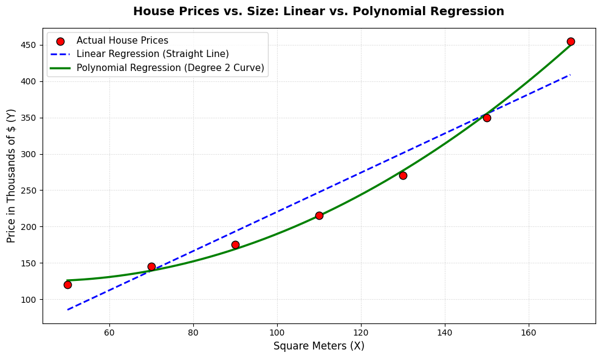

# Polynomial Regression

**Polynomial Regression** is a type of regression that allows a model to learn **curved relationships** between an input variable and the target variable.

Instead of fitting only a straight line, it adds **polynomial terms** such as \(x^2\), \(x^3\), and so on:

$$
y = \beta_0 + \beta_1x + \beta_2x^2 + \beta_3x^3 + \dots + \beta_nx^n
$$

* $\beta_0$: intercept
* \(\beta_1, \beta_2, \dots\): coefficients learned by the model
* \(x\): input feature
* \(n\): polynomial degree
* \(y\): predicted value

### Simple idea

* **Degree 1:** learns a straight line
* **Degree 2:** can learn a simple curve
* **Degree 3:** can learn more complex curves
* **Higher degrees:** can model increasingly complex relationships, but may lead to **overfitting**

### In scikit-learn

`PolynomialFeatures` creates the additional polynomial features, while `LinearRegression` learns their coefficients:

```python
from sklearn.preprocessing import PolynomialFeatures
from sklearn.linear_model import LinearRegression

poly = PolynomialFeatures(degree=2)

X_poly = poly.fit_transform(X)

model = LinearRegression()
model.fit(X_poly, y)
```

For `degree=2`, a feature \(x\) is transformed into:

$$
[1, x, x^2]
$$

The important point is that **Polynomial Regression is still a linear regression model with respect to its coefficients**. It becomes capable of fitting curves because the input features are transformed into polynomial terms.

---

## A Linear Regression Can Only Do This

$$
price = \beta_0 + \beta_1X
$$

A simple Linear Regression model has only **two parameters it can adjust**: $\beta_0$ and $\beta_1$.

* **$\beta_0$ — Intercept:** Moves the entire line **up or down**.
* **$\beta_1$ — Slope:** Controls how **steeply the line rises or falls**.

No matter what values the model learns for $\beta_0$ and $\beta_1$, the result is **always a straight line**.

> **Two parameters, one possible shape:** There is no combination of $\beta_0$ and $\beta_1$ that can produce a curve.

The limitation comes from the fact that the model only contains $(X)$. To represent a curved relationship, we need additional terms such as $(X^2)$, $(X^3)$, and so on.

---

## Polynomial Regression

Polynomial Regression is an extension of linear regression that allows the model to capture curved and non-linear relationships between variables.
* The Formula:
$$y = \beta_0 + \beta_1X + \beta_2X^2 + \beta_3X^3 + \dots + \beta_nX^n$$ 
* Degree 2 Example:
$$y = \beta_0 + \beta_1X + \beta_2X^2$$ 

## Visualizing the Impact of Each Power

* Linear Term ($X$): Draws a straight line that only rises or falls at a fixed, constant rate.
* Quadratic Term ($X^2$): Introduces a single bend (curvature), turning the line into a parabola where the slope changes dynamically.
* Cubic Term ($X^3$): Allows for two bends, creating an S-shape where the curve can change the direction of its bend.
* Higher Powers ($X^4, X^5, \dots$): Each extra power allows the model's curve to bend one more time, providing the flexibility to fit highly complex patterns.

## The Linearity Paradox

* Why it is still "Linear": The model is considered linear in its coefficients ($\beta_0, \beta_1, \beta_2$), not in its data points ($X$). Because the parameters enter the equation linearly, it can still be trained using the exact same standard least-squares method as simple linear regression.
* Feature Engineering: Instead of changing the core algorithm, polynomial regression simply treats the powers ($X^2, X^3$, etc.) as brand-new, independent input features.

Summary: Linear Regression + Feature Transformation (Powers of $X$) = Polynomial Regression.

---

## Polynomials and Their Terms

A polynomial is a mathematical expression made of the sums and differences of individual algebraic terms. Every exponent on the variables must be a non-negative integer (positive whole numbers or zero).
* Example:
$$3x^2 + 2x - 5$$ 

## Role of Each Term

* Quadratic Term ($3x^2$): Contains an exponent of 2. This dominant term dictates the overall shape and creates the fundamental curvature (parabola) of the graph.
* Linear Term ($2x$): Contains an implicit exponent of 1. This term acts as a modifier that tilts or shifts the center of the curve diagonally across the graph.
* Constant Term ($-5$): Contains a variable with an exponent of 0 (since $x^0 = 1$). This fixed value controls the vertical alignment by shifting the entire curve straight up or down on the y-axis.

---

## House Price Dataset & Pattern

Dataset Overview: A collection of seven houses analyzing the relationship between their size in square meters ($X$) and their market price in thousands of dollars ($Y$).

| Square Meters ($X$) | Price ($Y$) in Thousands ($) |
|---|---|
| 50 | 120 |
| 70 | 145 |
| 90 | 175 |
| 110 | 215 |
| 130 | 270 |
| 150 | 350 |
| 170 | 455 |


* Data Behavior: The data points do not follow a straight path. Instead, the scatter plot displays a curved, upward-fanning trend. As house sizes increase, the corresponding prices accelerate and rise at a progressively faster rate rather than a constant one.

---

## Non-Constant Price Acceleration

House prices do not scale at a uniform rate. While the house size increases by a fixed step of 20 m² each time, the corresponding price increase grows larger with every step.
Step-by-Step Breakdown:
* 50 to 70 m² (+20 m²): Price increases by $25k
* 70 to 90 m² (+20 m²): Price increases by $30k
* 90 to 110 m² (+20 m²): Price increases by $40k
* 110 to 130 m² (+20 m²): Price increases by $55k
* 130 to 150 m² (+20 m²): Price increases by $80k
* 150 to 170 m² (+20 m²): Price increases by $105k

**Why Linear Models Fail:** A standard linear regression line assumes a fixed trajectory, guessing that every additional 20 m² adds the exact same average value (+$55.8k based on the actual dataset totals). Because real-world prices accelerate rather than remain constant, a straight line will consistently underpredict or overpredict the true value, making a curved polynomial model necessary.

---

## Attempt 1: Evaluation of Linear Regression

* The Model Equation:
$$\text{Price } (\hat{y}) = -49.46 + 2.696X$$ 
Key Metrics:
* Intercept ($\beta_0$): $-49.46$ (The theoretical price baseline, showing a negative value due to the forced straight trajectory).
* Coefficient ($\beta_1$): $2.696$ (Indicates a fixed increase of $2.696k for every additional square meter).
* Mean Squared Error (MSE): 815.8 (A high error value, signaling a poor overall fit to the true shape of the data).

## Predictions vs. Reality

| Square Meters ($X$) | Actual Price ($Y$) | Predicted Price ($\hat{y}$) | Prediction Error ($Y - \hat{y}$) |
|---|---|---|---|
| 50 | 120 | 85.4 | -34.6 (Underestimates) |
| 70 | 145 | 139.3 | -5.7 (Underestimates) |
| 90 | 175 | 193.2 | +18.2 (Overestimates) |
| 110 | 215 | 247.1 | +32.1 (Overestimates) |
| 130 | 270 | 301.1 | +31.1 (Overestimates) |
| 150 | 350 | 355.0 | +5.0 (Overestimates) |
| 170 | 455 | 408.9 | -46.1 (Underestimates) |


Analysis of Limitations: The straight line creates a systematic error pattern. It underestimates values at both the lower and higher extremes while continuously overestimating prices for mid-range homes. Because a linear model cannot bend, it remains completely blind to the accelerating momentum of real estate values.

---

## Attempt 2: Feature Transformation & Degree-2 Polynomial Fit

Feature Engineering (PolynomialFeatures): To capture the acceleration, a new column is generated by squaring the original values (X² = X × X). This transforms a single-feature problem into a multi-feature input layout before feeding it into the linear estimator.

| Square Meters (X) | Squared Meters (X²) | Price (Y) in Thousands ($) |
|---|---|---|
| 50 | 2,500 | 120 |
| 70 | 4,900 | 145 |
| 90 | 8,100 | 175 |
| 110 | 12,100 | 215 |
| 130 | 16,900 | 270 |
| 150 | 22,500 | 350 |
| 170 | 28,900 | 455 |


* The Model Equation:
$$\text{Price } (\hat{y}) = 163.04 - 1.756X + 0.02024X^2$$ 
Key Components: Intercept (β₀): 163.04 (The baseline anchor for the curve).
* Linear Coefficient (β₁): -1.756 (A negative value that works dynamically alongside the squared term to adjust the position of the curve).
* Quadratic Coefficient (β₂): 0.02024 (A seemingly small number, but its impact scale is massive because it is multiplied by the rapidly growing X² values).

## Performance Improvement

* Mean Squared Error (MSE) Comparison:
* Straight Line (Linear): 815.8
   * Degree-2 Curve (Polynomial): 29.4
* Analysis of Success: By expanding the feature space to include X², the prediction error drops roughly 28-fold. The resulting parabola matches the upward acceleration of market prices, tracking the real-world trend with significantly higher accuracy than a straight line ever could.

---

## Attempt 3: Expanding to a 3rd-Order Polynomial (Cubic Model)

Feature Expansion: The model continues the same data transformation technique by calculating a third input feature: the cubed values ($X^3 = X \times X \times X$). Even though these numbers scale upward very rapidly, the algorithm handles them as simple, standard input columns within a multi-variable frame.
* The Model Equation:
$$\text{Price } (\hat{y}) = \beta_0 + \beta_1X + \beta_2X^2 + \beta_3X^3$$ 

## The Resulting Data Structure

| Square Meters ($X$) | Squared Meters ($X^2$) | Cubed Meters ($X^3$) | Price ($Y$) in Thousands ($) |
|---|---|---|---|
| 50 | 2,500 | 125,000 | 120 |
| 70 | 4,900 | 343,000 | 145 |
| 90 | 8,100 | 729,000 | 175 |
| 110 | 12,100 | 1,331,000 | 215 |
| 130 | 16,900 | 2,197,000 | 270 |
| 150 | 22,500 | 3,375,000 | 350 |
| 170 | 28,900 | 4,913,000 | 455 |


Model Implications: Introducing the cubic term ($X^3$) grants the model the ability to form an S-shaped curve with two distinct bends. However, because a 2nd-degree parabola already fits this specific dataset exceptionally well (dropping the MSE to 29.4), adding a 3rd degree may offer minimal accuracy gains while increasing the risk of overfitting the data points.


---

## The Linearity Duality

* Non-linear with respect to $X$: As house size changes, the price follows a curved path rather than a straight line. The real-world geometric relationship between the physical input and output variables is explicitly non-linear.
* Linear with respect to $\beta$: The mathematical structure remains linear for the parameters being solved. Each coefficient ($\beta_0, \beta_1, \beta_2$) is multiplied by a standalone numerical value and then added together. No coefficient is raised to a power ($\beta^2$), nested inside a function, or multiplied by another coefficient ($\beta_1 \times \beta_2$).

## How the Algorithm Operates

* Column-Blind Estimation: To the underlying optimization algorithm, the dataset is just a matrix of numbers. It does not know or care that the second column was derived by squaring the first column. It treats $X$ and $X^2$ as two distinct, independent columns of data.
* Shared Training Mechanism: Because the structure preserves parameter linearity, the model can be fit using standard Ordinary Least Squares (OLS) or Gradient Descent. It uses the exact same foundational optimization code that powers simple linear regression models.

---

## Two chained components: `PolynomialFeature` + `LinearRegression`

```python
import numpy as np
import sklearn.preprocessing as PolynomialFeatures
from sklearn.linear_model import LinearRegression

X = np.array([50, 70, 90, 110, 130, 150, 170]).reshape(-1, 1)
y = np.array([120, 145, 175, 215, 270, 350, 455])

poly = PolynomialFeatures(degree=2, include_bias=False) # 1. Create X**2
X_poly = poly.fit_transform(X)                          # [X, X**2]

model = LinearRegression()                              # 2. Learn the model
model.fit(X_poly, y)

model.predict(poly.transform([[190]]))                  # 3. Predict the price of a 190 m² house

X_poly[:3]

round(model.intercept_, 2)

model.coef_

model.predict(poly.transform([[190]]))
```

---

## Parameters vs. Hyperparameters in Polynomial Regression

* Parameters (Learned by the Model): These are the internal weights that the algorithm calculates automatically during training. The system looks at the data, tests different values, measures the error, and selects the exact coefficients that minimize it. You never set these by hand.
* $\beta_0$: 163.04 (The baseline intercept)
   * $\beta_1$: -1.756 (The weight for the linear term $X$)
   * $\beta_2$: 0.02024 (The weight for the quadratic term $X^2$)
* Hyperparameters (Decided by You): These are external configuration settings that you must choose before training begins. They cannot be learned from the data; they are design choices that dictate how the model is structured. In polynomial regression, the primary hyperparameter is the degree of the polynomial.
* PolynomialFeatures(degree=...): The setting that controls how many powers of $X$ are created.
   * Possible Values: 1 (straight line), 2 (parabola), 3 (S-curve), 4, 5, etc.

Key Takeaway: Hyperparameters define the structure of the mathematical playground, while parameters are the specific rules the model learns to play perfectly within that structure.

---

## Selecting the Optimal Polynomial Degree Hyperparameter

* The Core Strategy: The optimal polynomial degree cannot be calculated directly from a formula beforehand. Instead, it must be determined through empirical testing and validation, evaluating multiple candidate models to see which one performs best on unseen data.
* The Danger of Training Error: As you increase the polynomial degree, training error will always decrease because the model gains the flexibility to bend and pass closer to every single data point. However, this often leads to a model that memorizes noise rather than learning genuine patterns.
* The True Decider (Validation Error): The correct degree is chosen based on which model generalizes best to new, unseen data, minimizing the validation error rather than the training error.

## Leave-One-Out Cross-Validation (LOOCV)
The specific method described for this 7-house dataset is called Leave-One-Out Cross-Validation:

The Process:
1. Separate one single house to act as the temporary validation test.
2. Train the polynomial model using only the remaining six houses.
3. Measure the prediction error on the single house that was left out.
4. Repeat this exact process seven times, rotating which house is left out each time.

The Final Metric: Average the errors from all seven rounds to get a true representation of how well that specific degree performs on data it has never seen before. The degree with the lowest average validation error wins.

