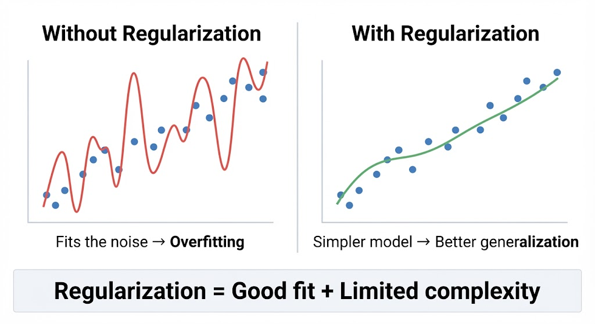
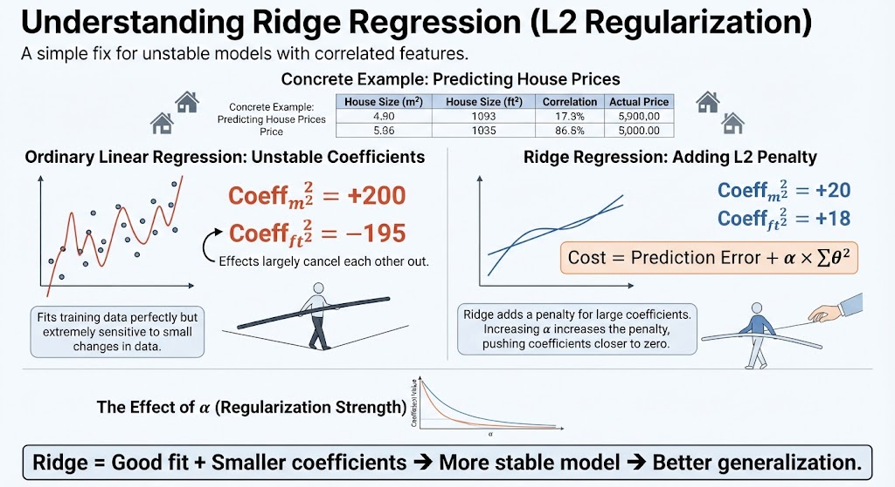

# Ridge Regression

Ridge Regression is a linear regression technique that tries to **fit the data well while keeping the model coefficients small**.

It adds a penalty to the loss function that discourages large coefficients:

**Penalty:**  
$\alpha \sum_{j=1}^{n}\theta_j^2$

The goal is to balance two things:
- **Good fit:** Make predictions close to the actual values.
- **Small coefficients:** Reduce the risk of overfitting.

### Overfitting
Ridge helps prevent **overfitting**, especially when the model has many features or features that are highly correlated.

Instead of allowing the model to use very large coefficients to fit the training data, Ridge pushes the coefficients toward zero.

### Collinearity
**Collinearity** occurs when two or more features are strongly correlated.

For example:

```text
House size in m²  ↔  House size in ft²
```

Linear regression can produce unstable or very large coefficients when features are highly correlated.

Ridge makes the model more stable by shrinking these coefficients.

### StandardScaler
Ridge's penalty depends on the size of the coefficients, so features should generally be **scaled to a similar range**.

`StandardScaler` transforms each feature so that it approximately has:

- Mean = 0
- Standard deviation = 1

```python
from sklearn.preprocessing import StandardScaler

X_scaled = StandardScaler().fit_transform(X)
```

This makes the Ridge penalty treat features more fairly.

### Σθ²
$\sum \theta^2$

This means **the sum of the squared model coefficients**.

For example, if the coefficients are:

```text
θ₁ = 2
θ₂ = -3
θ₃ = 1
```

Then:

$\sum\theta^2 = 2^2 + (-3)^2 + 1^2 = 14$

Ridge adds this value, multiplied by `alpha`, to the model's loss.

### `alpha`
`alpha` controls **how strongly Ridge penalizes large coefficients**.

```python
from sklearn.linear_model import Ridge

model = Ridge(alpha=1.0).fit(X, y)
```

- **Small `alpha`** → weaker regularization → model behaves more like ordinary linear regression.
- **Large `alpha`** → stronger regularization → coefficients become smaller.
- **Very large `alpha`** → coefficients can become too small, causing underfitting.

**Key idea:** Ridge Regression = **Linear Regression + L2 regularization**.

---

# Regularization

**Regularization** is a technique used to **limit a model’s complexity and reduce overfitting**.

Instead of only trying to fit the training data as closely as possible, the model is also penalized for becoming too complex.

---

### Issues with Linear Models

A linear model can struggle in two opposite ways:

- **Too simple:** A standard linear model can only learn linear relationships, so it cannot naturally capture curves or complex patterns.
- **Too flexible:** With many features, the model can have many parameters and potentially fit noise in the training data.

Regularization helps control this flexibility by discouraging unnecessarily large coefficients.

---

### Collinearity

**Collinearity** occurs when two or more features contain very similar information.

For example:

```text
age_in_days  ↔  age_in_years
```

These variables represent essentially the same underlying information.

A linear model may assign large coefficients with opposite signs:

```text
age_in_days  →  +θ
age_in_years →  -θ
```

Their effects can partially cancel each other, making the coefficients **unstable and difficult to interpret**.

Ridge Regression helps by shrinking these coefficients toward zero.

---

### Ridge Regression

**Ridge Regression** is linear regression with **L2 regularization**.

It adds a penalty for large coefficients to the cost function:

$\text{Cost} = \text{Prediction Error} + \alpha\sum_j\theta_j^2$


The model therefore tries to:

1. Fit the training data well.
2. Keep the coefficients relatively small.

---

### Hyperparameter: `alpha`

`alpha` controls the **strength of the regularization penalty**.

```python
Ridge(alpha=1.0)
```

- **Small `alpha`** → weak penalty → coefficients can remain larger.
- **Large `alpha`** → strong penalty → coefficients are pushed closer to zero.
- **Extremely large `alpha`** → coefficients may become too small → possible underfitting.

The penalty is applied to the **coefficients (`θ`)**, not directly to the input features.

---

### Evaluation and Scaling

The regularization penalty is part of the **training objective**. It is not added to evaluation metrics such as MSE or MAE when measuring model performance.

Features should generally be **standardized before applying Ridge**, because the penalty depends on coefficient size.

```python
from sklearn.preprocessing import StandardScaler
from sklearn.linear_model import Ridge

scaler = StandardScaler()
X_scaled = scaler.fit_transform(X)

model = Ridge(alpha=1.0)
model.fit(X_scaled, y)
```

**Important:** Fit the scaler only on the training data, then use the same fitted scaler to transform validation/test data.

---

## What is regularization?

I don't just want the model to have **low error**; I also want to **limit its complexity**.

> In a nutshell: **Regularization adds penalties or constraints that restrict the model's freedom, helping prevent it from fitting noise in the training data and reducing overfitting.**

**Simple idea:**  
A model without regularization may try too hard to fit every training example. Regularization tells the model: **“Fit the data well, but don't become unnecessarily complicated.”**



---

### Higher Complexity → Higher Risk of Overfitting

In general, **the more complex a model is, the greater its risk of overfitting**.

A highly flexible model can learn not only the real patterns in the data but also random noise and small irregularities.

> **More complexity → More freedom → Higher risk of fitting noise**

The goal of regularization is to find a good balance between **fitting the data** and **keeping the model simple**.

---

### We Have Regularized Before: Limiting the Degree

When using **polynomial regression**, limiting the polynomial degree is already a form of regularization.

For example:

```text
Degree 2 → y = θ₀ + θ₁x + θ₂x²
Degree 10 → much more flexible model
```

A lower degree restricts the model's complexity and prevents it from becoming unnecessarily flexible.

> **Limiting the polynomial degree = limiting model complexity.**

---

### Other Ways to Apply Regularization

#### Ridge Regression

**Ridge** penalizes large coefficients and **shrinks them toward zero**, but normally does not make them exactly zero.

It uses an **L2 penalty**:

$\alpha\sum_j \theta_j^2$

> **Ridge = Keep all features, but reduce the influence of large coefficients.**

---

#### Lasso Regression

**Lasso** also penalizes coefficients, but uses an **L1 penalty**:


$\alpha\sum_j |\theta_j|$

Unlike Ridge, Lasso can shrink some coefficients **exactly to zero**.

This means Lasso can effectively **remove features from the model**.

> **Lasso = Shrink coefficients and potentially eliminate some features.**

---

#### Elastic Net

**Elastic Net combines Ridge and Lasso**.

It uses both L1 and L2 penalties:

$\alpha\left(
r\sum_j|\theta_j|
+
(1-r)\sum_j\theta_j^2
\right)$

This gives the model both behaviors:

- **L1:** Can make coefficients exactly zero.
- **L2:** Shrinks coefficients and helps handle correlated features.

> **Elastic Net = Ridge + Lasso.**

---

#### Early Stopping

**Early stopping** is a regularization technique commonly used when training iterative models such as neural networks.

Instead of allowing training to continue until the model perfectly fits the training data, we **stop training when validation performance stops improving**.

For example:

```text
Training continues...
        ↓
Validation error decreases
        ↓
Validation error reaches its best point
        ↓
Validation error starts increasing
        ↓
STOP
```

This prevents the model from continuing to learn the noise in the training data.

> **Early stopping = Stop training before the model starts overfitting.**

### Quick Comparison

| Method | How it controls complexity | Can set coefficients to zero? |
|---|---|---|
| Polynomial degree | Limits model flexibility | No |
| Ridge | Penalizes large coefficients (L2) | Usually no |
| Lasso | Penalizes absolute coefficient values (L1) | **Yes** |
| Elastic Net | Combines L1 + L2 | **Yes** |
| Early Stopping | Stops training before overfitting | Not directly |

---

### No Curves... but Plenty of Parameters

A standard linear regression model can only create a **flat linear relationship**. Unlike a 20th-degree polynomial, it cannot create arbitrarily complex curves.

However, it can still have **many parameters** when there are many input variables.

For example:

$
\hat{y} = \theta_0 + \theta_1x_1 + \theta_2x_2 + \cdots + \theta_nx_n
$

Each input variable has its own coefficient (`θ`).

> **Linear models are simple in shape, but they can still have many parameters.**

---

## Issues in Linear Regression Models

Linear regression typically relies on several important assumptions about the relationship between the inputs, the output, and the errors.

### 1. Linearity

There should be an **approximately linear relationship** between the predictors and the target.

In simple terms:

> As an input changes, the expected output should change in a reasonably straight-line pattern.

If the relationship is strongly curved, a simple linear model may not capture it well.

---

### 2. Centered Errors

The **errors (residuals)** should be centered around zero and should not show a systematic pattern.

An error is:

$e_i = y_i - \hat{y}_i$

Ideally, residuals should look randomly scattered around zero.

You should not see a clear pattern such as:

```text
Errors
  ↑
  |       •
  |     •
  |   •
  | •
  +----------------→ x
```

A pattern in the residuals suggests that the model is missing some structure in the data.

> **Residuals should fluctuate randomly around zero, not systematically rise or fall with x.**

---

### 3. Constant Variance

The errors should have approximately the **same amount of spread** across the range of predictions or input values.

This is called **constant variance** or **homoscedasticity**.

Good:

```text
  • •   • • •
 •  • • •  •
----------------→ x
```

Problematic:

```text
  •
 • •
•  • •
     • • •
       • • • •
----------------→ x
```

In the second case, the errors become more spread out as `x` increases. This is called **heteroscedasticity**.

> **The residuals should have roughly the same spread throughout the range.**

---

### 4. Collinearity

The input variables should not contain **too much redundant information**.

For example:

```text
age_in_years
age_in_days
```

These variables provide almost the same information.

High collinearity can make coefficient estimates **unstable and difficult to interpret**, because the model has difficulty determining how much of the effect should be attributed to each correlated variable.

> **Collinearity = predictors contain overlapping information, making their individual effects difficult to separate.**

### Quick Summary

| Condition | What we want |
|---|---|
| **Linearity** | Inputs and target have an approximately linear relationship |
| **Centered errors** | Residuals are randomly distributed around zero |
| **Constant variance** | Residual spread stays roughly constant |
| **Low collinearity** | Predictors provide sufficiently distinct information |

---

## Issues in Linear Regression Models

### Huge coefficients that offset each other

When predictors are highly correlated, a linear regression model can produce **very large coefficients with opposite signs**.

For example:

```text
age_in_days  → +0.50
age_in_years → -182.50
```

The two coefficients may largely cancel each other because both variables represent similar information.

The model might still make accurate predictions, but the individual coefficients become **unstable and difficult to interpret**.

### Sensitive to small changes in the data

A model with highly correlated predictors can be **very sensitive to small changes in the training data**.

For example, adding or removing a few observations could cause the coefficients to change dramatically while the predictions remain relatively similar.

> **The model may fit the training data well, but its learned coefficients are unstable.**

---

## And This Is Where Regularization Comes In

**Regularization** adds a constraint or penalty that discourages the model from using unnecessarily large coefficients.

Instead of asking only:

> “How can I minimize the prediction error?”

the model also considers:

> “Can I achieve a good fit without using huge coefficients?”

This helps make the model **more stable** and can reduce overfitting.

---

# Ridge Regression: The Key Idea

**Ridge Regression** is a regularized version of Linear Regression that adds an **L2 penalty** for large coefficients.

The objective becomes:

\[
\text{Cost}
=
\text{Prediction Error}
+
\alpha\sum_j\theta_j^2
\]

The first part rewards good predictions.

The second part penalizes large coefficients.

So Ridge tries to find a balance:

> **Fit the data well + Keep the coefficients reasonably small**

### What does Ridge actually do?

Suppose ordinary Linear Regression finds:

```text
θ₁ = 100
θ₂ = -98
```

Ridge may prefer something more like:

```text
θ₁ = 20
θ₂ = 18
```

if the slightly worse fit is compensated by a much smaller penalty.

The exact values are determined by the data and the regularization strength `alpha`.

**Important:** Ridge usually **shrinks coefficients toward zero but does not force them to exactly zero**.

---

## Why does this help?

Large coefficients can make a model overly sensitive to small changes in the input data.

Ridge discourages those large coefficients, which can:

- Reduce overfitting
- Improve stability
- Help with multicollinearity
- Improve generalization to unseen data



> **Ridge doesn't try to make the model perfectly fit the training data. It tries to find a stable model that fits well without using unnecessarily large coefficients.**

---

